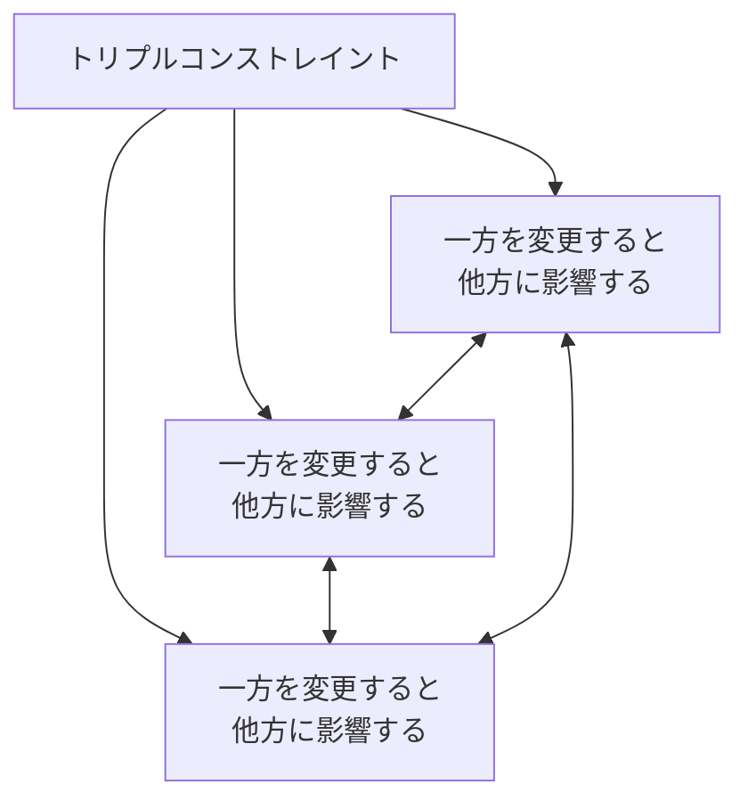
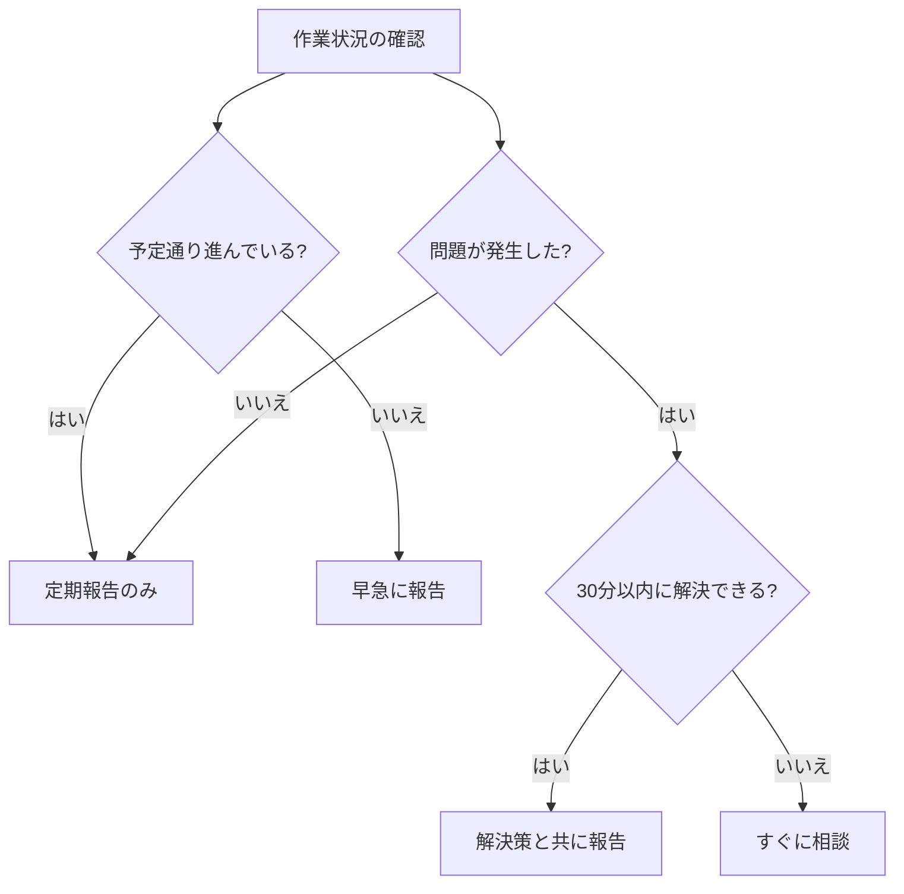

# 🏆 開発プロジェクトのマネジメント冒険者クエスト 1.0.0　　- 基本の館 第1章

ここでは、「開発プロジェクトのマネジメント 初級レベル演習課題」の模範解答を示します。

解答を確認しながら、自分のコードと比較してみましょう！

---

## 🔥 模範解答一覧

難易度は⭐の数で表現しています：
- ⭐：見習い冒険者でも挑戦できる基本の試練
- ⭐⭐：一人前の冒険者に求められる応用の試練
- ⭐⭐⭐：熟練冒険者のみが挑める高度な試練

### **1. 🧩 プロジェクトマネジメントの基本概念** 【難易度: ⭐】
#### ✅ 解答:

1. **プロジェクトの定義**:
   
   プロジェクトとは、「特定の目的を達成するために、期間と予算が定められた一時的な取り組み」です。日常的な業務と異なり、プロジェクトには明確な開始と終了があります。

2. **日常業務とプロジェクトの違い**:

   - **一時性**: プロジェクトには明確な開始と終了があるが、日常業務は継続的に行われる
   - **独自性**: プロジェクトは一度限りの独自の成果物を作るが、日常業務は繰り返し同じ作業を行うことが多い
   - **目的指向**: プロジェクトは特定の目標達成を目指すが、日常業務は組織の運営維持が主目的

3. **プロジェクトマネジメントの主な目的**:

   - **プロジェクトの成功を確実にする**: 要件通りの成果物を、定められた期間内に、予算内で納品する
   - **リスクを管理する**: 問題が発生する前に予測し、対策を講じる
   - **ステークホルダー（利害関係者）の期待を管理する**: 顧客や経営層など関係者の期待を適切に管理する

#### 🔍 解説:
プロジェクトの定義を理解することは、プロジェクトマネジメントの基礎となります。特に「一時的」「特定の目的」「制約のある資源」という要素がプロジェクトの本質です。日常業務との違いを理解することで、プロジェクト特有の管理手法の必要性が明確になります。

プロジェクトマネジメントの目的は、単に計画通りに進めることだけではなく、様々な制約条件の中で最適な結果を出すことや、関係者の期待を適切に管理することも含まれます。初級エンジニアとして、これらの目的を理解しておくことで、自分の役割をより広い視点で捉えることができます。

#### 🔗 参考リンク:
- [PMBOKガイド（Project Management Body of Knowledge）](https://www.pmi.org/pmbok-guide-standards)
- [プロジェクトマネジメント入門](https://www.ipa.go.jp/jinzai/pm/index.html)

---

### **2. ⚖️ トリプルコンストレイントの理解** 【難易度: ⭐⭐】
#### ✅ 解答:

1. **トリプルコンストレイント（三重制約）の説明**:

   トリプルコンストレイントとは、プロジェクトマネジメントにおける3つの主要な制約要素（スコープ、時間、コスト）のバランスを取ることの重要性を示す概念です。これらは相互に影響し合い、一般的に「品質-納期-コスト」の関係とも呼ばれます。

   - **スコープ**: プロジェクトで実現する機能や成果物の範囲、および要求される品質レベル
   - **時間**: プロジェクトの完了までの期間、納期
   - **コスト**: プロジェクトに投入できる予算や人的リソース

2. **シナリオごとの影響と対応策**:

   a) **納期（リリース日）は変更できない状況で機能追加を行う場合**:
   
   影響:
   - コストの増加（追加リソースの投入が必要）
   - 品質低下のリスク（時間的制約の中で追加作業を行うため）
   
   対応策:
   - 追加の開発リソース（人員）を投入する
   - 機能の優先順位付けを行い、重要度の低い既存機能を延期する
   - 並行作業を増やし、開発効率を上げる

   b) **予算（開発コスト）は増やせない状況で機能追加を行う場合**:
   
   影響:
   - 納期の延長（同じリソースで追加作業を行うため）
   - スコープの調整が必要（予算内で実現できる範囲に制限）
   
   対応策:
   - 納期の延長を顧客と交渉する
   - 追加機能と既存機能の優先順位を見直し、低優先度の機能を削減する
   - 開発プロセスの効率化や自動化を検討する

   c) **品質を落とさずに機能追加を行う場合**:
   
   影響:
   - 納期の延長（品質を維持するための時間が必要）
   - コストの増加（品質を維持するためのリソースが必要）
   
   対応策:
   - 納期とコストの両方の増加を顧客と交渉する
   - 品質を維持するためのテスト工程を適切に計画する
   - 追加機能の段階的な導入を検討し、リスクを分散させる

3. **トリプルコンストレイントの関係性を表すMermaid図**:



#### 🔍 解説:
トリプルコンストレイントは、プロジェクトマネジメントの基本的な概念であり、プロジェクトの制約条件間のトレードオフを理解するのに役立ちます。「鉄の三角形」とも呼ばれるこの概念は、プロジェクトの現実的な計画立案と変更管理の基礎となります。

特に初級エンジニアが理解すべき重要なポイントは、これら3つの要素は相互に影響し合うということです。例えば、機能（スコープ）を追加すると、それに応じて時間（納期）が延びるか、コスト（リソース）が増えるか、あるいは品質が低下するかのいずれかが発生します。この関係性を理解することで、変更要求があった際の影響を適切に評価し、現実的な対応策を検討できるようになります。

#### 🔗 参考リンク:
- [プロジェクトマネジメントのトリプルコンストレイント](https://www.projectmanagement.com/contentPages/article.cfm?ID=289710&thisPageURL=/articles/289710/The-Triple-Constraint--A-Triple-Illusion#_=_)
- [変更管理とトレードオフの考え方](https://www.pmi.org/learning/library/managing-constraints-juggling-time-cost-quality-7612)

---

### **3. 🔄 開発プロセスの比較** 【難易度: ⭐⭐】
#### ✅ 解答:

1. **ウォーターフォールモデルの特徴と適している状況**:

   **特徴**:
   - 順序立てて段階的に開発を進めるモデル
   - 各工程（要件定義→設計→実装→テスト→リリース）が完了してから次の工程に進む
   - 各工程の成果物が明確
   - 計画が立てやすく、進捗管理がしやすい
   - 要件変更に弱い（後工程での変更コストが高い）

   **適している状況**:
   - 要件が明確で変更が少ない場合
   - 大規模なシステム開発
   - 契約ベースの開発（特に請負開発）
   - 高い信頼性や安全性が求められるシステム（金融、医療、交通など）
   - 規制要件の厳しい業界のシステム開発

2. **アジャイル開発手法（スクラム）の特徴と適している状況**:

   **特徴**:
   - 短い期間（スプリント：通常2〜4週間）で機能を少しずつ開発
   - フィードバックを得ながら改善していく反復的アプローチ
   - デイリースクラム（毎日の短いミーティング）で進捗確認と問題共有
   - スプリントプランニング、スプリントレビュー、振り返りなどの定期的なイベント
   - 変化に強く、柔軟に対応できる
   - 早い段階から動くソフトウェアを提供できる

   **適している状況**:
   - 要件が流動的な場合
   - 顧客との協力関係が強い場合
   - 革新的な製品開発
   - 市場の変化が速い領域
   - 小〜中規模のプロジェクト
   - チームの自律性が高い組織

3. **各プロジェクト状況における適切な開発プロセス**:

   a) **銀行の基幹システム更新プロジェクト**:
   
   **適切な開発プロセス**: ウォーターフォールモデル
   
   **理由**:
   - 要件が明確で変更が少ない
   - 高い信頼性と安全性が求められる
   - 規制要件への準拠が必要
   - 大規模なシステムで多くの関係者が関与
   - 契約ベースの開発が一般的
   - 明確な計画と進捗管理が必要

   b) **スタートアップ企業の新規モバイルアプリ開発**:
   
   **適切な開発プロセス**: アジャイル開発手法（スクラム）
   
   **理由**:
   - 要件が流動的で市場の反応を見ながら調整が必要
   - 早期にユーザーフィードバックを得たい
   - 競争の激しい市場で迅速な対応が求められる
   - 革新的な機能や使い勝手の探索が必要
   - 比較的小規模なチームで開発される可能性が高い
   - 頻繁な変更に柔軟に対応する必要がある

   c) **既存システムの保守・運用プロジェクト**:
   
   **適切な開発プロセス**: カンバン方式または反復型開発
   
   **理由**:
   - 小規模な改修が定期的に発生する
   - 作業の可視化と流れの管理が重要
   - 優先順位の変更に柔軟に対応する必要がある
   - 既存システムの安定性を維持しながら改修する必要がある
   - 緊急の不具合修正と計画的な機能改善の両方に対応する必要がある
   - 作業量の予測が難しく、フローベースの管理が適している

#### 🔍 解説:
開発プロセスの選択は、プロジェクトの性質や要件の安定性、チームの特性、顧客との関係性など、様々な要因によって決まります。どの開発プロセスが「最良」というわけではなく、プロジェクトの状況に最も適したアプローチを選ぶことが重要です。

ウォーターフォールモデルは計画駆動型のアプローチで、要件が明確で変更が少ない場合に適しています。一方、アジャイル開発手法は変化対応型のアプローチで、要件が流動的で頻繁な変更が予想される場合に適しています。

実際のプロジェクトでは、これらのハイブリッドアプローチを採用することも多いです。例えば、全体の計画はウォーターフォール的に行いつつ、開発フェーズではアジャイル的な反復開発を取り入れる「ウォーターフォール・スクラム・ハイブリッド」などがあります。

#### 🔗 参考リンク:
- [アジャイル宣言](https://agilemanifesto.org/iso/ja/manifesto.html)
- [スクラムガイド](https://scrumguides.org/docs/scrumguide/v2020/2020-Scrum-Guide-Japanese.pdf)
- [開発プロセスの選択ガイド](https://www.atlassian.com/agile/project-management/project-management-intro)

---

### **4. 📊 WBSとガントチャートの活用** 【難易度: ⭐⭐】
#### ✅ 解答:

1. **WBS（Work Breakdown Structure）の説明**:

   WBSとは、プロジェクトの作業を階層的に分解した構造図です。「プロジェクトで何をするか」を明確にするためのツールです。

   **目的**:
   - プロジェクトの全体像を把握する
   - 作業の漏れや重複を防ぐ
   - 作業の依存関係を明確にする
   - 見積もりや担当者割り当ての基礎とする
   - プロジェクトの進捗管理の基盤とする

   **作成手順**:
   1. プロジェクト全体を最上位に置く
   2. 主要な成果物や段階に分解する
   3. さらに小さな作業単位に分解する
   4. 管理可能なレベル（通常は数日〜2週間程度で完了する作業）まで分解する
   5. 各作業に一意のID（番号）を付与する

2. **WBSの詳細化**:

```
1. Webサイト開発
   1.1 要件定義
   1.2 設計
       1.2.1 画面設計
       1.2.2 データベース設計
       1.2.3 システム構成設計
   1.3 実装
       1.3.1 フロントエンド実装
           1.3.1.1 ヘッダー・フッター実装
           1.3.1.2 メインページ実装
           1.3.1.3 問い合わせフォーム実装
       1.3.2 バックエンド実装
           1.3.2.1 データベース構築
           1.3.2.2 API実装
           1.3.2.3 管理画面実装
   1.4 テスト
       1.4.1 単体テスト
       1.4.2 結合テスト
       1.4.3 システムテスト
       1.4.4 ユーザー受入テスト
   1.5 リリース
       1.5.1 デプロイメント準備
       1.5.2 本番環境構築
       1.5.3 データ移行
       1.5.4 運用マニュアル作成
```

3. **WBSとガントチャートの違いと補完関係**:

   **WBSとガントチャートの違い**:
   - WBSは「何をするか」を階層的に表現する（作業の分解構造）
   - ガントチャートは「いつするか」を時間軸で表現する（スケジュール）
   - WBSは作業の構造と関係性に焦点を当てる
   - ガントチャートは作業の順序、期間、依存関係に焦点を当てる

   **補完関係**:
   - WBSで特定された作業項目がガントチャートのタスクになる
   - WBSで作業の全体像を把握し、漏れがないことを確認した上で、ガントチャートでスケジュールを計画する
   - WBSは作業の論理的な分解を示し、ガントチャートはその時間的な展開を示す
   - WBSは静的な構造を提供し、ガントチャートは動的な進捗状況を可視化する
   - 両者を組み合わせることで、「何を」「いつ」「誰が」行うかを総合的に管理できる

#### 🔍 解説:
WBSとガントチャートは、プロジェクト計画の基本的なツールです。WBSはプロジェクトの作業範囲を明確にし、ガントチャートはその作業のスケジュールを視覚化します。

WBSを作成する際の重要なポイントは、「成果物指向」であることです。つまり、各作業項目は具体的な成果物や結果を生み出すものであるべきです。また、「100%ルール」に従い、上位レベルの作業は下位レベルの作業の総和と等しくなるように分解します。

WBSの分解レベルは、「8/80ルール」を参考にすることがあります。これは、最小の作業単位が8時間（1日）以上、80時間（2週間）以下になるように分解するという目安です。ただし、プロジェクトの性質や組織の管理粒度によって適切なレベルは異なります。

#### 🔗 参考リンク:
- [WBSの作成ガイド](https://www.workbreakdownstructure.com/)
- [プロジェクト計画ツールの活用法](https://www.pmi.org/learning/library/work-breakdown-structures-practical-tools-11127)
- [効果的なガントチャートの作成方法](https://www.gantt.com/)

---

### **5. 🤝 請負開発とSESの違い** 【難易度: ⭐⭐】
#### ✅ 解答:

1. **請負開発とSESの契約形態の違い**:

   **請負開発**:
   - 成果物（システム）の納品を約束する契約
   - 「何を」作るかが契約の中心
   - 発注者と受注者の関係
   - 完成責任を負う（成果物に対する責任）

   **SES（システムエンジニアリングサービス）**:
   - 人材（エンジニア）の提供を約束する契約
   - 「誰が」「どれだけの期間」働くかが契約の中心
   - 派遣に近い関係（ただし法律上は派遣とは異なる）
   - 稼働責任を負う（労働時間に対する責任）

2. **請負開発とSESの違いの表**:

| 項目 | 請負開発 | SES |
|-----|---------|-----|
| 契約の対象 | 成果物（システム） | 人材（エンジニア） |
| 責任範囲 | 成果物の品質・納期 | 契約した稼働時間の提供 |
| 作業場所 | 自社内が基本 | 顧客先（客先常駐）が基本 |
| 指示命令系統 | 自社の管理者から | 顧客から直接 |
| 報酬体系 | 成果物に対して（固定金額または実績精算） | 稼働時間（人月）に対して |

3. **シナリオの判断**:

   a) **クライアント企業のオフィスで働き、クライアントの社員から直接作業指示を受けている**
   
   **判断**: SES
   
   **理由**: 
   - 客先常駐で働いている
   - 顧客から直接指示を受けている
   - これはSESの典型的な特徴である

   b) **自社オフィスで開発を行い、月に1回クライアントに進捗報告を行っている**
   
   **判断**: 請負開発
   
   **理由**: 
   - 自社オフィスで開発を行っている
   - 定期的な進捗報告を行っている（成果物の進捗を報告）
   - 作業場所と報告形態が請負開発の特徴に合致する

   c) **作業時間に対して報酬が支払われ、残業代も別途支給される**
   
   **判断**: SES
   
   **理由**: 
   - 稼働時間に対して報酬が支払われる
   - 残業代が別途支給される
   - 時間ベースの報酬体系はSESの特徴である

   d) **システム納品後の不具合対応は無償で行う必要がある**
   
   **判断**: 請負開発
   
   **理由**: 
   - 成果物（システム）に対する責任がある
   - 納品後の品質保証責任を負っている
   - 成果物に対する責任は請負開発の特徴である

#### 🔍 解説:
請負開発とSESの違いを理解することは、自分の立場や責任範囲を把握するために非常に重要です。特に初級エンジニアは、この違いを明確に理解していないことがあり、誤解から問題が生じることがあります。

請負開発では「何を作るか」が契約の中心であり、成果物の品質と納期に責任を持ちます。一方、SESでは「誰が」「どれだけの期間」働くかが契約の中心であり、契約した稼働時間の提供に責任を持ちます。

この違いは、日々の業務の進め方にも影響します。請負開発では自社の管理者からの指示に従い、成果物の完成に向けて作業を進めます。SESでは顧客から直接指示を受け、顧客の一員として働くことになります。

#### 🔗 参考リンク:
- [請負契約とSES契約の法的違い](https://www.mhlw.go.jp/stf/seisakunitsuite/bunya/koyou_roudou/koyou/haken-shoukai/index.html)
- [IT業界の契約形態ガイド](https://www.ipa.go.jp/jinzai/itss/index.html)
- [エンジニアのためのキャリアパス選択ガイド](https://www.jisa.or.jp/publication/tabid/272/Default.aspx)

---

### **6. 📢 報告・連絡・相談の実践** 【難易度: ⭐】
#### ✅ 解答:

1. **報告・連絡・相談（報連相）の目的と重要性**:

   **報告**:
   - **目的**: 作業の進捗状況や結果を伝える
   - **重要性**: 
     - プロジェクトの現状を関係者が把握できる
     - 問題の早期発見につながる
     - 適切な意思決定の基盤となる
     - 責任の明確化につながる

   **連絡**:
   - **目的**: 情報を共有する
   - **重要性**: 
     - チーム全体が同じ情報を持つことで協働が円滑になる
     - 重複作業や矛盾した作業を防止できる
     - 関係者間の認識のずれを防ぐ
     - 透明性の高い環境を作る

   **相談**:
   - **目的**: 判断に迷ったときや問題が発生したときに助言を求める
   - **重要性**: 
     - より良い解決策を見つけられる
     - リスクの早期軽減につながる
     - チームの知恵を活用できる
     - 個人の責任を軽減し、心理的安全性を高める

2. **シナリオごとの適切な報連相の対応**:

   a) **タスクの実装中に仕様の解釈があいまいな点を発見した**
   
   **適切な対応**: 相談
   
   **理由**: 
   - 仕様の解釈があいまいな場合、自己判断で進めると誤った実装になるリスクがある
   - リーダーや仕様を決定した担当者に確認することで、正確な実装ができる
   - 早い段階で相談することで、手戻りを最小限に抑えられる

   b) **予定より作業が早く終わり、次のタスクに取りかかれそうだ**
   
   **適切な対応**: 報告と連絡
   
   **理由**: 
   - 作業の完了を報告することで、プロジェクトの進捗状況が更新される
   - 次のタスクに取りかかる意向を連絡することで、作業の重複や依存関係の問題を防げる
   - チームの作業計画の調整に役立つ情報となる

   c) **担当タスクで技術的な問題が発生し、解決に時間がかかりそうだ**
   
   **適切な対応**: 報告と相談
   
   **理由**: 
   - 問題発生と予定遅延の可能性を早めに報告することで、プロジェクト計画の調整ができる
   - 技術的な問題について相談することで、チーム内の知見を活用した解決策を見つけられる
   - 一人で抱え込まず、早期に共有することで問題の深刻化を防げる

   d) **チームメンバーの作業に影響を与える可能性のある変更を行った**
   
   **適切な対応**: 連絡
   
   **理由**: 
   - 変更内容を関係者に連絡することで、影響を受ける可能性のあるメンバーが対応できる
   - 事前に連絡することで、予期せぬ問題の発生を防げる
   - チーム全体の整合性を保つために重要な情報共有となる

3. **問題発生時の報告判断プロセスのフローチャート**:



#### 🔍 解説:
報告・連絡・相談（報連相）は、チームでの協働において非常に重要なコミュニケーションの基本です。特に初級エンジニアにとって、適切なタイミングと内容で報連相を行うことは、プロジェクトの成功と自身の成長に大きく影響します。

報連相のタイミングで特に重要なのは、「問題が小さいうちに共有する」という原則です。多くの初級エンジニアは「自分で解決できる問題は報告しなくてよい」と考えがちですが、これは誤った考え方です。小さな問題や遅延の兆候は、早期に共有することで対応が容易になります。

また、報連相は単なる義務ではなく、チームの協力を得るための手段でもあります。特に「相談」は、自分一人で抱え込まず、チームの知恵を借りることで、より良い解決策を見つけるための重要なプロセスです。

#### 🔗 参考リンク:
- [効果的なチームコミュニケーション](https://www.mindtools.com/pages/article/newTMM_92.htm)
- [報連相の基本と実践](https://www.jma.or.jp/product/detail/seminar/100619)
- [問題解決のためのコミュニケーション術](https://www.projectmanagement.com/articles/354566/Effective-Communication-for-Project-Success)

---

### **7. 📝 効果的な進捗報告** 【難易度: ⭐】
#### ✅ 解答:

1. **効果的な進捗報告に含めるべき要素**:

   - **タスク名と概要**: 何の作業についての報告かを明確に
   - **進捗率または状況**: 数値（％）や状態（未着手/進行中/完了など）で現状を示す
   - **完了した作業**: 具体的に何が完了したかを明記
   - **残作業**: これから行う必要がある作業を明記
   - **予定との差異**: 計画通りか、遅れているか、早まっているかを示す
   - **問題点や障害**: 発生している課題や障壁を共有
   - **次のステップ**: 今後の予定や必要なアクションを示す
   - **支援が必要な事項**: 他のメンバーやリーダーからのサポートが必要な点

2. **進捗報告の例の評価と改善点**:

   元の報告:
   ```
   タスク「ユーザー登録機能の実装」はまだ完了していません。いくつか問題があって時間がかかっています。もう少し時間が必要です。
   ```

   **改善点**:
   1. **具体性の不足**: 進捗率や完了した部分、残作業が具体的に示されていない
   2. **問題の詳細が不明**: どのような問題が発生しているのか具体的に説明されていない
   3. **期限の見通しがない**: いつまでに完了する見込みかが示されていない
   4. **対応策や必要なサポートが示されていない**: 問題解決のためにどうするつもりか、何か支援が必要かが不明
   5. **全体的に情報量が少なく、次のアクションが不明確**: 報告を受けた側が何をすべきか判断できない

3. **改善された進捗報告の例**:

   ```
   【タスク名】ユーザー登録機能の実装
   【進捗率】60%
   【ステータス】遅延（予定より2日遅れ）
   【完了した作業】
   - 登録画面のUI実装
   - 入力フォームのバリデーション処理
   - データベーステーブル設計と作成
   
   【未完了の作業】
   - APIとの連携処理
   - エラーハンドリング
   - 単体テスト
   
   【発生している問題】
   外部認証サービスとの連携で、APIレスポンスのフォーマットが仕様書と異なっており、データの解析に時間がかかっています。
   
   【対応策】
   現在、外部サービスの開発元に問い合わせ中です。回答があるまでは、モックデータを使用して他の部分の実装を進めます。
   
   【完了見込み】
   問題が解決すれば、2日後（5/26）までに完了できる見込みです。
   
   【サポート依頼】
   外部サービスの担当者との調整をサポートいただけると助かります。
   ```

#### 🔍 解説:
効果的な進捗報告は、プロジェクトの透明性を高め、問題の早期発見と解決を促進します。特に初級エンジニアにとって、適切な進捗報告は自分の作業状況を可視化し、必要なサポートを得るための重要なスキルです。

良い進捗報告の特徴は、具体性と客観性です。「だいたい半分くらい」ではなく「60%完了」、「問題がある」ではなく「外部APIとの連携でデータ形式の不一致が発生」というように、具体的かつ客観的な情報を提供することが重要です。

また、単に現状を報告するだけでなく、今後の見通しや対応策、必要なサポートも含めることで、報告を受けた側が適切な判断や支援を行えるようになります。

#### 🔗 参考リンク:
- [効果的な進捗報告の書き方](https://www.projectmanager.com/blog/status-reporting)
- [プロジェクト状況の可視化テクニック](https://www.pmi.org/learning/library/project-status-reporting-6721)
- [チームコミュニケーションの改善方法](https://www.atlassian.com/team-playbook/plays/project-status-update)

---

### **8. 🚨 問題発生時の対応** 【難易度: ⭐⭐】
#### ✅ 解答:

1. **問題発生時の報告に含めるべき要素**:

   - **問題の概要**: 何が起きているのかを簡潔に説明
   - **発生状況**: いつ、どのような条件で問題が発生するか
   - **再現手順**: 問題を再現するための具体的な手順
   - **影響範囲**: どの機能やユーザーに影響するか
   - **緊急度と重要度**: 問題の深刻さと対応の優先度
   - **試した対策**: 自分が試した解決策とその結果
   - **原因の推測**: 現時点で考えられる原因
   - **必要なサポート**: 問題解決のために必要な支援

2. **チームリーダーへの問題報告メール**:

   ```
   件名: 【問題報告】ログイン機能でのデータベース接続エラーの発生について
   
   山田リーダー
   
   ログイン機能のテスト中に発生している問題について報告いたします。
   
   【問題の概要】
   テスト環境でのログイン機能テスト中に、データベース接続エラーが発生しています。
   
   【発生状況】
   - 本番環境と同じ設定のテスト環境でのみ発生
   - 開発環境では再現しない
   - 昨日（5/24）午後から発生を確認
   
   【再現手順】
   1. ログイン画面にアクセス
   2. ユーザー名とパスワードを入力
   3. ログインボタンをクリック
   → 「データベース接続エラー」というメッセージが表示される
   
   【影響範囲】
   - 現在はログイン機能のみ影響を受けている
   - ただし、同じデータベース接続を使用する他の機能（ユーザー情報表示、注文履歴など）にも影響する可能性がある
   
   【試した対策】
   - データベース接続情報の確認（接続文字列、認証情報など）→ 設定値は正しいことを確認
   - サーバーの再起動 → 効果なし
   - ログファイルの確認 → 特定のIPアドレスからの接続が拒否されているログを発見
   
   【考えられる原因】
   テスト環境のデータベースでアクセス制限が設定されている可能性があります。開発環境と異なり、テスト環境は本番に近い設定になっているため、セキュリティ設定の違いが影響している可能性があります。
   
   【必要なサポート】
   データベース管理者の方に、テスト環境のデータベースアクセス設定を確認していただきたいです。特に、接続元IPアドレスの制限がないか確認が必要です。
   
   この問題により、明日予定しているテスト工程に影響が出る可能性があります。早急な対応をお願いいたします。
   
   何か追加情報が必要でしたら、いつでもお知らせください。
   
   佐藤
   ```

3. **問題解決のために自身がとるべき行動**:

   - **詳細な調査の継続**: ログファイルやエラーメッセージの詳細分析を行い、より具体的な原因特定を試みる
   - **一時的な回避策の検討**: 本来の解決策が見つかるまでの間、テストを継続できる代替手段を検討する（例：開発環境でのテスト範囲拡大、モックデータの使用など）
   - **類似事例の調査**: 社内ナレッジベースや技術フォーラムで類似の問題と解決策を調査する
   - **関連ドキュメントの確認**: データベース接続に関する設定ドキュメントや環境差異に関する資料を確認する
   - **問題の記録と共有**: 発生した問題、試した対策、結果などを詳細に記録し、今後の参考になるよう共有する

#### 🔍 解説:
問題発生時の適切な報告と対応は、プロジェクトの遅延を最小限に抑え、品質を確保するために非常に重要です。特に初級エンジニアが陥りがちな「自分で解決しようとして報告が遅れる」という状況を避けるためには、問題の早期共有と透明性の高いコミュニケーションが不可欠です。

問題報告の際は、単に「問題がある」と伝えるだけでなく、具体的な状況、影響範囲、試した対策などを含めることで、受け手が問題の重要度と緊急度を適切に判断できるようになります。また、自分なりの原因推測や必要なサポートを明確にすることで、効率的な問題解決につながります。

問題解決においては、自分一人で抱え込まず、チームの知恵を借りることも重要です。同時に、自分自身でも積極的に調査や対策を続けることで、問題解決能力を高めていくことができます。

#### 🔗 参考リンク:
- [効果的な問題報告の方法](https://www.atlassian.com/blog/inside-atlassian/how-to-write-the-perfect-bug-report)
- [トラブルシューティングの基本手順](https://www.mindtools.com/pages/article/newTMC_80.htm)
- [技術的問題の解決アプローチ](https://www.indeed.com/career-advice/career-development/problem-solving-skills)

---

### **9. 🛠️ プロジェクト管理ツールの活用** 【難易度: ⭐⭐】
#### ✅ 解答:

1. **プロジェクト管理ツールの用途と活用ポイント**:

   a) **タスク管理ツール（Jira, Trelloなど）**:
   
   **主な用途**:
   - プロジェクトのタスクを可視化し、進捗状況を管理する
   - 担当者や期限を設定し、作業の割り当てを明確にする
   - タスクの優先順位付けと順序管理を行う
   - 作業の進捗状況をリアルタイムで共有する
   
   **活用ポイント**:
   - タスクの詳細（説明、担当者、期限）を明確に記録する
   - 状態（未着手、進行中、完了など）を常に最新に保つ
   - コメント機能を活用して情報共有や質問を行う
   - ラベルや優先度を活用してタスクを整理する
   - 定期的にボードを見直し、滞留しているタスクに対処する

   b) **バージョン管理システム（Git）**:
   
   **主な用途**:
   - ソースコードの変更履歴を管理する
   - 複数人での並行開発を可能にする
   - コードの変更を追跡し、問題発生時に原因を特定する
   - 異なるバージョンやリリース間の差分を管理する
   
   **活用ポイント**:
   - 適切なコミットメッセージを書く（何をなぜ変更したかを明記）
   - 小さな単位で頻繁にコミットする
   - ブランチを活用して並行開発や機能ごとの開発を行う
   - プルリクエスト/マージリクエストを通じてコードレビューを実施する
   - コンフリクト（競合）の解決方法を理解し、適切に対処する

   c) **文書共有ツール（Confluence, Google Docsなど）**:
   
   **主な用途**:
   - プロジェクトのドキュメントを一元管理する
   - チーム内での情報共有と知識の蓄積を行う
   - 仕様書や設計書などの成果物を共同編集する
   - 会議の議事録や決定事項を記録・共有する
   
   **活用ポイント**:
   - 文書の構造化と整理（カテゴリ、タグ、階層構造など）
   - アクセス権限の適切な設定（機密情報の保護）
   - バージョン管理の活用（変更履歴の追跡）
   - コメント機能を使った議論や質問の記録
   - テンプレートの活用による文書作成の効率化と標準化

2. **シナリオごとの適切なコミュニケーションツール**:

   a) **チーム全体に緊急の情報を共有する必要がある**
   
   **最適なツール**: チャットツール（Slack, Microsoft Teamsなど）
   
   **理由**: 
   - リアルタイムで全員に通知が届く
   - モバイルアプリでも確認できるため、離席中のメンバーにも届く
   - @hereや@channelなどの機能で全員の注意を引ける
   - 既読確認機能があるツールでは、誰が情報を確認したか把握できる
   - 緊急性の高い情報に適した即時性がある

   b) **複数のステークホルダーを含む正式な会議の議事録を共有する**
   
   **最適なツール**: 文書共有ツール（Confluence, Google Docs, SharePointなど）
   
   **理由**: 
   - 正式な文書として適切にフォーマットできる
   - 長文の情報を構造化して表現できる
   - 永続的に参照できる形で保存される
   - アクセス権限を適切に設定できる
   - コメント機能で追加の質問や確認ができる
   - 更新履歴が残るため、変更点を追跡できる

   c) **リモートワーク中のチームメンバーと設計について詳細に議論する**
   
   **最適なツール**: Web会議ツール（Zoom, Google Meet, Microsoft Teamsなど）
   
   **理由**: 
   - リアルタイムでの双方向コミュニケーションが可能
   - 画面共有機能で図や資料を見ながら議論できる
   - ホワイトボード機能やドローイングツールを使って視覚的に説明できる
   - 複雑な内容や微妙なニュアンスを音声や表情で伝えられる
   - 録画機能で議論内容を後から参照できる

   d) **顧客に月次の進捗報告書を送付する**
   
   **最適なツール**: メール（添付ファイルとして文書を送付）
   
   **理由**: 
   - 公式なコミュニケーション手段として適している
   - 送信記録が残り、法的な証跡となる
   - 添付ファイルとして正式なフォーマットの文書を送付できる
   - 顧客側で保管・転送しやすい
   - 多くの組織で標準的に使用されているツール
   - セキュリティ対策（暗号化など）を施せる

3. **バージョン管理システム（Git）を使用する際の基本的なベストプラクティス**:

   - **意味のあるコミットメッセージを書く**: 「バグ修正」ではなく「ログイン画面でのパスワード検証エラーを修正」のように具体的に何をなぜ変更したかを記述する
   - **小さな単位で頻繁にコミットする**: 大きな変更を一度にコミットするのではなく、論理的にまとまった小さな変更ごとにコミットすることで、変更の追跡や問題発生時の切り分けが容易になる
   - **機能ごとにブランチを作成する**: 新機能開発やバグ修正ごとに専用のブランチを作成し、メインブランチ（masterやmain）の安定性を保つ
   - **コミット前にコードレビューを行う**: プルリクエスト/マージリクエストを通じて、他のメンバーにコードをレビューしてもらい、品質を確保する
   - **定期的にプルして最新状態を維持する**: 他のメンバーの変更を取り込むために定期的にプル（pull）を行い、コンフリクトを早期に発見・解決する
   - **機密情報をコミットしない**: パスワード、APIキー、個人情報などの機密情報はリポジトリにコミットせず、環境変数や設定ファイルで管理する
   - **コミット前に動作確認を行う**: コミットする前に変更内容が正しく動作することを確認し、ビルドやテストが失敗するコードをコミットしない

#### 🔍 解説:
プロジェクト管理ツールの適切な活用は、チームの生産性と協働の質を大きく向上させます。各ツールの特性を理解し、目的に応じて適切なツールを選択することが重要です。

タスク管理ツールは、「何を」「誰が」「いつまでに」行うかを可視化し、プロジェクトの透明性を高めます。バージョン管理システムは、コードの変更履歴を追跡し、複数人での並行開発を可能にします。文書共有ツールは、知識の蓄積と共有を促進し、チームの共通理解を形成します。

コミュニケーションツールの選択においては、情報の性質（緊急性、公式性、複雑さなど）と受け手の状況を考慮することが重要です。適切なツールを選ぶことで、情報の伝達効率と理解度が向上します。

Gitなどのバージョン管理システムは、単なるコードの保存場所ではなく、チームの協働を支える重要な基盤です。適切な使用方法を身につけることで、コードの品質向上と開発効率の向上につながります。

#### 🔗 参考リンク:
- [プロジェクト管理ツールの選び方](https://www.atlassian.com/software/jira/guides/getting-started/overview)
- [Gitの効果的な使い方](https://git-scm.com/book/ja/v2)
- [リモートチームのためのコミュニケーションツール活用ガイド](https://www.gartner.com/en/digital-workplace/insights/collaboration-tools)

---

### **10. 🧠 フォロワーシップの実践** 【難易度: ⭐⭐⭐】
#### ✅ 解答:

1. **フォロワーシップの定義と重要性**:

   **フォロワーシップの定義**:
   フォロワーシップとは、単に指示に従うだけでなく、チームの一員として積極的に貢献し、リーダーやプロジェクトの成功をサポートする姿勢や行動のことです。効果的なフォロワーは、自律的に考え、建設的な意見を述べ、チームの目標達成に向けて主体的に行動します。

   **フォロワーシップの重要性**:
   - プロジェクトの成功はリーダーだけでなく、フォロワーの質にも大きく依存する
   - 優れたフォロワーはリーダーの効果を最大化し、チーム全体のパフォーマンスを向上させる
   - 組織内での大半の時間は誰もがフォロワーとして過ごすため、フォロワーシップのスキルは普遍的に重要
   - フォロワーシップのスキルはリーダーシップへの準備にもなる
   - 複雑な問題解決には、多様な視点と全員の積極的な参加が必要
   - 自律的なフォロワーがいることで、リーダーはより戦略的な課題に集中できる

2. **効果的なフォロワーの特徴**:

   - **自己管理能力**: 自分のタスクを主体的に管理し、期限を守り、質の高い成果を出す
   - **批判的思考**: 指示を盲目的に従うのではなく、状況を分析し、建設的な意見や代替案を提案する
   - **積極的な貢献**: 求められる以上の貢献をし、チームの目標達成に向けて自発的に行動する
   - **誠実さと勇気**: 問題や懸念事項を正直に伝え、必要に応じて異論を唱える勇気を持つ
   - **チームワーク**: 他のメンバーと協力し、チーム全体の成功を自分の成功と考える
   - **適応力**: 変化する状況や新しい方向性に柔軟に対応する
   - **継続的学習**: 常に新しい知識やスキルを習得し、自己成長を追求する
   - **信頼性**: 約束したことを確実に実行し、一貫した行動で信頼を築く
   - **組織理解**: 組織の目標や価値観を理解し、自分の行動をそれに合わせる
   - **コミュニケーション能力**: 明確かつ効果的にコミュニケーションを取り、適切なタイミングで報告・連絡・相談を行う

3. **シナリオごとのフォロワーシップを発揮する行動**:

   a) **チームリーダーが多忙で、いくつかの重要な詳細を見落としている可能性がある**
   
   **フォロワーシップを発揮する行動**:
   - 見落とされている可能性のある詳細を整理し、簡潔にまとめる
   - 適切なタイミング（リーダーが余裕のある時）を選んで、懸念事項を伝える
   - 「確認させてください」という形で、リーダーの意図を尊重しながら問題提起する
   - 単に問題を指摘するだけでなく、解決策や対応案も一緒に提案する
   - フォローアップのために、議論した内容と決定事項を文書化して共有する
   - 自分でできる範囲の対応は積極的に引き受け、リーダーの負担を軽減する

   b) **チーム内で意見の対立が発生し、プロジェクトの進行が滞っている**
   
   **フォロワーシップを発揮する行動**:
   - 対立している両者の意見を客観的に整理し、共通点と相違点を明確にする
   - 感情的な対立ではなく、プロジェクトの目標という共通の基盤に立ち返るよう促す
   - 第三者の立場から、両方の意見の長所を取り入れた折衷案を提案する
   - 必要に応じて、意見の対立を解消するための小さな実験や検証を提案する
   - 建設的な議論の場を設定し、ファシリテーターとして対話を促進する
   - 対立が解消した後も、チームの一体感を取り戻すための活動を支援する

   c) **新しいチームメンバーが加わり、環境に慣れるのに苦労している**
   
   **フォロワーシップを発揮する行動**:
   - 自発的に新メンバーのメンターやバディとなり、環境や業務に慣れるよう支援する
   - プロジェクトの背景や経緯、暗黙のルールなどを丁寧に説明する
   - チーム内の他のメンバーとの関係構築を手助けする（紹介や共同作業の機会を作るなど）
   - 質問しやすい雰囲気を作り、「どんな質問でも歓迎」という姿勢を示す
   - 新メンバーの強みや経験を活かせる機会を見つけ、チームへの貢献を促す
   - 定期的にフィードバックを行い、適応状況を確認する

   d) **プロジェクトの方向性に疑問を感じるが、リーダーは現在の計画を進めることに固執している**
   
   **フォロワーシップを発揮する行動**:
   - 自分の懸念を具体的なデータや事実に基づいて整理する
   - 1対1の場でリーダーに対して、尊重の姿勢を保ちながら懸念を伝える
   - 「チームの成功のため」という共通の目標を強調し、建設的な対話を心がける
   - 代替案や改善案を具体的に提案し、リスクと機会の両面から説明する
   - 小規模な試験的取り組みを提案し、低リスクで検証する方法を示す
   - リーダーの決定が最終的に下された場合は、それを尊重し、チームとして一致団結して取り組む

#### 🔍 解説:
フォロワーシップは、単に指示に従うだけの受動的な役割ではなく、チームの成功に積極的に貢献する能動的な役割です。特に初級エンジニアにとって、フォロワーシップのスキルを身につけることは、チームでの信頼を築き、将来のリーダーシップへの準備となります。

効果的なフォロワーは、自分の役割と責任を明確に理解し、自律的に行動します。また、リーダーやチームメンバーとの良好な関係を構築し、必要に応じて建設的な意見を述べる勇気を持ちます。

フォロワーシップを発揮する際の重要なポイントは、「チームの成功」という共通の目標を常に意識することです。個人の功績や評価よりも、チーム全体の成果を優先する姿勢が、真のフォロワーシップの基盤となります。

#### 🔗 参考リンク:
- [フォロワーシップの重要性](https://hbr.org/2015/07/what-followers-want-from-leaders)
- [効果的なフォロワーシップの実践](https://www.ccl.org/articles/leading-effectively-articles/followership-the-other-side-of-leadership/)
- [チーム成功のためのフォロワーシップスキル](https://www.mindtools.com/pages/article/newLDR_59.htm)

---

## 📖 冒険者の図書館

- [プロジェクトマネジメント知識体系ガイド（PMBOKガイド）](https://www.pmi.org/pmbok-guide-standards)
- [アジャイル開発の聖典](https://agilemanifesto.org/iso/ja/manifesto.html)
- [開発プロジェクトマネジメントの秘伝書](https://www.ipa.go.jp/jinzai/pm/index.html)
- [チームビルディングの魔法書](https://www.teambuilding.jp/)
- [コミュニケーション術の古代文書](https://www.mindtools.com/pages/main/newMN_CDV.htm)