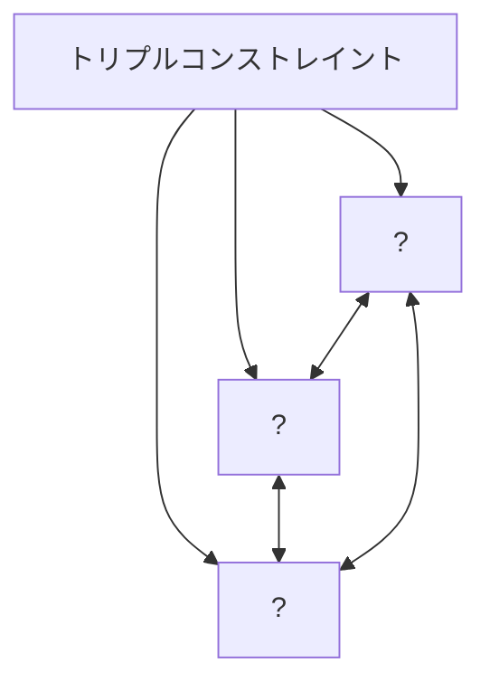
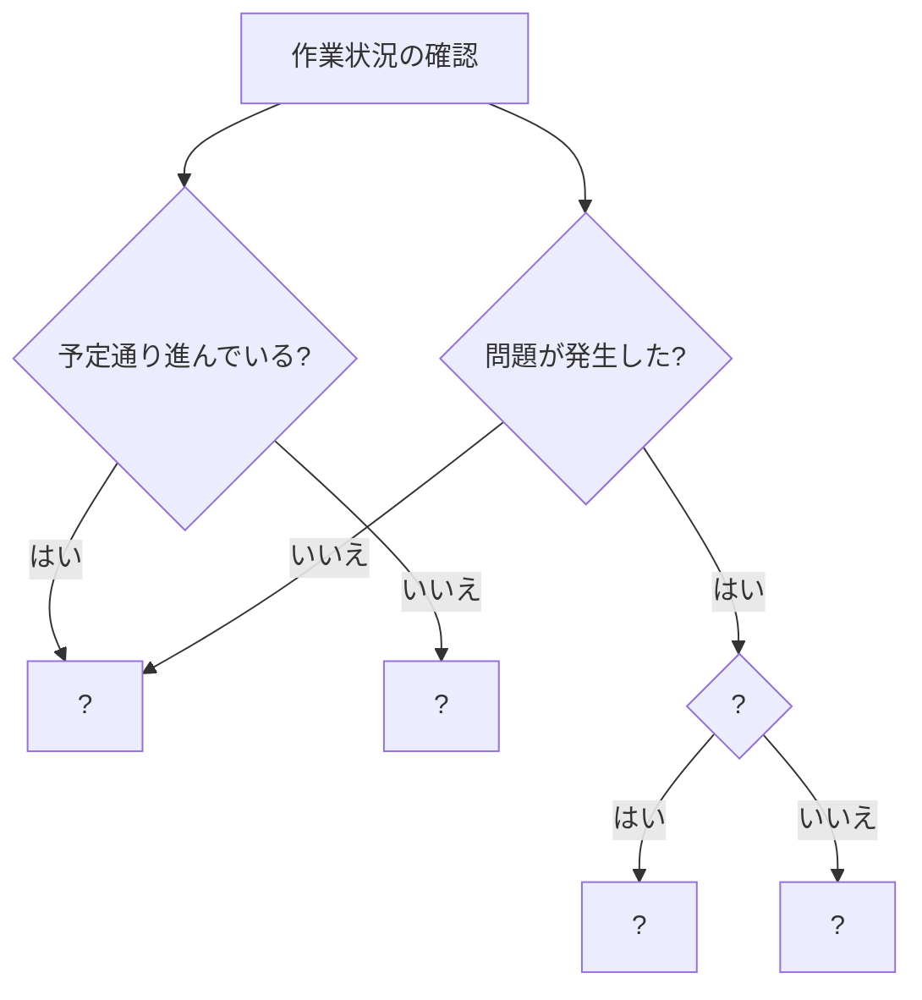

# 🏆 開発プロジェクトのマネジメント冒険者クエスト 1.0.0　- 基本の館 第1章

あなたは今、開発プロジェクトのマネジメントの基本をマスターするための冒険に挑戦しようとしています！

---

## 📋 クエスト(問題)一覧

難易度は⭐の数で表現しています：
- ⭐：見習い冒険者でも挑戦できる基本の試練
- ⭐⭐：一人前の冒険者に求められる応用の試練
- ⭐⭐⭐：熟練冒険者のみが挑める高度な試練

| 🔢 番号 | 📜 クエスト名              | 🎯 難易度 |
| ------- | --------------------- | ------ |
| 1       | 🧩 プロジェクトマネジメントの基本概念 | ⭐    |
| 2       | ⚖️ トリプルコンストレイントの理解   | ⭐⭐   |
| 3       | 🔄 開発プロセスの比較         | ⭐⭐   |
| 4       | 📊 WBSとガントチャートの活用    | ⭐⭐   |
| 5       | 🤝 請負開発とSESの違い       | ⭐⭐   |
| 6       | 📢 報告・連絡・相談の実践      | ⭐    |
| 7       | 📝 効果的な進捗報告         | ⭐    |
| 8       | 🚨 問題発生時の対応         | ⭐⭐   |
| 9       | 🛠️ プロジェクト管理ツールの活用   | ⭐⭐   |
| 10      | 🧠 フォロワーシップの実践      | ⭐⭐⭐  |

---

## 🔥 クエスト詳細（問題）

### **1. 🧩 プロジェクトマネジメントの基本概念**

#### 🎯 学習項目：1.1 プロジェクトとは何か、1.2 プロジェクトマネジメントの目的と重要性

#### 📜 クエスト内容：

あなたは新しく開発チームに配属されたエンジニアです。チームリーダーから「プロジェクトとは何か」について説明するよう求められました。

**設問**:
1. プロジェクトの定義を簡潔に説明してください。
2. 日常業務とプロジェクトの違いを3つ挙げてください。
3. プロジェクトマネジメントの主な目的を3つ説明してください。

---

### **2. ⚖️ トリプルコンストレイントの理解**

#### 🎯 学習項目：1.3 トリプルコンストレイント

#### 📜 クエスト内容：

あなたが参加しているWebアプリケーション開発プロジェクトで、顧客から「当初の要件に追加機能を入れたい」という要望が出されました。プロジェクトマネージャーはトリプルコンストレイントの観点から検討する必要があると言っています。

**設問**:
1. プロジェクトマネジメントにおけるトリプルコンストレイント（三重制約）とは何か説明してください。
2. 以下のシナリオについて、トリプルコンストレイントの観点から考えられる影響と対応策を説明してください。

   a) 納期（リリース日）は変更できない状況で機能追加を行う場合
   b) 予算（開発コスト）は増やせない状況で機能追加を行う場合
   c) 品質を落とさずに機能追加を行う場合

3. 下記のMermaid図を完成させて、トリプルコンストレイントの関係性を表現してください。



---

### **3. 🔄 開発プロセスの比較**

#### 🎯 学習項目：1.4 開発プロセスの理解

#### 📜 クエスト内容：

あなたの会社では新規プロジェクトの開発プロセスを検討しています。ウォーターフォールモデルとアジャイル開発手法のどちらを採用するか議論されています。

**設問**:
1. ウォーターフォールモデルの特徴と、適している状況を説明してください。
2. アジャイル開発手法（スクラム）の特徴と、適している状況を説明してください。
3. 以下のプロジェクト状況において、どちらの開発プロセスが適しているか、その理由とともに説明してください。

   a) 銀行の基幹システム更新プロジェクト（要件が明確で変更が少ない）
   b) スタートアップ企業の新規モバイルアプリ開発（要件が流動的で市場の反応を見ながら調整が必要）
   c) 既存システムの保守・運用プロジェクト（小規模な改修が定期的に発生）

---

### **4. 📊 WBSとガントチャートの活用**

#### 🎯 学習項目：1.5 プロジェクト計画の基礎

#### 📜 クエスト内容：

あなたは小規模なWebサイト開発プロジェクトのメンバーとして参加することになりました。プロジェクトマネージャーからWBSとガントチャートの作成を手伝うよう依頼されました。

**設問**:
1. WBS（Work Breakdown Structure）とは何か、その目的と作成手順を説明してください。
2. 以下のWBSの一部を、さらに詳細な作業に分解してください。

```
1. Webサイト開発
   1.1 要件定義
   1.2 設計
       1.2.1 ?
       1.2.2 ?
       1.2.3 ?
   1.3 実装
       1.3.1 ?
       1.3.2 ?
   1.4 テスト
   1.5 リリース
```

3. WBSとガントチャートの違いを説明し、それぞれがプロジェクト管理においてどのように補完し合うか説明してください。

---

### **5. 🤝 請負開発とSESの違い**

#### 🎯 学習項目：2.1 請負開発とSESの違い、2.2 SESの特徴と基本、2.3 請負開発の特徴と基本

#### 📜 クエスト内容：

あなたは新入社員として、請負開発プロジェクトとSESプロジェクトの両方に参加する可能性があります。上司からそれぞれの違いを理解しておくよう指示されました。

**設問**:
1. 請負開発とSESの契約形態の違いを説明してください。
2. 以下の表を完成させて、請負開発とSESの違いを整理してください。

| 項目 | 請負開発 | SES |
|-----|---------|-----|
| 契約の対象 | ? | ? |
| 責任範囲 | ? | ? |
| 作業場所 | ? | ? |
| 指示命令系統 | ? | ? |
| 報酬体系 | ? | ? |

3. 以下のシナリオにおいて、請負開発とSESのどちらの形態で働いている場合か判断し、その理由を説明してください。

   a) クライアント企業のオフィスで働き、クライアントの社員から直接作業指示を受けている
   b) 自社オフィスで開発を行い、月に1回クライアントに進捗報告を行っている
   c) 作業時間に対して報酬が支払われ、残業代も別途支給される
   d) システム納品後の不具合対応は無償で行う必要がある

---

### **6. 📢 報告・連絡・相談の実践**

#### 🎯 学習項目：3.1 基本的なコミュニケーション、3.3 チーム内コミュニケーション

#### 📜 クエスト内容：

あなたは開発チームの一員として、担当タスクに取り組んでいます。効果的な報告・連絡・相談（報連相）を行うことが求められています。

**設問**:
1. 報告・連絡・相談（報連相）それぞれの目的と重要性を説明してください。
2. 以下のシナリオにおいて、適切な報連相の対応を選択し、その理由を説明してください。

   a) タスクの実装中に仕様の解釈があいまいな点を発見した
   b) 予定より作業が早く終わり、次のタスクに取りかかれそうだ
   c) 担当タスクで技術的な問題が発生し、解決に時間がかかりそうだ
   d) チームメンバーの作業に影響を与える可能性のある変更を行った

3. 下記のフローチャートを完成させて、問題発生時の報告判断プロセスを表現してください。



---

### **7. 📝 効果的な進捗報告**

#### 🎯 学習項目：3.3 チーム内コミュニケーション

#### 📜 クエスト内容：

あなたは週次の進捗報告会議で自分の担当タスクについて報告する必要があります。効果的な進捗報告を行うことが求められています。

**設問**:
1. 効果的な進捗報告に含めるべき要素を5つ挙げてください。
2. 以下の進捗報告の例を評価し、改善点を3つ挙げてください。

```
タスク「ユーザー登録機能の実装」はまだ完了していません。いくつか問題があって時間がかかっています。もう少し時間が必要です。
```

3. 上記の進捗報告を改善し、より効果的な報告の例を作成してください。

---

### **8. 🚨 問題発生時の対応**

#### 🎯 学習項目：3.3 チーム内コミュニケーション

#### 📜 クエスト内容：

あなたが担当しているログイン機能の実装中に、予期せぬエラーが発生し、解決に時間がかかっています。チームリーダーに状況を報告する必要があります。

**設問**:
1. 問題発生時の報告に含めるべき要素を5つ挙げてください。
2. 以下のシナリオに基づいて、チームリーダーへの問題報告メールを作成してください。

```
シナリオ：
- ログイン機能のテスト中に、特定の条件下でデータベース接続エラーが発生
- エラーは本番環境と同じ設定のテスト環境でのみ発生し、開発環境では再現しない
- データベース設定の確認やサーバーの再起動を試したが解決しない
- 現在の影響範囲はログイン機能のみだが、他の機能にも影響する可能性がある
- データベース管理者のサポートが必要と思われる
```

3. 問題解決のために、あなた自身がとるべき行動を3つ挙げてください。

---

### **9. 🛠️ プロジェクト管理ツールの活用**

#### 🎯 学習項目：4.1 プロジェクト管理ツール、4.2 コミュニケーションツール

#### 📜 クエスト内容：

あなたのチームでは、プロジェクト管理とコミュニケーションのために様々なツールを使用しています。これらのツールを効果的に活用することが求められています。

**設問**:
1. 以下のプロジェクト管理ツールの主な用途と活用ポイントを説明してください。
   a) タスク管理ツール（Jira, Trelloなど）
   b) バージョン管理システム（Git）
   c) 文書共有ツール（Confluence, Google Docsなど）

2. 以下のシナリオにおいて、最も適切なコミュニケーションツールとその理由を説明してください。
   a) チーム全体に緊急の情報を共有する必要がある
   b) 複数のステークホルダーを含む正式な会議の議事録を共有する
   c) リモートワーク中のチームメンバーと設計について詳細に議論する
   d) 顧客に月次の進捗報告書を送付する

3. バージョン管理システム（Git）を使用する際の基本的なベストプラクティスを3つ挙げてください。

---

### **10. 🧠 フォロワーシップの実践**

#### 🎯 学習項目：5. フォロワーシップの基本

#### 📜 クエスト内容：

あなたはプロジェクトチームの一員として、リーダーやチームの成功をサポートするフォロワーシップを発揮することが求められています。

**設問**:
1. フォロワーシップとは何か、その重要性を説明してください。
2. 効果的なフォロワーの特徴を5つ挙げてください。
3. 以下のシナリオにおいて、フォロワーシップを発揮するためにあなたがとるべき行動を説明してください。

   a) チームリーダーが多忙で、いくつかの重要な詳細を見落としている可能性がある
   b) チーム内で意見の対立が発生し、プロジェクトの進行が滞っている
   c) 新しいチームメンバーが加わり、環境に慣れるのに苦労している
   d) プロジェクトの方向性に疑問を感じるが、リーダーは現在の計画を進めることに固執している

---

## 📖 冒険者の図書館

- [プロジェクトマネジメント知識体系ガイド（PMBOKガイド）](https://www.pmi.org/pmbok-guide-standards)
- [アジャイル開発の聖典](https://agilemanifesto.org/iso/ja/manifesto.html)
- [開発プロジェクトマネジメントの秘伝書](https://www.ipa.go.jp/jinzai/pm/index.html)
- [チームビルディングの魔法書](https://www.teambuilding.jp/)
- [コミュニケーション術の古代文書](https://www.mindtools.com/pages/main/newMN_CDV.htm)