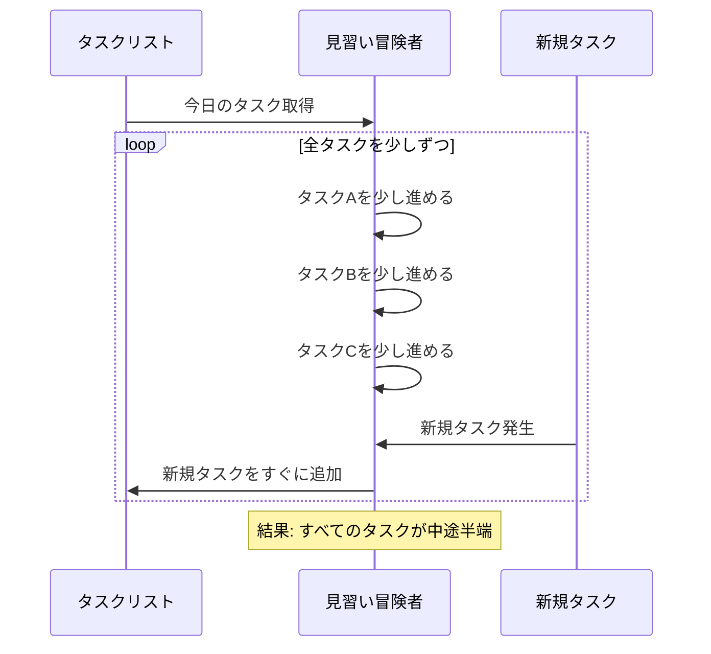
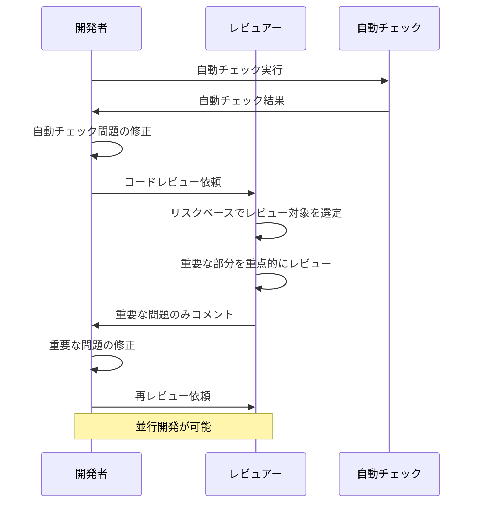
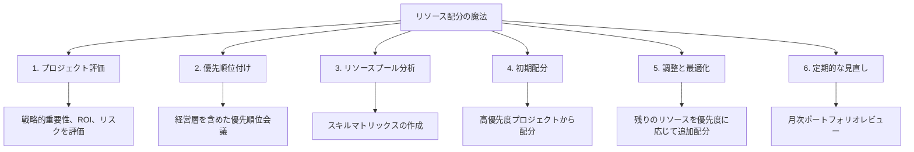

# 🏰 開発プロジェクトのマネジメント冒険者ギルド 1.0.0

開発プロジェクトのマネジメントの知識を深め、達人を目指そう！

本ガイドでは、あなたのスキルレベルに応じたペルソナを設定し、それぞれの冒険を支援する。

## 🌟 冒険者ランク一覧

| 🏅 ランク | 🛡️ 見習い冒険者 | ⚔️ 一般冒険者 | 🔮 伝説の冒険者 |
|------|--------------|---------------|--------------|
| 📅 冒険歴 | 2年目の新米冒険者 | 5年の実戦経験を持つ中堅冒険者 | 17年の豊富な経験を持つ伝説級冒険者 |
| ⌨️ プロジェクト経験値 | 基本的なコーディングと小規模機能の実装 | 中規模プロジェクトのサブリーダー経験あり | 大規模プロジェクトの統括と複数チームの指揮 |
| 🗺️ 探索範囲 | 顧客先での基本的な任務遂行 | 自社内での開発と顧客折衝 | 複数プロジェクトの統括と海外拠点との連携 |
| 📜 品質への執着 | 上司の指示に従って基本的な品質を維持 | 品質基準を設定し、チームの成果物を管理 | 組織全体の品質基準を確立し、継続的改善を推進 |
| 🔍 倒せるモンスターの難易度 | 基本的な開発課題と小規模な機能実装 | 中規模プロジェクトの管理とチームの課題解決 | 複雑な組織変革と戦略的プロジェクト管理 |

## 🛡️ 見習い冒険者のプロフィール

| 項目 | 詳細 |
|------|------|
| **📋 所属ギルド** | 🏢 中堅SIerギルドの新米冒険者<br/>🌱 大学で情報工学の基礎魔法を学んだ<br/>🔧 主に基本設計書に基づくコーディングの任務を担当<br/>🆕 最近、小規模な機能追加の担当者に任命された |
| **🧙‍♂️ 習得した魔法** | ✅ Javaによるバックエンド開発の基本魔法<br/>✅ 基本的なSQL呪文の詠唱<br/>✅ Git操作の初級魔術<br/>✅ チケット管理ツール（Jira）の基本操作 |
| **😅 よくある失敗談** | ❌ 「自分で解決できそうな問題は報告しなくてもいい」と考え、問題が大きくなってから報告<br/>❌ 請負開発とSESの違いを理解せず、責任範囲を誤解<br/>❌ 自分の作業時間を過小評価し、納期に間に合わない<br/>❌ 複数のタスクを並行して進めようとして、どれも中途半端になる |
| **💪 特殊能力** | 🧠 実践を通じて学ぶ吸収力<br/>👀 先輩冒険者の仕事の進め方を観察して学ぶ観察眼<br/>📝 具体的な例やテンプレートがあると理解が早まる特性<br/>🗣️ 対面でのフィードバックから効率的に学べる対話力 |
| **🛠️ 装備品** | 💻 統合開発環境（IDE）の初級モデル<br/>📱 チャットツール（Slack, Microsoft Teams）<br/>📊 タスク管理ツール（Jira）の基本ライセンス<br/>📚 バージョン管理システム（Git）の初級マニュアル |
| **🏆 達成クエスト例** | 🔍 基幹システムの小規模バグ修正<br/>📝 既存機能の軽微な改修<br/>📊 単体テストの実施と結果報告<br/>📑 基本的な議事録作成 |
| **🌠 冒険者の野望** | 🎯 プロジェクトマネジメントの基本概念を理解する<br/>🌍 請負開発とSESの違いを明確に理解する<br/>💬 効果的な報告・連絡・相談の方法を身につける<br/>🧰 基本的なプロジェクト管理ツールを使いこなせるようになる<br/>👥 顧客とのコミュニケーションスキルを向上させる |
| **📖 修行方法** | 📚 公式ドキュメントを読む習慣をつける<br/>🛠️ 実際のプロジェクトで使われているツールの操作を積極的に練習する<br/>👨‍🏫 先輩冒険者のレビューやフィードバックを積極的に受ける<br/>⏱️ ポモドーロテクニックを活用した時間管理<br/>📝 朝一番に今日のタスクリストを作成する習慣をつける |

## ⚔️ 一般冒険者のプロフィール

| 項目 | 詳細 |
|------|------|
| **📋 所属ギルド** | 🏢 中規模開発ギルドの中堅冒険者<br/>🎓 コンピュータサイエンス専攻の大学院で高度な魔法を習得<br/>⚔️ これまでに3つの中規模プロジェクトでサブリーダーを経験<br/>👑 最近、小規模プロジェクト（5人チーム）のリーダーに任命された |
| **🧙‍♂️ 習得した魔法** | ✅ Java/Spring Bootによるバックエンド開発の高度な魔法<br/>✅ データベース設計と最適化の術<br/>✅ CI/CDパイプラインの構築魔術<br/>✅ 基本的なチームマネジメントの指揮術<br/>✅ 要件定義と基本設計の魔導書作成術 |
| **😅 よくある失敗談** | ❌ チームの能力にばらつきがあるのに一律の見積もりをしてしまう<br/>❌ リスク要因を十分に考慮せず、予期せぬ障害に対応できない<br/>❌ 過去の類似プロジェクトの実績を過信して見積もりを誤る<br/>❌ 品質を重視するあまり納期が遅れがちになる<br/>❌ コードレビューに時間がかかりすぎて開発速度が落ちる |
| **💪 特殊能力** | 🧩 実践的なケーススタディから学ぶ分析力<br/>🤝 他のプロジェクトマネージャーとの情報交換から知見を得る交流術<br/>📊 データと分析に基づいた意思決定能力<br/>⚡ 短期間で実践できる具体的なテクニックを習得する適応力 |
| **🛠️ 装備品** | 💻 高性能開発環境一式<br/>📊 プロジェクト管理ツールの上位ライセンス<br/>📈 リスク管理と課題追跡システム<br/>🔄 CI/CDパイプラインの自動化ツール<br/>📝 要件定義と設計のテンプレート集 |
| **🏆 達成クエスト例** | 🏗️ 中規模Webアプリケーションの設計と実装<br/>👥 5人チームのリーダーとしてのプロジェクト完遂<br/>📝 要件定義書の作成と顧客承認の獲得<br/>🔄 CI/CDパイプラインの構築と運用<br/>🛡️ 品質保証プロセスの確立 |
| **🌠 冒険者の野望** | 🎯 効果的なプロジェクト計画と管理手法を習得する<br/>👥 チームビルディングとモチベーション管理のスキルを向上させる<br/>💎 品質管理プロセスを確立し、効率的に運用する<br/>🛡️ リスク管理と課題管理の体系的アプローチを学ぶ<br/>🤝 顧客との効果的な交渉と期待値管理を身につける |
| **📖 修行方法** | 🗓️ チームミーティングには必ずアジェンダを用意し、目的を明確にする<br/>⏱️ タイムボックスを使い、議論が脱線しないよう管理する<br/>📜 リスク登録簿を作成し、定期的に更新する<br/>👑 「リスクオーナー」を指名し、各リスクへの対応責任を明確にする<br/>🔍 コードレビューの効率化と品質向上の両立を図る |

## 🔮 伝説の冒険者のプロフィール

| 項目 | 詳細 |
|------|------|
| **📋 所属ギルド** | 🏯 大規模プロジェクト統括ギルドの長老級冒険者<br/>🌍 大手SIerで10年間の修行後、現在のギルドで7年目<br/>👑 大規模プロジェクト（30人以上）の指揮官を複数経験<br/>📜 PMPなどの国際的な資格を保有する知識の体現者<br/>🏛️ ギルド内のPMO（プロジェクトマネジメントオフィス）の創設者 |
| **🧙‍♂️ 習得した魔法** | ✅ 複数プロジェクトの統括管理の大魔法<br/>✅ 高度な顧客折衝と契約交渉の術<br/>✅ 組織的なプロセス改善の推進魔法<br/>✅ 人材育成とチーム構築の奥義<br/>✅ ビジネス戦略とプロジェクト戦略の連携術 |
| **😅 よくある失敗談** | ❌ 変革への抵抗に効果的に対処できず、組織変革が停滞する<br/>❌ 変革の成果を定量的に示せず、経営層の継続的なコミットメントを失う<br/>❌ 限られたリソースを複数プロジェクトに最適配分できず、競合が発生する<br/>❌ プロジェクト間の優先順位付けの客観的基準を確立できない<br/>❌ 文化的差異によるコミュニケーション課題を解決できず、グローバルプロジェクトが遅延する |
| **💪 特殊能力** | 🧠 戦略的思考と体系的アプローチによる問題解決能力<br/>📚 他社のベストプラクティスやケーススタディから学ぶ洞察力<br/>💼 経営的視点とプロジェクト管理を統合する全体最適化能力<br/>👨‍🏫 メンターとしての役割も担いながら学び続ける成長マインド |
| **🛠️ 装備品** | 🌐 プロジェクトポートフォリオ管理システム<br/>📊 経営ダッシュボードと戦略マップ<br/>🔄 組織変革管理ツールセット<br/>🌍 グローバルコミュニケーションプラットフォーム<br/>📈 ビジネス価値測定と最適化フレームワーク |
| **🏆 達成クエスト例** | 🏆 30人規模の大型プロジェクトの成功裏の完遂<br/>🌐 グローバル分散開発チームの効果的な統括<br/>🏛️ 組織PMOの設立と標準プロセスの確立<br/>💰 戦略的顧客との長期契約の獲得<br/>🔄 全社的なアジャイル開発手法の導入 |
| **🌠 冒険者の野望** | 🎯 組織全体のプロジェクトポートフォリオ管理を最適化する<br/>👑 戦略的な顧客関係管理と高度な交渉スキルを磨く<br/>🔄 組織変革とプロセス改善を効果的に推進する<br/>🌍 グローバルプロジェクト管理の手法を習得する<br/>💰 ビジネス価値を最大化するプロジェクト戦略を構築する |
| **📖 修行方法** | 🔮 顧客の事業目標を深く理解し、技術的解決策を提案する<br/>🗓️ 定期的な戦略レビュー会議を設定し、長期的な協力関係を構築する<br/>🏰 顧客組織の意思決定者との関係を複数レベルで構築する<br/>🦅 チームの自律性を高め、意思決定権限を委譲する<br/>🛡️ 心理的安全性を確保し、失敗から学ぶ文化を醸成する<br/>🔄 定期的なレトロスペクティブを通じて継続的改善を促進する |

## 💻 各レベルの冒険者が書く魔法の違い

### 🛡️ 見習い冒険者の魔法

**進捗報告の魔法**

```
// 🚫 見習い冒険者の曖昧な進捗報告
「タスクはだいたい終わりました」
「あとちょっとです」
「問題なく進んでいます」

// ✅ 効果的な進捗報告の魔法
「タスク名：〇〇機能の実装」
「進捗率：70%」
「ステータス：On Track」
「完了項目：データベース設計、API設計、基本画面レイアウト」
「未完了項目：バリデーション処理、エラーハンドリング、単体テスト」
「ブロッカー/課題：外部APIの仕様が不明確」
```

**タスク管理の魔法**



### ⚔️ 一般冒険者の魔法

**工数見積もりの魔法**

```
// 🚫 一般冒険者の誤った見積もり魔法
「過去の類似タスクの実績をそのまま適用」
「チームメンバー全員に同じ生産性を期待」
「リスク要因を考慮せず楽観的に見積もり」

// ✅ 3点見積法という高度な魔法
「楽観的見積もり (O): 3人日」
「最も可能性の高い見積もり (M): 5人日」
「悲観的見積もり (P): 10人日」
「期待値 (E) = (O + 4M + P) ÷ 6 = 5.5人日」
「標準偏差 (SD) = (P - O) ÷ 6 = 1.17人日」
「85%信頼区間 = E + SD = 6.67人日」
「バッファ含む最終見積もり = 6.6人日」
```

**コードレビューの魔法**



### 🔮 伝説の冒険者の魔法

**組織変革の魔法**

```
// 🚫 伝説の冒険者でも陥りがちな誤った変革魔法
「新しいツールやプロセスを導入すれば変革は成功する」
「トップダウンで変革を押し付ける」
「変革の成功指標を設定しない」

// ✅ 効果的な組織変革の魔法
「変革の必要性と価値を明確に伝える」
「変革チャンピオンを育成し、ボトムアップの参加を促進」
「小さな成功を積み重ね、可視化する」
「明確なKPIを設定し、定期的に測定する」
「人と文化の変革を重視する」
```

**リソース配分の魔法**



## 📚 冒険者のレベルアップ攻略法

### 🛡️→⚔️ 見習いから一般冒険者になるためのクエスト

1. **要件定義の書物解読クエスト**
   - 要件のヒアリング技術を習得し、顧客の真のニーズを引き出せるようになる
   - 要件の優先順位付け（MoSCoW法など）を実践できるようになる
   - 要件定義書を作成し、ステークホルダーと合意形成できるようになる

2. **チーム編成と役割分担の術習得クエスト**
   - チームメンバーのスキル評価ができるようになる
   - 適材適所の人員配置ができるようになる
   - 役割と責任の明確化ができるようになる

3. **品質管理の秘術習得クエスト**
   - 品質基準の設定ができるようになる
   - コードレビューの実施方法を確立できるようになる
   - テスト計画の策定ができるようになる

4. **リスク管理の盾習得クエスト**
   - リスク特定の方法を習得する
   - リスク評価（影響度と発生確率）ができるようになる
   - リスク対応計画を立案できるようになる

### ⚔️→🔮 一般から伝説の冒険者になるためのクエスト

1. **複数プロジェクト統括の大魔法習得クエスト**
   - 複数プロジェクトの優先順位付けができるようになる
   - リソースの最適配分ができるようになる
   - プロジェクト間の依存関係管理ができるようになる

2. **PMO神殿建設クエスト**
   - PMO設立と運営ができるようになる
   - プロジェクト標準化と品質保証の仕組みを確立できるようになる
   - 組織的なプロジェクト支援体制を構築できるようになる

3. **戦略的顧客関係構築の奥義習得クエスト**
   - ステークホルダーマッピングができるようになる
   - 影響力と関心度に基づく対応戦略を立案できるようになる
   - 戦略的パートナーシップの構築ができるようになる

4. **組織変革の魔法習得クエスト**
   - プロセス評価と改善点の特定ができるようになる
   - アジャイル・DevOpsの導入と展開ができるようになる
   - 継続的改善の文化醸成ができるようになる

## 🧙‍♂️ 冒険者訓練所からの秘伝

### 👶 見習い冒険者への伝言

- 🗣️ 「問題を一人で抱え込まず、早めに報告・相談することが冒険の成功への近道」
- 📊 「曖昧な報告は冒険の失敗を招く。具体的な数字と状況で報告しよう」
- 📚 「公式ドキュメントという古代の書物を読む習慣をつけよう。多くの知恵が詰まっている」
- 🛠️ 「実際のプロジェクトで使われている魔法の道具（ツール）の操作を積極的に練習しよう」
- 👨‍🏫 「先輩冒険者のレビューやフィードバックは成長の糧。謙虚に受け止めよう」
- 🗣️ 「顧客との会話では専門用語という難解な呪文を避け、わかりやすい言葉で説明しよう」
- ⏱️ 「ポモドーロテクニックという時間管理の魔法を活用し、効率的に冒険を進めよう」

### 🧙‍♂️ 一般冒険者への伝言

- 🗓️ 「チームミーティングには必ずアジェンダという地図を用意し、目的地を明確にしよう」
- ⏱️ 「タイムボックスという魔法の砂時計を使い、議論が脱線しないよう管理しよう」
- 📜 「リスク登録簿という魔法の書物を作成し、定期的に更新することで危険を予測しよう」
- 👑 「『リスクオーナー』という責任者を指名し、各リスクへの対応責任を明確にしよう」
- 🔍 「コードレビューという魔法の鏡を使って、品質という宝石の輝きを高めよう」
- 🛡️ 「機能性、品質、保守性という3つの視点からコードを評価する目を養おう」
- 🧮 「見積もりは予言ではなく、確率の科学。3点見積法という魔法を使い、不確実性に備えよう」

### 🧙‍♂️ 伝説の冒険者への伝言

- 🔮 「顧客の事業目標という深層の願いを理解し、技術という魔法で解決策を提案しよう」
- 🗓️ 「定期的な戦略レビュー会議という儀式を設け、長期的な協力関係という絆を深めよう」
- 🏰 「顧客組織の意思決定者という城の主との関係を複数レベルで構築し、強固な同盟を結ぼう」
- 🦅 「チームの自律性という翼を広げ、意思決定権限という力を委譲することで、高い空へ飛ばそう」
- 🛡️ 「心理的安全性という盾を確保し、失敗から学ぶ文化という土壌を育てよう」
- 🔄 「定期的なレトロスペクティブという振り返りの儀式を通じて、継続的改善という成長を促そう」
- 🌱 「真の変革は道具ではなく、心と文化から始まる。人々の心に変革の種を植え、小さな成功という水で育てよう」

## 📜 冒険者の図書館

- [プロジェクトマネジメント知識体系ガイド (PMBOK® ガイド)](https://www.pmi.org/pmbok-guide-standards) - 伝説の冒険者たちが編纂した知識の宝庫
- [アジャイルプラクティスガイド](https://www.pmi.org/pmbok-guide-standards/practice-guides/agile) - 俊敏な冒険のための指南書
- [スクラムガイド](https://scrumguides.org/) - スクラムという協働魔法の公式解説書
- [人月の神話](https://www.amazon.co.jp/dp/4621066080/) - 古代の賢者フレデリック・ブルックスの知恵の書
- [熊とワルツを](https://www.amazon.co.jp/dp/4822285243/) - 困難なプロジェクトを乗り切るための伝説の指南書
- [チーム・ジャーニー](https://www.amazon.co.jp/dp/4798163635/) - チーム構築の旅路を照らす灯火

🎉 **さあ、あなたも開発プロジェクトのマネジメントの冒険へ旅立とう！** 🚀