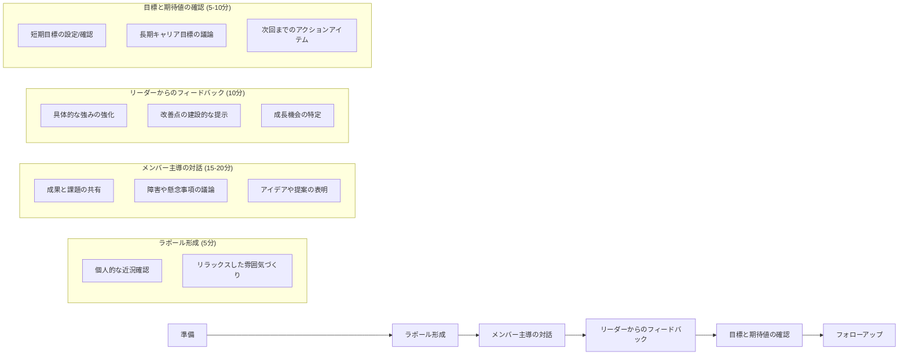
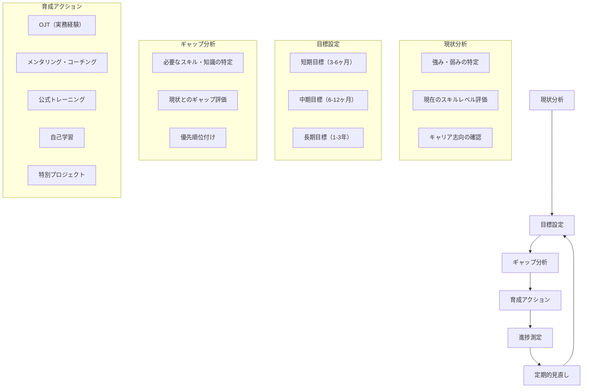

# 🏆 開発プロジェクトのマネジメント学習ロードマップ 1.0.0 - 中級レベル模範解答

ここでは、「開発プロジェクトのマネジメント学習ロードマップ - 中級レベル演習課題」の模範解答を示します。

解答を確認しながら、自分の回答と比較してみましょう！

---

## 🔥 模範解答一覧

難易度は⭐の数で表現しています：
- ⭐：基本的な概念や簡単な実践問題
- ⭐⭐：やや複雑な概念や応用が必要な問題
- ⭐⭐⭐：より高度な思考や総合的な判断が必要な問題
- ⭐⭐⭐⭐：複雑な状況での意思決定や高度な専門知識が必要な問題

| 番号 | 問題名                     | 難易度 |
| --- | -------------------------- | ----- |
| 1   | 工数見積もりの精度向上      | ⭐⭐⭐   |
| 2   | チームビルディング          | ⭐⭐⭐   |
| 3   | 品質管理プロセスの構築      | ⭐⭐⭐⭐  |
| 4   | リスク管理計画の策定        | ⭐⭐⭐   |
| 5   | 変更管理の実践              | ⭐⭐⭐⭐  |
| 6   | 要件定義と分析の実践        | ⭐⭐⭐   |
| 7   | スケジュール管理の実践      | ⭐⭐⭐⭐  |
| 8   | チーム編成と役割分担の最適化 | ⭐⭐⭐   |
| 9   | パフォーマンス管理と1on1ミーティング | ⭐⭐⭐   |
| 10  | 継続的インテグレーション/継続的デリバリー（CI/CD）の導入 | ⭐⭐⭐⭐  |

### **9. パフォーマンス管理と1on1ミーティング** 【難易度: ⭐⭐⭐】

#### ✅ 解答:

1. **効果的な1on1ミーティングの構造と頻度**

**基本設計**:
- **頻度**: 2週間に1回（30-45分）
- **場所**: プライバシーが確保できる静かな環境
- **記録**: 主要な議論点、合意事項、アクションアイテムを記録

**準備すべき項目**:

| 準備項目 | 担当 | 内容 |
|---------|------|------|
| **事前アジェンダ共有** | リーダー | • 前回のフォローアップ項目<br>• 今回のフォーカステーマ<br>• メンバーからの議題希望を収集 |
| **パフォーマンスデータ収集** | リーダー | • タスク完了状況<br>• 品質メトリクス<br>• チーム貢献度<br>• スキル向上の進捗 |
| **自己評価シート** | メンバー | • 成果と課題の自己評価<br>• 直面している障害<br>• 支援が必要な領域<br>• キャリア目標の進捗 |
| **フィードバック準備** | リーダー | • 具体的な事例に基づく建設的フィードバック<br>• 強みの強化と改善点の特定<br>• 次のステップの提案 |

**進行方法**:



2. **各チームメンバーに対する1on1ミーティングのアジェンダ例**

**田中さん（締切を守れないことがある中堅開発者）**:

**重点テーマ**: タスク管理と時間見積もりの改善

```
【アジェンダ】
1. 近況確認と雑談 (5分)
2. 前回のフォローアップ: タスク分割手法の適用結果 (5分)
3. 現在のタスク状況と課題の共有 (10分)
   - 特に見積もりと実績の差異に焦点
   - 予期せぬ障害の特定
4. タイムマネジメント改善のためのフィードバック (10分)
   - 見積もり精度向上のためのテクニック提案
   - 早期警告の重要性と方法
5. 次の2週間の目標設定 (10分)
   - 具体的なタスク管理改善アクション
   - 進捗の可視化方法
6. キャリア目標の進捗確認 (5分)
7. 質問・要望・その他 (5分)
```

**鈴木さん（成長意欲は高いが経験が浅い若手開発者）**:

**重点テーマ**: 技術スキル向上と自信の構築

```
【アジェンダ】
1. 近況確認と雑談 (5分)
2. 前回のフォローアップ: 学習計画の進捗 (5分)
3. 最近の成功体験と学びの共有 (10分)
   - 特に克服した技術的課題
   - 新しく習得したスキル
4. 現在直面している技術的課題 (10分)
   - 具体的な支援ニーズの特定
   - リソースや指導の提供
5. スキル向上のためのフィードバック (5分)
   - 強みの強化方法
   - 効果的な学習アプローチの提案
6. 次の成長ステップの設定 (5分)
   - 短期的な技術目標
   - 挑戦的なタスクの特定
7. メンタリング関係の確認 (5分)
8. 質問・要望・その他 (5分)
```

3. **建設的なフィードバックを与えるためのフレームワークと適用例**

**SBI（Situation-Behavior-Impact）フレームワーク**:

| 要素 | 説明 | ポイント |
|------|------|---------|
| **状況 (Situation)** | いつ、どこで、どのような状況で観察されたかを具体的に説明 | • 特定の時間、場所、コンテキスト<br>• 客観的な事実<br>• 最近の具体的な例 |
| **行動 (Behavior)** | その状況で観察された具体的な行動を説明 | • 観察可能な行動に焦点<br>• 主観的な解釈を避ける<br>• 具体的な言動や行為 |
| **影響 (Impact)** | その行動がチーム、プロジェクト、個人に与えた影響を説明 | • 具体的な結果や影響<br>• 感情的な影響も含む<br>• 建設的な視点で伝える |

**田中さんの納期遅延問題への適用例**:

```
【状況 (Situation)】
「先週のログイン機能実装タスクで、当初の見積もりが3日だったのに対して、実際には5日かかりました。特に、認証部分の実装で予想外の問題が発生したようでした。」

【行動 (Behavior)】
「問題が発生した時点で報告がなく、納期の2日前になって初めて遅延の可能性を共有されました。また、見積もり段階で認証部分の複雑さを考慮していなかったようです。」

【影響 (Impact)】
「その結果、依存関係のあるUI実装チームの作業開始が遅れ、全体のスケジュールに影響が出ました。また、急遽リソースの再配置が必要になり、他のタスクにも波及効果がありました。」

【建設的な提案】
「今後は、タスクをより小さな単位に分解して見積もりの精度を上げること、そして問題が発生した時点で早めに共有することで、チーム全体で対応策を考えられるようにしましょう。具体的には、1日単位のサブタスクに分解し、毎日の進捗を簡潔に報告する習慣をつけてみてはどうでしょうか。また、技術的な不確実性が高い部分は、事前に短いスパイク期間を設けて検証するアプローチも効果的だと思います。あなたの技術力は高く評価していますので、この時間管理のスキルが向上すれば、さらに大きな貢献ができるようになると確信しています。」
```

4. **チーム全体のパフォーマンスを向上させるための指標（KPI）**

| KPI | 定義 | 測定方法 | 目標値 |
|-----|------|---------|-------|
| **納期遵守率** | 予定通りに完了したタスクの割合 | タスク管理ツールから、完了予定日と実際の完了日を比較して計算<br>納期遵守率 = (期限内に完了したタスク数 ÷ 全完了タスク数) × 100% | 90%以上 |
| **コード品質スコア** | 静的解析ツールによるコード品質の評価 | SonarQubeなどの静的解析ツールを使用して測定<br>コードスメル、重複、複雑度、テストカバレッジなどの複合指標 | A評価以上<br>（ツールの評価基準による） |
| **バグ再発率** | 同じ種類のバグが再発する割合 | バグ追跡システムから分類とタグ付けを行い計算<br>バグ再発率 = (再発バグ数 ÷ 全バグ数) × 100% | 10%以下 |
| **知識共有活動指標** | チーム内での知識共有活動の頻度と参加度 | 技術共有セッション、ペアプログラミング、コードレビュー、ドキュメント作成などの活動を記録<br>活動ポイント = 各活動の重み付け合計 | チームメンバー平均<br>月間20ポイント以上 |
| **チーム満足度** | チームメンバーの満足度と帰属意識 | 月次の匿名アンケートで5段階評価<br>• 仕事の満足度<br>• チームの協力関係<br>• 成長実感<br>• 貢献実感<br>• ワークライフバランス | 4.0/5.0以上 |

5. **個別育成計画の枠組みと鈴木さんの具体的育成計画**

**個別育成計画の枠組み**:



**鈴木さんの具体的育成計画**:

**現状分析**:
- **強み**: 成長意欲が高い、基本的な技術知識がある、学習能力が高い
- **弱み**: 実践的な経験が浅い、複雑な問題解決経験が少ない、自信不足
- **現在のスキルレベル**: JavaScript/React（初級〜中級）、バックエンド連携（初級）、テスト（初級）
- **キャリア志向**: フロントエンド専門家として成長し、将来的にはリード職を目指したい

**目標設定**:
- **短期目標（3ヶ月）**:
  - React中級レベルの技術習得（状態管理、パフォーマンス最適化）
  - 単独での小規模機能実装が完遂できる
  - 基本的なユニットテスト作成スキルの習得
- **中期目標（6-12ヶ月）**:
  - React上級レベルへの到達（高度なパターン、アーキテクチャ）
  - バックエンド連携の理解と実装スキルの向上
  - 小規模機能のリード経験
- **長期目標（1-3年）**:
  - フロントエンド技術スペシャリストとしての確立
  - 技術選定や設計判断ができるレベルへの成長
  - メンタリングスキルの獲得

**育成アクション計画**:

| 期間 | OJT（実務経験） | メンタリング・コーチング | 公式トレーニング | 自己学習 | 特別プロジェクト |
|------|---------------|----------------------|--------------|---------|--------------|
| **1-3ヶ月目** | • 既存コンポーネントの改修タスク<br>• 単体テスト作成タスク | • 週1回のBさんとのペアプログラミング<br>• 2週間に1回の1on1ミーティング | • React中級者向けオンラインコース受講 | • 「React Design Patterns」書籍学習<br>• Jest公式チュートリアル | • チーム内ミニライブラリの開発 |
| **4-6ヶ月目** | • 新規コンポーネント開発<br>• API連携機能実装 | • コードレビューでの重点指導<br>• 技術共有セッションでの発表 | • フロントエンドパフォーマンス最適化ワークショップ | • パフォーマンス最適化技術の調査<br>• アクセシビリティガイドラインの学習 | • パフォーマンス改善プロジェクト |
| **7-12ヶ月目** | • 小規模機能のリード経験<br>• 技術検証タスク | • 他メンバーへの知識共有<br>• 外部メンターとの定期面談 | • React上級者向けカンファレンス参加 | • アーキテクチャパターンの研究<br>• 技術ブログの執筆 | • 新機能のプロトタイプ開発 |

#### 🔍 解説:

パフォーマンス管理と1on1ミーティングは、チームメンバーの成長と成果を促進するための重要なプロセスです。効果的な1on1ミーティングの設計、個別アプローチの適用、建設的なフィードバックの提供、適切なKPIの設定、個別育成計画の策定を通じて、チーム全体のパフォーマンス向上と個人の成長を実現することができます。

効果的な1on1ミーティングの構造と頻度では、2週間に1回の30-45分のミーティングを基本設計とし、事前アジェンダ共有、パフォーマンスデータ収集、自己評価シート、フィードバック準備などの準備項目を明確にしています。また、ラポール形成、メンバー主導の対話、リーダーからのフィードバック、目標と期待値の確認、フォローアップという進行方法を示し、効果的なコミュニケーションと信頼関係の構築を促進します。

各チームメンバーに対する1on1ミーティングのアジェンダ例では、田中さん（締切を守れない中堅開発者）、鈴木さん（成長意欲の高い若手）など、多様なメンバーに対して、それぞれの状況に応じた重点テーマと具体的なアジェンダを設計しています。これにより、個々のニーズに合わせた支援と成長促進が可能になります。

建設的なフィードバックを与えるためのフレームワークとして、SBI（Situation-Behavior-Impact）フレームワークを採用し、田中さんの納期遅延問題に適用した具体例を示しています。状況、行動、影響を明確に分けて伝え、最後に建設的な提案を加えることで、防衛反応を最小限に抑えつつ、行動変容を促す効果的なフィードバックが可能になります。

チーム全体のパフォーマンスを向上させるための指標（KPI）としては、納期遵守率、コード品質スコア、バグ再発率、知識共有活動指標、チーム満足度の5つを設定し、それぞれの定義、測定方法、目標値を明確にしています。これらの指標を定期的にモニタリングすることで、チームの状態を客観的に把握し、改善につなげることができます。

個別育成計画の枠組みと鈴木さんの具体的育成計画では、現状分析、目標設定、ギャップ分析、育成アクション、進捗測定、定期的見直しというサイクルを示し、鈴木さんの具体的な育成計画として、現状分析、目標設定、ギャップ分析、育成アクション計画の詳細を提示しています。これにより、計画的かつ体系的な人材育成が可能になります。

## 📖 参考資料

- [プロジェクトマネジメント知識体系ガイド（PMBOK®ガイド）第7版](https://www.pmi.org/pmbok-guide-standards)
- [エンジニアのためのマネジメントキャリアパス](https://www.oreilly.co.jp/books/9784873118482/)
- [1on1ミーティング - 部下との信頼関係を築く技術](https://www.amazon.co.jp/dp/4761273720/)
- [ハイパフォーマンスチームの作り方](https://www.amazon.co.jp/dp/4822255646/)
- [フィードバックの技術](https://www.amazon.co.jp/dp/4761271760/)
