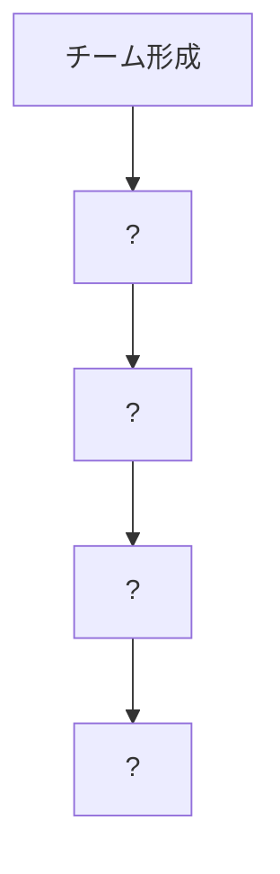
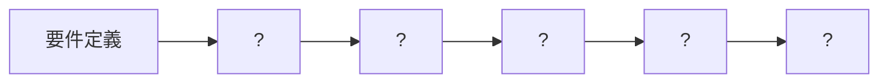
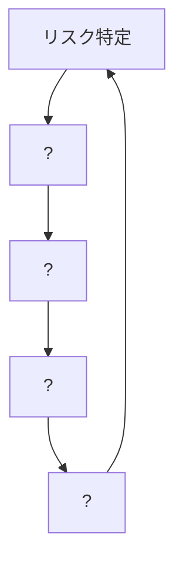
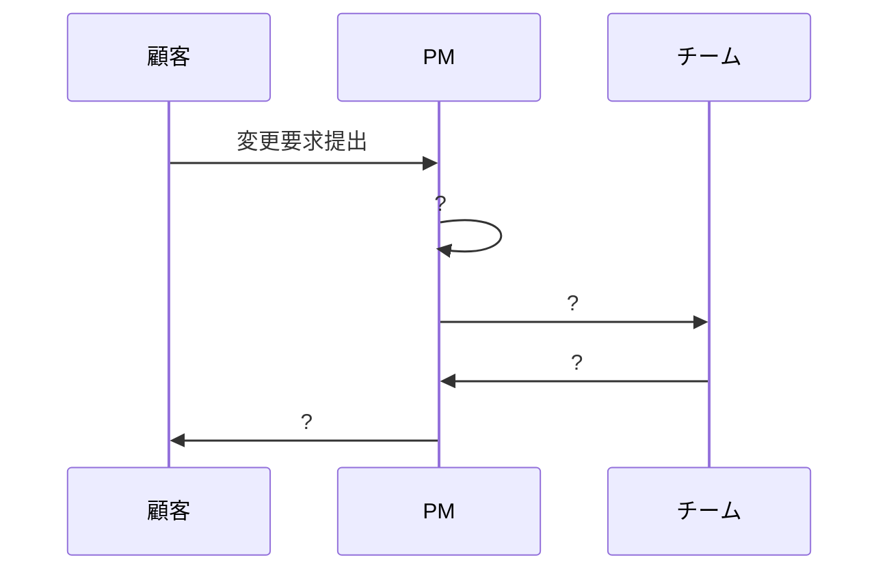
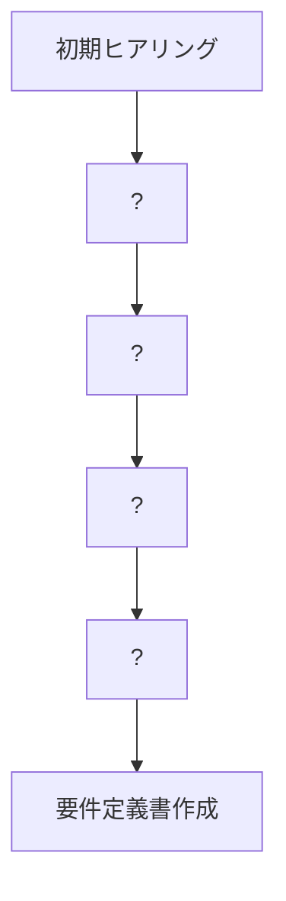
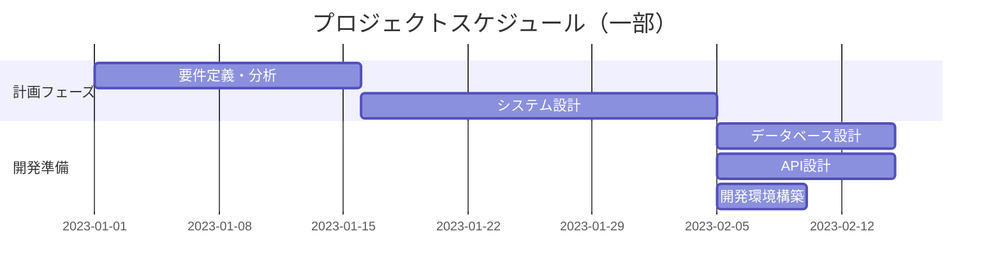
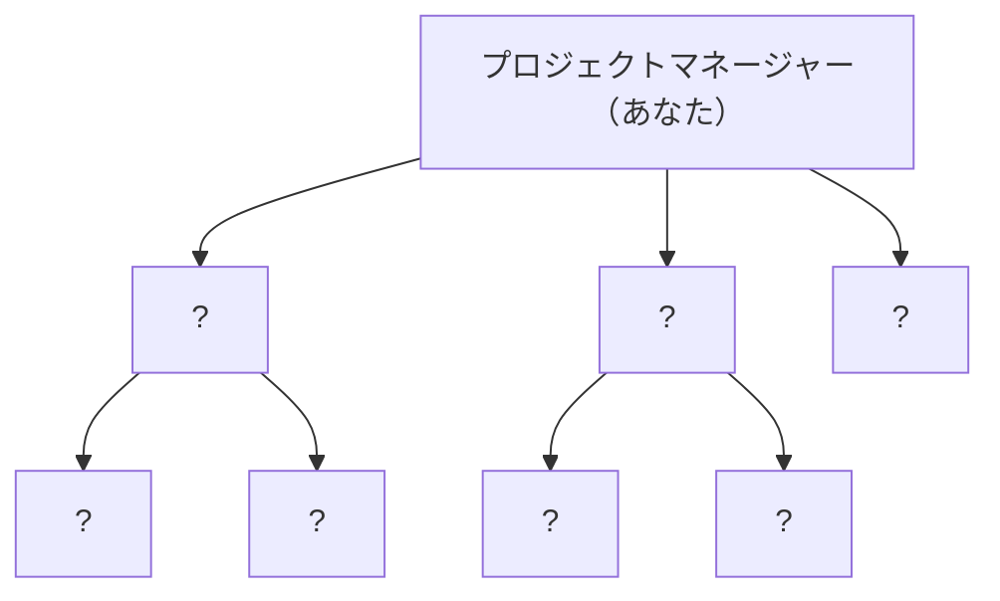
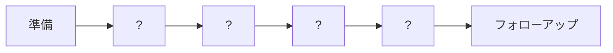

# 🏆 開発プロジェクトのマネジメント学習ロードマップ 1.0.0 - 中級レベル演習課題

あなたは今、開発プロジェクトのマネジメントの中級スキルをマスターするための冒険に挑戦しようとしています！

---

## 📋 クエスト(問題)一覧

難易度は⭐の数で表現しています：
- ⭐：基本的な概念や簡単な実践問題
- ⭐⭐：やや複雑な概念や応用が必要な問題
- ⭐⭐⭐：より高度な思考や総合的な判断が必要な問題
- ⭐⭐⭐⭐：複雑な状況での意思決定や高度な専門知識が必要な問題

| 🔢 番号 | 📜 クエスト名                     | 🎯 難易度 |
| ------- | ------------------------------ | ------ |
| 1       | 📊 工数見積もりの精度向上           | ⭐⭐⭐    |
| 2       | 👥 チームビルディング              | ⭐⭐⭐    |
| 3       | 🔍 品質管理プロセスの構築           | ⭐⭐⭐⭐   |
| 4       | ⚠️ リスク管理計画の策定            | ⭐⭐⭐    |
| 5       | 🔄 変更管理の実践                 | ⭐⭐⭐⭐   |
| 6       | 📝 要件定義と分析の実践            | ⭐⭐⭐    |
| 7       | ⏱️ スケジュール管理の実践           | ⭐⭐⭐⭐   |
| 8       | 👨‍💼 チーム編成と役割分担の最適化     | ⭐⭐⭐    |
| 9       | 📈 パフォーマンス管理と1on1ミーティング | ⭐⭐⭐    |
| 10      | 🔄 継続的インテグレーション/継続的デリバリー（CI/CD）の導入 | ⭐⭐⭐⭐   |

---

## 🔥 クエスト詳細（問題）

### **1. 📊 工数見積もりの精度向上**

#### 🎯 学習項目：プロジェクト計画の詳細化、見積もり作成の方法

#### 📜 クエスト内容：

あなたは請負開発の小規模プロジェクト（5人チーム）のリーダーとして、新規プロジェクトの工数見積もりを行うことになりました。このプロジェクトは、既存の顧客管理システムに新機能を追加するものです。

以下の情報をもとに、3点見積法を用いて工数を算出し、見積もりの精度を向上させるための方法を検討してください。

**プロジェクト情報：**
- 新機能：顧客の購買履歴分析機能
- 主な機能要件：
  1. 顧客ごとの購買傾向グラフ表示
  2. 商品カテゴリ別の購入頻度分析
  3. 購買パターンのレポート出力
- チームメンバー構成：
  - プロジェクトリーダー（あなた）：経験5年
  - 設計担当：経験3年
  - 開発者A：経験4年
  - 開発者B：経験1年
  - テスター：経験2年

**過去の類似機能開発実績：**
- 顧客情報検索機能：15人日
- レポート出力機能：10人日
- グラフ表示機能：12人日

**設問：**
1. 3点見積法を用いて、このプロジェクトの工数を算出してください。楽観的見積もり、最も可能性の高い見積もり、悲観的見積もりを考慮し、期待値と標準偏差を計算してください。
2. 見積もりの精度を向上させるために、あなたが実施すべき5つの具体的なアクションをリストアップしてください。
3. チームメンバーのスキルレベルの差異を考慮した工数調整の方法を説明してください。

---

### **2. 👥 チームビルディング**

#### 🎯 学習項目：チームビルディング、モチベーション管理、コンフリクト解決

#### 📜 クエスト内容：

あなたは新しく結成された開発チームのリーダーに任命されました。チームは以下のメンバーで構成されています：

- Aさん：技術力は高いが、コミュニケーションが苦手で一匹狼タイプ
- Bさん：経験は浅いが、学習意欲が高く、チームワークを重視する
- Cさん：中堅で安定した技術力があるが、新しい技術への抵抗感がある
- Dさん：SESとして客先常駐経験が長く、チームへの帰属意識が薄い
- Eさん：品質にこだわりが強く、納期よりも完璧さを優先しがち

プロジェクトは6ヶ月の開発期間で、新規Webアプリケーションの開発です。チームのパフォーマンスを最大化し、メンバー間の協力関係を構築するための戦略を立ててください。

**設問：**
1. チームの現状分析として、このチームの強みと課題を図示してください。
2. チームビルディングのための具体的な活動計画を、フェーズ別（立ち上げ期、実行期、終了期）に作成してください。
3. 各メンバーのモチベーションを高めるための個別アプローチを提案してください。
4. チーム内で発生しうるコンフリクトのシナリオを2つ挙げ、その解決策を説明してください。

以下のMermaid記法を使用して、チームビルディングのプロセスを図示してください：

---

### **3. 🔍 品質管理プロセスの構築**

#### 🎯 学習項目：品質保証プロセス、コードレビュー、テスト計画

#### 📜 クエスト内容：

あなたは請負開発プロジェクトの品質管理責任者として、効率的かつ効果的な品質管理プロセスを構築する任務を与えられました。プロジェクトは以下の特徴を持っています：

- Webアプリケーション開発（フロントエンド＋バックエンド）
- 開発期間：4ヶ月
- チーム規模：8名（設計2名、開発5名、テスト1名）
- 顧客要求：高い品質と安定性、セキュリティ対策の徹底

現在、以下の課題があります：
- コードレビューに時間がかかりすぎている
- テスト工程が後回しになりがち
- 品質基準が明確に定義されていない
- 開発速度と品質のバランスが取れていない

**設問：**
1. このプロジェクトに適した品質管理プロセスの全体像を図示してください。
2. 効率的なコードレビュープロセスを設計し、レビューチェックリストを作成してください。
3. テスト戦略を立案し、テストの種類、実施タイミング、担当者を明確にしてください。
4. 品質メトリクスを定義し、どのように測定・モニタリングするかを説明してください。
5. 開発速度と品質のバランスを取るための具体的な施策を3つ提案してください。

以下のMermaid記法を使用して、品質管理プロセスのフローを図示してください：

---

### **4. ⚠️ リスク管理計画の策定**

#### 🎯 学習項目：リスク管理、リスク評価、リスク対応計画

#### 📜 クエスト内容：

あなたは新規プロジェクトのリスク管理担当者として、プロジェクト開始前にリスク管理計画を策定することになりました。プロジェクトの概要は以下の通りです：

- プロジェクト名：金融機関向け顧客情報管理システムリプレイス
- 期間：10ヶ月
- 予算：8,000万円
- チーム構成：15名（PM、設計者、開発者、テスター、インフラ担当）
- 特徴：
  - レガシーシステムからの移行を含む
  - 厳格なセキュリティ要件あり
  - 複数の外部システムとの連携あり
  - 稼働中システムからの切り替えが必要

**設問：**
1. このプロジェクトで想定されるリスクを、カテゴリ別（技術的リスク、スケジュールリスク、リソースリスク、外部依存リスク、ビジネスリスク）に特定してください。
2. 特定したリスクの影響度と発生確率を評価し、リスクマトリックスを作成してください。
3. 優先度の高いリスク（上位5つ）に対する対応計画を、「回避」「転嫁」「軽減」「受容」の4つの戦略に基づいて立案してください。
4. リスクモニタリングの方法と頻度を提案してください。
5. リスクが顕在化した場合のエスカレーションプロセスを図示してください。

以下のMermaid記法を使用して、リスク管理プロセスを図示してください：

---

### **5. 🔄 変更管理の実践**

#### 🎯 学習項目：変更管理、スコープ変更の管理、変更要求の評価プロセス

#### 📜 クエスト内容：

あなたは進行中のプロジェクトのプロジェクトマネージャーとして、以下の変更要求に対応することになりました。プロジェクトは現在、全体の60%が完了しており、予定通りのスケジュールと予算で進行しています。

**プロジェクト情報：**
- ECサイトリニューアルプロジェクト
- 残りの期間：2ヶ月
- 残りの予算：1,200万円
- 現在のスコープ：
  - 商品検索・表示機能
  - 会員管理機能
  - 注文処理機能
  - 支払い処理機能
  - 管理者向け商品管理機能

**変更要求：**
1. スマートフォンアプリとの連携機能の追加（見積工数：20人日）
2. 商品レコメンド機能の実装（見積工数：15人日）
3. 多言語対応（英語・中国語）の追加（見積工数：25人日）
4. 既存の支払い処理機能の仕様変更（見積工数：10人日）

**設問：**
1. 各変更要求の影響分析（スケジュール、コスト、品質、リソースへの影響）を行ってください。
2. 変更要求の評価基準を定義し、各要求を評価してください。
3. 変更要求の優先順位付けを行い、受け入れるべき変更と延期/拒否すべき変更を判断してください。
4. 変更を受け入れる場合の対応計画（スケジュール調整、リソース配分、コスト調整）を立案してください。
5. 顧客との変更交渉のシナリオを作成してください。

以下のMermaid記法を使用して、変更管理プロセスを図示してください：

---

### **6. 📝 要件定義と分析の実践**

#### 🎯 学習項目：要件定義と分析、要件のヒアリング技術、要件の優先順位付け

#### 📜 クエスト内容：

あなたは新規開発プロジェクトの要件定義フェーズを担当するプロジェクトリーダーです。クライアントは大手小売チェーンで、店舗の在庫管理システムを刷新したいと考えています。初回のヒアリングで以下の情報を得ました。

**クライアントからの要望（抜粋）：**
- 「現在の在庫管理システムは古く、操作が複雑で時間がかかる」
- 「店舗スタッフがもっと簡単に在庫を確認・発注できるようにしたい」
- 「本部でリアルタイムに全店舗の在庫状況を把握したい」
- 「季節商品の需要予測に基づいた発注提案があるとよい」
- 「モバイル端末からも操作できるとよい」
- 「将来的には顧客向けアプリと連携させて、店舗在庫の確認ができるようにしたい」
- 「できるだけ早く導入したいが、予算は限られている」

**設問：**
1. 上記の情報をもとに、追加でヒアリングすべき項目を5つ挙げ、その理由を説明してください。
2. 要件を機能要件と非機能要件に分類し、それぞれ優先順位付け（MoSCoW法：Must, Should, Could, Won't）を行ってください。
3. 要件定義プロセスの全体像を図示し、各ステップでの成果物と注意点を説明してください。
4. 要件の曖昧さや矛盾を特定するための技法を3つ提案し、このプロジェクトでの適用例を示してください。
5. 要件定義書のテンプレートを作成し、主要なセクションとその内容を説明してください。

以下のMermaid記法を使用して、要件定義プロセスを図示してください：

---

### **7. ⏱️ スケジュール管理の実践**

#### 🎯 学習項目：スケジュール管理、クリティカルパスの特定と管理、マイルストーン設定と進捗管理

#### 📜 クエスト内容：

あなたはWebアプリケーション開発プロジェクトのプロジェクトマネージャーです。プロジェクトは以下の特性を持っています：

**プロジェクト情報：**
- 開発期間：6ヶ月
- チーム構成：10名（PM、設計者2名、フロントエンド開発者3名、バックエンド開発者3名、テスター1名）
- 主要機能：ユーザー管理、コンテンツ管理、分析ダッシュボード、API連携
- 制約条件：特定の機能は外部ベンダーの提供するAPIに依存

**タスクリスト（主要タスクと見積もり工数）：**
1. 要件定義・分析（15日、先行タスクなし）
2. システム設計（20日、タスク1の完了後）
3. データベース設計（10日、タスク2の完了後）
4. API設計（10日、タスク2の完了後）
5. フロントエンド開発環境構築（5日、タスク2の完了後）
6. バックエンド開発環境構築（5日、タスク2の完了後）
7. ユーザー管理機能開発（15日、タスク3, 6の完了後）
8. コンテンツ管理機能開発（20日、タスク3, 6の完了後）
9. 外部API連携開発（15日、タスク4, 6の完了後）
10. 分析ダッシュボード開発（25日、タスク5, 9の完了後）
11. フロントエンドUI実装（30日、タスク5, 7, 8の完了後）
12. 単体テスト（各機能の開発と並行）
13. 結合テスト（15日、タスク7, 8, 9, 10, 11の完了後）
14. システムテスト（10日、タスク13の完了後）
15. ユーザー受入テスト（10日、タスク14の完了後）
16. 本番環境構築・デプロイ（5日、タスク14と並行可能）
17. トレーニング・マニュアル作成（10日、タスク11の完了後、タスク15と並行可能）

**設問：**
1. 上記のタスクリストをもとに、プロジェクトのクリティカルパスを特定してください。
2. プロジェクトの主要なマイルストーンを5つ設定し、その理由を説明してください。
3. 進捗管理のためのダッシュボードを設計し、含めるべき主要な指標と可視化方法を提案してください。
4. スケジュールの遅延リスクを早期に発見するための「早期警戒指標」を3つ定義し、モニタリング方法を説明してください。
5. 実際に遅延が発生した場合の対応策を、「スコープ」「スケジュール」「リソース」の3つの観点から提案してください。

以下のMermaid記法を使用して、ガントチャートの一部を図示してください：

---

### **8. 👨‍💼 チーム編成と役割分担の最適化**

#### 🎯 学習項目：チーム編成と役割分担、適材適所の人員配置、役割と責任の明確化

#### 📜 クエスト内容：

あなたは新規プロジェクトのプロジェクトマネージャーとして、チーム編成と役割分担を行うことになりました。プロジェクトとチームメンバーの情報は以下の通りです。

**プロジェクト情報：**
- プロジェクト名：金融機関向けモバイルバンキングアプリ開発
- 期間：8ヶ月
- 主要技術：React Native（フロントエンド）、Java Spring Boot（バックエンド）、AWS（インフラ）
- 特徴：セキュリティ要件が厳格、複数の外部システム連携あり

**利用可能なチームメンバー情報：**

| ID | 役職 | 経験年数 | 技術スキル | 強み | 弱み | 希望 |
|----|------|---------|------------|------|------|------|
| A | シニア開発者 | 8年 | Java, Spring, DB設計 | アーキテクチャ設計, パフォーマンスチューニング | UI/UX, ドキュメント作成 | 技術的な挑戦を求める |
| B | 中堅開発者 | 5年 | React, React Native, JavaScript | UI実装, ユーザー体験設計 | バックエンド, インフラ | モバイルアプリ開発に携わりたい |
| C | 若手開発者 | 2年 | Java, JavaScript, HTML/CSS | 学習意欲, コミュニケーション | 設計経験不足 | 幅広いスキルを身につけたい |
| D | インフラエンジニア | 6年 | AWS, Docker, CI/CD | 自動化, セキュリティ対策 | アプリケーション開発 | クラウドネイティブな環境構築 |
| E | テストエンジニア | 4年 | テスト設計, 自動化テスト, 性能テスト | 品質管理, バグ発見 | 開発スキル | セキュリティテストを学びたい |
| F | UI/UXデザイナー | 3年 | Figma, Adobe XD, ユーザーリサーチ | ビジュアルデザイン, プロトタイピング | 技術的な実装知識 | 金融アプリのUX向上に貢献したい |
| G | 若手開発者 | 1年 | JavaScript, React | フロントエンド開発, 勉強熱心 | 経験不足, 設計スキル | モバイルアプリ開発を学びたい |
| H | プロジェクトサポート | 7年 | ドキュメント管理, 調整業務, 品質管理 | 段取り, コミュニケーション | 技術スキル | プロジェクト全体を支援したい |

**設問：**
1. 上記のメンバー情報をもとに、最適なチーム編成と役割分担を提案してください。役割には、技術リード、アーキテクト、開発者、テスター、スクラムマスター（またはチームリード）などを含めてください。
2. チーム編成の根拠となる考え方と、各メンバーの配置理由を説明してください。
3. チーム内のスキルギャップを特定し、それを埋めるための対策を提案してください。
4. 役割と責任を明確にするためのRACI（Responsible, Accountable, Consulted, Informed）マトリックスを作成してください。主要なプロジェクト活動に対して、誰がどの役割を担うかを示してください。
5. チームの成長と学習を促進するための具体的な施策を3つ提案してください。

以下のMermaid記法を使用して、チーム構成と報告ラインを図示してください：

---

### **9. 📈 パフォーマンス管理と1on1ミーティング**

#### 🎯 学習項目：パフォーマンス管理、1on1ミーティングの実施、フィードバックの与え方

#### 📜 クエスト内容：

あなたはソフトウェア開発チームのリーダーとして、チームメンバーのパフォーマンス管理と育成に取り組んでいます。チームは以下のメンバーで構成されています：

- 田中さん（30歳）：中堅開発者、技術力は高いが、締切を守れないことがある
- 鈴木さん（25歳）：若手開発者、成長意欲は高いが、まだ技術的な経験が浅い
- 佐藤さん（35歳）：ベテラン開発者、高品質なコードを書くが、新技術への適応に時間がかかる
- 高橋さん（28歳）：中堅開発者、コミュニケーション能力が高く、チーム内の調整役になっている
- 渡辺さん（23歳）：新人開発者、基礎知識はあるが、実践的なスキルはこれから

最近のプロジェクトでは、いくつかの課題が発生しています：
- 一部のタスクで納期遅延が発生
- コードの品質にばらつきがある
- チーム内のナレッジ共有が不十分
- 一部メンバーの成長が停滞している

**設問：**
1. 効果的な1on1ミーティングの構造と頻度を設計し、準備すべき項目と進行方法を説明してください。
2. 各チームメンバーに対する1on1ミーティングのアジェンダ例を作成してください。特に、それぞれの状況に応じた重点テーマを設定してください。
3. 建設的なフィードバックを与えるためのフレームワークを提案し、田中さんの納期遅延問題に適用した具体的なフィードバック例を示してください。
4. チーム全体のパフォーマンスを向上させるための指標（KPI）を5つ設定し、測定方法と目標値を説明してください。
5. 各メンバーの成長を促進するための個別育成計画の枠組みを設計し、鈴木さんを例に具体的な育成計画を作成してください。

以下のMermaid記法を使用して、効果的な1on1ミーティングのプロセスを図示してください：

---

### **10. 🔄 継続的インテグレーション/継続的デリバリー（CI/CD）の導入**

#### 🎯 学習項目：継続的インテグレーション/継続的デリバリー（CI/CD）、自動テスト、デプロイメント戦略

#### 📜 クエスト内容：

あなたは中規模のWebアプリケーション開発プロジェクトのリーダーとして、CI/CDパイプラインの構築と導入を任されました。現在のプロジェクト状況は以下の通りです：

**プロジェクト情報：**
- Webアプリケーション（フロントエンド：React、バックエンド：Node.js）
- チーム規模：8名（フロントエンド3名、バックエンド3名、QA1名、インフラ1名）
- 開発環境：Git（GitHub）、Jira（タスク管理）
- 現状の課題：
  - 手動デプロイによるミスが発生している
  - 統合テストが不定期で、問題発見が遅れがち
  - 環境間（開発、テスト、本番）の構成差異によるバグ
  - リリースプロセスが複雑で時間がかかる

**設問：**
1. このプロジェクトに適したCI/CDパイプラインの全体アーキテクチャを設計し、各ステージの目的と実行内容を説明してください。
2. 自動テスト戦略を立案し、実装すべきテストの種類、ツール、カバレッジ目標を提案してください。
3. 本番環境へのデプロイメント戦略（ブルー/グリーンデプロイ、カナリアリリースなど）を比較検討し、このプロジェクトに最適な方法を選択して理由を説明してください。
4. CI/CD導入に伴うチーム運用プロセスの変更点を説明し、新しいワークフローを提案してください。
5. CI/CDパイプラインの健全性と効果を測定するための指標を定義し、モニタリング方法を説明してください。

以下のMermaid記法を使用して、CI/CDパイプラインのフローを図示してください：

---

## 📖 冒険者の図書館

- [プロジェクトマネジメント知識体系ガイド（PMBOK®ガイド）](https://www.pmi.org/pmbok-guide-standards)
- [アジャイルプロジェクトマネジメントの基礎](https://www.atlassian.com/ja/agile)
- [ソフトウェア開発見積もりガイド](https://www.ipa.go.jp/files/000005144.pdf)
- [チームビルディングの教科書](https://www.teambuilding.jp/)
- [リスクマネジメント実践ガイド](https://www.ipa.go.jp/files/000005142.pdf)