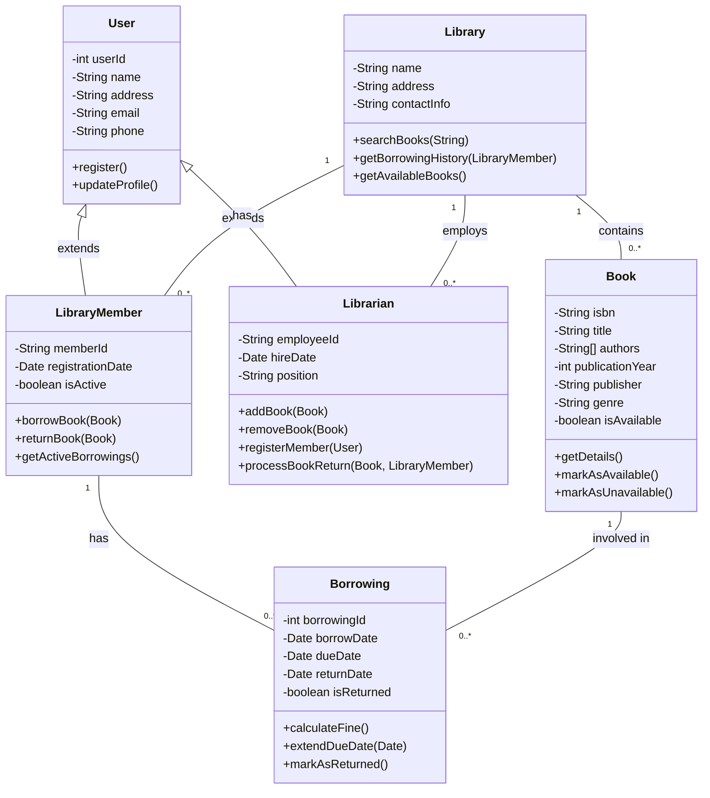

# 🏆 ソフトウェア設計冒険者クエスト 1.0.0　　- 基本の館 第1章

ここでは、「ソフトウェア設計 初級レベル演習課題」の模範解答を示します。

解答を確認しながら、自分のコードと比較してみましょう！

---

## 🔥 模範解答一覧

難易度は⭐の数で表現しています：
- ⭐：見習い冒険者でも挑戦できる基本の試練
- ⭐⭐：一人前の冒険者に求められる応用の試練
- ⭐⭐⭐：熟練冒険者のみが挑める高度な試練

### **1. 🛡️ SOLID原則の適用** 【難易度: ⭐⭐】
#### ✅ 解答:

1. 違反しているSOLID原則の特定:

- **単一責任の原則 (SRP: Single Responsibility Principle)**
  - `UserManager`クラスが複数の責任を持っています：ユーザーデータの永続化、ログ記録、メール送信、HTMLの生成など。
  - 各クラスは単一の責任を持つべきであり、変更の理由も1つだけであるべきです。

- **依存性逆転の原則 (DIP: Dependency Inversion Principle)**
  - `UserManager`が具体クラス`MySQLDatabase`に直接依存しています。
  - 高レベルのモジュールは低レベルのモジュールに依存すべきではなく、両方とも抽象に依存すべきです。

- **オープン・クローズドの原則 (OCP: Open-Closed Principle)**
  - 新しいデータベースタイプや通知方法を追加するには、`UserManager`クラスを修正する必要があります。
  - クラスは拡張に対してオープンで、修正に対してクローズドであるべきです。

- **インターフェース分離の原則 (ISP: Interface Segregation Principle)**
  - 明示的なインターフェースは定義されていませんが、`UserManager`は多くの機能を1つのクラスに詰め込んでいます。
  - クライアントは使用しないメソッドに依存すべきではありません。

2. リファクタリング案:

```java
// インターフェースと抽象クラスの定義
// データベースアクセスの抽象化
interface UserRepository {
    void saveUser(User user);
    User getUserByEmail(String email);
}

// MySQLデータベース実装
class MySQLUserRepository implements UserRepository {
    private Database database;
    
    public MySQLUserRepository(Database database) {
        this.database = database;
    }
    
    @Override
    public void saveUser(User user) {
        // SQLインジェクション対策としてプリペアドステートメントを使用
        String query = "INSERT INTO users (name, email, role) VALUES (?, ?, ?)";
        // 実際の実装ではプリペアドステートメントを使用
        System.out.println("Executing query: " + query);
    }
    
    @Override
    public User getUserByEmail(String email) {
        // SQLインジェクション対策としてプリペアドステートメントを使用
        String query = "SELECT * FROM users WHERE email = ?";
        // 実際の実装ではプリペアドステートメントを使用
        System.out.println("Executing query: " + query);
        
        // ダミーの実装
        User user = new User();
        user.setName("John Doe");
        user.setEmail(email);
        user.setRole("USER");
        return user;
    }
}

// ロギングの抽象化
interface Logger {
    void log(String message);
}

// 具体的なロガー実装
class ConsoleLogger implements Logger {
    @Override
    public void log(String message) {
        System.out.println("[LOG] " + message);
    }
}

// メール送信の抽象化
interface EmailService {
    void sendWelcomeEmail(String email, String name);
}

// 具体的なメール送信実装
class SimpleEmailService implements EmailService {
    @Override
    public void sendWelcomeEmail(String email, String name) {
        System.out.println("Welcome email sent to " + email);
    }
}

// ユーザープロファイル表示の抽象化
interface UserProfileView {
    String generateUserProfileHtml(User user);
}

// 具体的なユーザープロファイル表示実装
class SimpleUserProfileView implements UserProfileView {
    @Override
    public String generateUserProfileHtml(User user) {
        StringBuilder html = new StringBuilder();
        html.append("<div class='user-profile'>");
        html.append("<h2>").append(user.getName()).append("</h2>");
        html.append("<p>Email: ").append(user.getEmail()).append("</p>");
        if (user.getRole().equals("ADMIN")) {
            html.append("<p class='admin-badge'>Administrator</p>");
        }
        html.append("</div>");
        return html.toString();
    }
}

// ユーザーサービス（ビジネスロジック）
class UserService {
    private final UserRepository userRepository;
    private final Logger logger;
    private final EmailService emailService;
    
    // 依存性注入を使用
    public UserService(UserRepository userRepository, Logger logger, EmailService emailService) {
        this.userRepository = userRepository;
        this.logger = logger;
        this.emailService = emailService;
    }
    
    public void saveUser(User user) {
        // ユーザーを保存
        userRepository.saveUser(user);
        
        // ユーザーが管理者の場合、ログに記録
        if (user.getRole().equals("ADMIN")) {
            logger.log("Admin user created: " + user.getName());
        }
        
        // ユーザー作成メールを送信
        emailService.sendWelcomeEmail(user.getEmail(), user.getName());
    }
    
    public User getUserByEmail(String email) {
        return userRepository.getUserByEmail(email);
    }
}
```

#### 🔍 解説:

このリファクタリングでは、以下のSOLID原則を適用しました：

1. **単一責任の原則 (SRP)**
   - 各クラスが単一の責任を持つように分割しました：
     - `UserRepository`: データアクセス
     - `Logger`: ログ記録
     - `EmailService`: メール送信
     - `UserProfileView`: HTML生成
     - `UserService`: ビジネスロジック

2. **依存性逆転の原則 (DIP)**
   - 高レベルのモジュール（`UserService`）が低レベルのモジュールに直接依存せず、抽象（インターフェース）に依存するようにしました。
   - 依存性注入を使用して、具体的な実装をコンストラクタを通じて提供しています。

3. **オープン・クローズドの原則 (OCP)**
   - 新しいデータベースタイプや通知方法を追加するには、既存のコードを変更せずに新しいクラスを作成するだけで済みます。
   - 例えば、`PostgreSQLUserRepository`や`SMTPEmailService`などの新しい実装を追加できます。

4. **インターフェース分離の原則 (ISP)**
   - 各インターフェースが特定の目的に焦点を当てており、クライアントは必要なメソッドだけに依存します。

5. **リスコフの置換原則 (LSP)**
   - インターフェースの実装クラスは、そのインターフェースを使用するクライアントコードを壊すことなく交換可能です。

#### 🔗 参考リンク:
- [SOLID原則の解説](https://www.digitalocean.com/community/conceptual-articles/s-o-l-i-d-the-first-five-principles-of-object-oriented-design)
- [依存性注入パターン](https://en.wikipedia.org/wiki/Dependency_injection)

---

### **2. 🏗️ クラス設計の改善** 【難易度: ⭐⭐】
#### ✅ 解答:

1. クラス設計の問題点:

- **単一責任の原則違反**
  - `Product`クラスが在庫管理とHTML生成の両方の責任を持っています。
  - `Order`クラスが注文管理、支払い処理、メール送信、HTML生成など複数の責任を持っています。

- **ドメインロジックとプレゼンテーションロジックの混在**
  - ドメインオブジェクト（`Product`と`Order`）がHTMLを生成するメソッドを持っています。
  - これにより、UIの変更がドメインオブジェクトの変更を必要とし、保守性が低下します。

- **不適切な依存関係**
  - `Order`クラスが`Product`クラスの内部実装（在庫管理）に直接依存しています。
  - 在庫管理のロジックが変更された場合、`Order`クラスも変更が必要になります。

- **ビジネスロジックの分散**
  - 注文処理に関するビジネスロジックが`Order`クラス内に直接実装されています。
  - 支払い処理やメール送信などの外部サービスとの連携が`Order`クラスに直接実装されています。

2. リファクタリング案:

```typescript
// ドメインモデル

// 商品エンティティ
class Product {
    private _id: number;
    private _name: string;
    private _price: number;
    private _description: string;
    private _category: string;
    private _stock: number;
    
    constructor(id: number, name: string, price: number, description: string, category: string, stock: number) {
        this._id = id;
        this._name = name;
        this._price = price;
        this._description = description;
        this._category = category;
        this._stock = stock;
    }
    
    // ゲッター
    get id(): number { return this._id; }
    get name(): string { return this._name; }
    get price(): number { return this._price; }
    get description(): string { return this._description; }
    get category(): string { return this._category; }
    get stock(): number { return this._stock; }
    
    // 在庫チェック
    hasStock(quantity: number): boolean {
        return this._stock >= quantity;
    }
    
    // 在庫を減らす（ドメインロジック）
    decreaseStock(quantity: number): void {
        if (!this.hasStock(quantity)) {
            throw new Error("在庫不足です");
        }
        this._stock -= quantity;
    }
    
    // 在庫を増やす（ドメインロジック）
    increaseStock(quantity: number): void {
        this._stock += quantity;
    }
}

// 注文項目値オブジェクト
class OrderItem {
    private _product: Product;
    private _quantity: number;
    
    constructor(product: Product, quantity: number) {
        this._product = product;
        this._quantity = quantity;
    }
    
    get product(): Product { return this._product; }
    get quantity(): number { return this._quantity; }
    get subtotal(): number { return this._product.price * this._quantity; }
}

// 注文エンティティ
class Order {
    private _id: number;
    private _customerName: string;
    private _customerEmail: string;
    private _customerAddress: string;
    private _items: OrderItem[] = [];
    private _orderDate: Date;
    private _status: OrderStatus;
    
    constructor(id: number, customerName: string, customerEmail: string, customerAddress: string) {
        this._id = id;
        this._customerName = customerName;
        this._customerEmail = customerEmail;
        this._customerAddress = customerAddress;
        this._orderDate = new Date();
        this._status = OrderStatus.NEW;
    }
    
    // ゲッター
    get id(): number { return this._id; }
    get customerName(): string { return this._customerName; }
    get customerEmail(): string { return this._customerEmail; }
    get customerAddress(): string { return this._customerAddress; }
    get items(): ReadonlyArray<OrderItem> { return this._items; }
    get orderDate(): Date { return this._orderDate; }
    get status(): OrderStatus { return this._status; }
    
    // 注文項目を追加（ドメインロジック）
    addItem(product: Product, quantity: number): void {
        // 在庫チェックはドメインサービスに移動
        this._items.push(new OrderItem(product, quantity));
    }
    
    // 注文の合計金額を計算（ドメインロジック）
    calculateTotal(): number {
        return this._items.reduce((total, item) => total + item.subtotal, 0);
    }
    
    // 注文ステータスを更新（ドメインロジック）
    updateStatus(status: OrderStatus): void {
        this._status = status;
    }
}

// 注文ステータス列挙型
enum OrderStatus {
    NEW = "新規注文",
    PROCESSING = "処理中",
    COMPLETED = "完了",
    CANCELLED = "キャンセル"
}

// アプリケーションサービス

// 在庫サービス
class InventoryService {
    private productRepository: ProductRepository;
    
    constructor(productRepository: ProductRepository) {
        this.productRepository = productRepository;
    }
    
    // 在庫チェック
    checkStock(productId: number, quantity: number): boolean {
        const product = this.productRepository.findById(productId);
        if (!product) {
            throw new Error("商品が見つかりません");
        }
        return product.hasStock(quantity);
    }
    
    // 在庫を減らす
    decreaseStock(productId: number, quantity: number): void {
        const product = this.productRepository.findById(productId);
        if (!product) {
            throw new Error("商品が見つかりません");
        }
        product.decreaseStock(quantity);
        this.productRepository.save(product);
    }
}

// 注文サービス
class OrderService {
    private orderRepository: OrderRepository;
    private inventoryService: InventoryService;
    private paymentService: PaymentService;
    private emailService: EmailService;
    
    constructor(
        orderRepository: OrderRepository,
        inventoryService: InventoryService,
        paymentService: PaymentService,
        emailService: EmailService
    ) {
        this.orderRepository = orderRepository;
        this.inventoryService = inventoryService;
        this.paymentService = paymentService;
        this.emailService = emailService;
    }
    
    // 注文作成
    createOrder(
        customerName: string,
        customerEmail: string,
        customerAddress: string,
        items: { productId: number, product: Product, quantity: number }[]
    ): Order {
        // 注文IDの生成
        const orderId = this.generateOrderId();
        
        // 注文オブジェクトの作成
        const order = new Order(orderId, customerName, customerEmail, customerAddress);
        
        // 商品の在庫チェックと注文項目の追加
        for (const item of items) {
            if (!this.inventoryService.checkStock(item.productId, item.quantity)) {
                throw new Error(`商品「${item.product.name}」の在庫が不足しています`);
            }
            order.addItem(item.product, item.quantity);
        }
        
        // 注文の保存
        this.orderRepository.save(order);
        
        // 在庫の減少
        for (const item of items) {
            this.inventoryService.decreaseStock(item.productId, item.quantity);
        }
        
        return order;
    }
    
    // 注文処理
    processOrder(orderId: number): void {
        const order = this.orderRepository.findById(orderId);
        if (!order) {
            throw new Error("注文が見つかりません");
        }
        
        // 注文ステータスの更新
        order.updateStatus(OrderStatus.PROCESSING);
        
        // 支払い処理
        this.paymentService.processPayment(order);
        
        // 注文確認メールの送信
        this.emailService.sendOrderConfirmationEmail(order);
        
        // 注文ステータスの更新
        order.updateStatus(OrderStatus.COMPLETED);
        
        // 注文の保存
        this.orderRepository.save(order);
    }
    
    // 注文IDの生成
    private generateOrderId(): number {
        return Math.floor(Math.random() * 10000);
    }
}

// プレゼンテーション層

// 商品表示
class ProductView {
    generateProductDetailsHtml(product: Product): string {
        return `
            <div class="product">
                <h2>${product.name}</h2>
                <p class="price">¥${product.price}</p>
                <p class="description">${product.description}</p>
                <p class="category">カテゴリ: ${product.category}</p>
                <p class="stock">在庫: ${product.stock}個</p>
            </div>
        `;
    }
}

// 注文表示
class OrderView {
    generateOrderDetailsHtml(order: Order): string {
        let productsHtml = "";
        for (const item of order.items) {
            productsHtml += `
                <div class="order-item">
                    <span>${item.product.name}</span>
                    <span>¥${item.product.price} x ${item.quantity}</span>
                    <span>¥${item.product.price * item.quantity}</span>
                </div>
            `;
        }
        
        return `
            <div class="order">
                <h2>注文 #${order.id}</h2>
                <p>お客様: ${order.customerName}</p>
                <p>メール: ${order.customerEmail}</p>
                <p>住所: ${order.customerAddress}</p>
                <p>注文日: ${order.orderDate.toLocaleDateString()}</p>
                <p>ステータス: ${order.status}</p>
                <div class="order-items">
                    ${productsHtml}
                </div>
                <p class="total">合計: ¥${order.calculateTotal()}</p>
            </div>
        `;
    }
}
```

#### 🔍 解説:

このリファクタリングでは、以下の設計原則と改善点を適用しました：

1. **責任の分離（単一責任の原則）**
   - ドメインモデル（`Product`、`OrderItem`、`Order`）は、ビジネスルールとデータのみを扱います。
   - アプリケーションサービス（`InventoryService`、`OrderService`など）は、ユースケースの調整を担当します。
   - プレゼンテーション層（`ProductView`、`OrderView`）は、表示のみを担当します。

2. **ドメインロジックの集約**
   - 商品の在庫管理は`Product`クラスと`InventoryService`に集約されています。
   - 注文処理のビジネスロジックは`Order`クラスと`OrderService`に集約されています。

3. **適切な依存関係の管理**
   - 高レベルのモジュール（サービス）は、低レベルのモジュール（リポジトリ）に直接依存せず、インターフェースに依存しています。
   - 依存性注入を使用して、具体的な実装をコンストラクタを通じて提供しています。

4. **値オブジェクトの導入**
   - `OrderItem`を値オブジェクトとして導入し、注文項目の不変性を確保しています。

5. **列挙型の使用**
   - `OrderStatus`を列挙型として定義し、注文ステータスの型安全性を確保しています。

#### 🔗 参考リンク:
- [ドメイン駆動設計（DDD）の概要](https://martinfowler.com/bliki/DomainDrivenDesign.html)
- [値オブジェクトとエンティティの違い](https://enterprisecraftsmanship.com/posts/entity-vs-value-object-the-ultimate-list-of-differences/)

---

### **3. 📊 UMLクラス図の作成** 【難易度: ⭐⭐⭐】
#### ✅ 解答:

以下は、図書館管理システムのUMLクラス図をMermaid記法で表現したものです。



#### 🔍 解説:

このUMLクラス図は、図書館管理システムの主要なクラスとその関連を表しています。

1. **クラスの定義**:
   - `User`: システムのすべてのユーザーの基本クラス
   - `LibraryMember`: 図書館の利用者（`User`を継承）
   - `Librarian`: 図書館員（`User`を継承）
   - `Book`: 図書館の本
   - `Borrowing`: 本の貸出情報
   - `Library`: 図書館自体

2. **属性**:
   - 各クラスには、関連する情報を格納する属性があります。
   - 例: `Book`クラスには`isbn`、`title`、`authors`などの属性があります。

3. **メソッド**:
   - 例: `LibraryMember`クラスには`borrowBook`、`returnBook`などのメソッドがあります。

4. **関連**:
   - `User`と`LibraryMember`/`Librarian`の間には継承関係があります。
   - `LibraryMember`と`Borrowing`の間には1対多の関連があります（1人の利用者が複数の貸出を持つ）。
   - `Book`と`Borrowing`の間には1対多の関連があります（1冊の本が複数の貸出に関与する）。
   - `Library`は`Book`、`LibraryMember`、`Librarian`と関連しています。

5. **多重度**:
   - 関連線の端にある「1」や「0..*」は多重度を表し、関連するオブジェクトの数を示します。
   - 例: 1人の`LibraryMember`は0個以上の`Borrowing`を持つことができます。

#### 🔗 参考リンク:
- [UMLクラス図の基本](https://www.visual-paradigm.com/guide/uml-unified-modeling-language/uml-class-diagram-tutorial/)
- [Mermaid記法でのクラス図の書き方](https://mermaid-js.github.io/mermaid/#/classDiagram)

---

### **4. 🔄 シーケンス図の解釈** 【難易度: ⭐⭐】
#### ✅ 解答:

1. ユーザー認証プロセスの説明:

このシーケンス図は、ユーザー認証（ログイン）プロセスを表しています。プロセスの流れは以下の通りです：

1. ユーザーがログイン画面でメールアドレスとパスワードを入力します。
2. ログインビュー（`LoginView`）がこの情報を`AuthController`に送信します。
3. `AuthController`は認証処理を`UserService`に委譲します。
4. `UserService`は`UserRepository`を使用して、指定されたメールアドレスのユーザーを検索します。
5. `UserRepository`はユーザー情報を返します。

ここで条件分岐が発生します：

**ユーザーが存在する場合**:
6. `UserService`は入力されたパスワードとユーザーのパスワードハッシュを比較します。

   **パスワードが正しい場合**:
   7. `UserService`は`TokenService`を使用して認証トークンを生成します。
   8. `TokenService`はトークンを返します。
   9. `UserService`は成功レスポンスとトークンを`AuthController`に返します。
   10. `AuthController`はこの情報を`LoginView`に転送します。
   11. `LoginView`はユーザーにダッシュボード画面を表示します。

   **パスワードが間違っている場合**:
   12. `UserService`はエラーメッセージを`AuthController`に返します。
   13. `AuthController`はこのエラーを`LoginView`に転送します。
   14. `LoginView`はユーザーにエラーメッセージを表示します。

**ユーザーが存在しない場合**:
15. `UserService`はエラーメッセージを`AuthController`に返します。
16. `AuthController`はこのエラーを`LoginView`に転送します。
17. `LoginView`はユーザーにエラーメッセージを表示します。

2. 設計上の特徴:

1. **レイヤードアーキテクチャ**:
   - プレゼンテーション層（`LoginView`）
   - コントローラー層（`AuthController`）
   - サービス層（`UserService`、`TokenService`）
   - データアクセス層（`UserRepository`）
   という明確なレイヤー構造になっています。

2. **責任の分離**:
   - `LoginView`はユーザーインターフェースの表示のみを担当
   - `AuthController`はリクエストの処理と応答の調整を担当
   - `UserService`は認証ロジックを担当
   - `UserRepository`はデータアクセスを担当
   - `TokenService`はトークン生成を担当
   各コンポーネントが単一の責任を持っています。

3. **依存関係の方向**:
   - 依存関係が上位レイヤーから下位レイヤーへの一方向になっています。
   - 下位レイヤーは上位レイヤーに依存していません。

4. **エラーハンドリング**:
   - 異なるエラーケース（ユーザーが存在しない、パスワードが間違っている）に対して適切な処理が行われています。
   - エラーメッセージが適切に上位レイヤーに伝播されています。

5. **認証の分離**:
   - トークン生成が専用のサービス（`TokenService`）に分離されています。
   - これにより、認証メカニズムの変更が容易になります。

3. AuthControllerのloginメソッドの擬似コード:

```typescript
class AuthController {
    private userService: UserService;
    
    constructor(userService: UserService) {
        this.userService = userService;
    }
    
    async login(email: string, password: string): Promise<AuthResponse> {
        try {
            // UserServiceに認証処理を委譲
            const authResult = await this.userService.authenticateUser(email, password);
            
            // 認証結果を返す
            return authResult;
        } catch (error) {
            // エラーハンドリング
            console.error("Authentication error:", error);
            return {
                success: false,
                error: "認証処理中にエラーが発生しました"
            };
        }
    }
}

// レスポンス型定義
interface AuthResponse {
    success: boolean;
    token?: string;
    error?: string;
}
```

#### 🔍 解説:

このシーケンス図は、クリーンアーキテクチャやレイヤードアーキテクチャの原則に従った設計を示しています。各コンポーネントが明確な責任を持ち、依存関係が適切に管理されています。

特に注目すべき点は以下の通りです：

1. **単一責任の原則**: 各コンポーネントが単一の責任を持っています。例えば、`UserService`は認証ロジックのみを担当し、`TokenService`はトークン生成のみを担当しています。

2. **依存性逆転の原則**: 高レベルのモジュール（`AuthController`）が低レベルのモジュール（`UserRepository`）に直接依存せず、抽象（`UserService`）に依存しています。

3. **関心の分離**: ユーザーインターフェース、ビジネスロジック、データアクセスが明確に分離されています。

4. **エラーハンドリング**: 異なるエラーケースに対して適切な処理が行われ、ユーザーに適切なフィードバックが提供されています。

#### 🔗 参考リンク:
- [シーケンス図の基本](https://www.visual-paradigm.com/guide/uml-unified-modeling-language/what-is-sequence-diagram/)
- [クリーンアーキテクチャ](https://blog.cleancoder.com/uncle-bob/2012/08/13/the-clean-architecture.html)

---

### **5. 🧩 デザインパターンの選択** 【難易度: ⭐⭐⭐】
#### ✅ 解答:

1. 適したデザインパターンの選択:

このシナリオに最も適したデザインパターンは**ストラテジーパターン（Strategy Pattern）**です。

**選択理由**:
- ストラテジーパターンは、アルゴリズムのファミリーを定義し、それぞれをカプセル化して交換可能にするパターンです。
- 通知の送信方法（メール、SMS、プッシュ通知など）は、異なる「アルゴリズム」と見なすことができます。
- 各通知方法は独立して実装でき、新しい通知方法を追加する際に既存のコードを変更する必要がありません。
- ランタイムで通知方法を切り替えるという要件にも適しています。

2. ストラテジーパターンを使用した通知システムの実装:

```typescript
// 通知戦略のインターフェース
interface NotificationStrategy {
    send(recipient: string, subject: string, content: string): Promise<boolean>;
}

// メール通知の実装
class EmailNotification implements NotificationStrategy {
    async send(recipient: string, subject: string, content: string): Promise<boolean> {
        console.log(`Sending email to ${recipient}`);
        console.log(`Subject: ${subject}`);
        console.log(`Content: ${content}`);
        
        // 実際のメール送信ロジック
        try {
            // メール送信APIの呼び出しなど
            await this.sendEmailApi(recipient, subject, content);
            return true;
        } catch (error) {
            console.error(`Failed to send email: ${error}`);
            return false;
        }
    }
    
    private async sendEmailApi(to: string, subject: string, body: string): Promise<void> {
        // 実際のメール送信APIの呼び出し
        // この例では単純化のため、成功したと仮定
        return Promise.resolve();
    }
}

// SMS通知の実装
class SmsNotification implements NotificationStrategy {
    async send(recipient: string, subject: string, content: string): Promise<boolean> {
        console.log(`Sending SMS to ${recipient}`);
        console.log(`Content: ${subject} - ${content}`);
        
        // 実際のSMS送信ロジック
        try {
            // SMS送信APIの呼び出しなど
            await this.sendSmsApi(recipient, `${subject} - ${content}`);
            return true;
        } catch (error) {
            console.error(`Failed to send SMS: ${error}`);
            return false;
        }
    }
    
    private async sendSmsApi(to: string, message: string): Promise<void> {
        // 実際のSMS送信APIの呼び出し
        // この例では単純化のため、成功したと仮定
        return Promise.resolve();
    }
}

// プッシュ通知の実装
class PushNotification implements NotificationStrategy {
    async send(recipient: string, subject: string, content: string): Promise<boolean> {
        console.log(`Sending push notification to ${recipient}`);
        console.log(`Title: ${subject}`);
        console.log(`Body: ${content}`);
        
        // 実際のプッシュ通知送信ロジック
        try {
            // プッシュ通知APIの呼び出しなど
            await this.sendPushApi(recipient, subject, content);
            return true;
        } catch (error) {
            console.error(`Failed to send push notification: ${error}`);
            return false;
        }
    }
    
    private async sendPushApi(to: string, title: string, body: string): Promise<void> {
        // 実際のプッシュ通知APIの呼び出し
        // この例では単純化のため、成功したと仮定
        return Promise.resolve();
    }
}

// 通知サービス（コンテキスト）
class NotificationService {
    private strategy: NotificationStrategy;
    
    constructor(strategy: NotificationStrategy) {
        this.strategy = strategy;
    }
    
    // 戦略を設定（ランタイムでの切り替え）
    setStrategy(strategy: NotificationStrategy): void {
        this.strategy = strategy;
    }
    
    // 通知を送信
    async notify(recipient: string, subject: string, content: string): Promise<boolean> {
        return this.strategy.send(recipient, subject, content);
    }
}

// 通知ファクトリー（オプション）
class NotificationFactory {
    static createStrategy(type: 'email' | 'sms' | 'push'): NotificationStrategy {
        switch (type) {
            case 'email':
                return new EmailNotification();
            case 'sms':
                return new SmsNotification();
            case 'push':
                return new PushNotification();
            default:
                throw new Error(`Unknown notification type: ${type}`);
        }
    }
}
```

3. 実装したコードを使用した例:

```typescript
// 使用例
async function notificationExample(): Promise<void> {
    // 通知サービスの作成（初期戦略はメール）
    const notificationService = new NotificationService(
        NotificationFactory.createStrategy('email')
    );
    
    // メール通知の送信
    console.log("--- Email Notification ---");
    await notificationService.notify(
        "user@example.com",
        "Welcome to our service",
        "Thank you for signing up. We're excited to have you on board!"
    );
    
    // SMS通知に切り替え
    console.log("\n--- SMS Notification ---");
    notificationService.setStrategy(NotificationFactory.createStrategy('sms'));
    await notificationService.notify(
        "+1234567890",
        "Account Verification",
        "Your verification code is 123456"
    );
    
    // プッシュ通知に切り替え
    console.log("\n--- Push Notification ---");
    notificationService.setStrategy(NotificationFactory.createStrategy('push'));
    await notificationService.notify(
        "device_token_123",
        "New Message",
        "You have received a new message from John"
    );
}

// 実行
notificationExample().catch(console.error);
```

#### 🔍 解説:

このストラテジーパターンの実装には、以下の要素が含まれています：

1. **ストラテジーインターフェース（`NotificationStrategy`）**:
   - すべての通知戦略が実装する共通インターフェース
   - `send`メソッドを定義し、通知の送信方法を抽象化

2. **具体的な戦略（`EmailNotification`、`SmsNotification`、`PushNotification`）**:
   - ストラテジーインターフェースを実装
   - それぞれが特定の通知方法のロジックをカプセル化

3. **コンテキスト（`NotificationService`）**:
   - 現在の戦略を保持し、クライアントからの要求を戦略に委譲
   - `setStrategy`メソッドを通じて、ランタイムで戦略を切り替え可能

4. **ファクトリー（`NotificationFactory`）**:
   - 戦略の作成を簡素化するヘルパークラス（オプション）
   - 文字列識別子から適切な戦略インスタンスを作成

この設計の利点：

1. **拡張性**: 新しい通知方法（例：Slack通知、Webhook通知）を追加する場合、既存のコードを変更せずに新しい戦略クラスを追加するだけで済みます。

2. **柔軟性**: ランタイムで通知方法を切り替えることができます。例えば、ユーザー設定に基づいて通知方法を選択できます。

3. **テスト容易性**: 各戦略を独立してテストでき、モックを使用してコンテキストをテストすることも容易です。

4. **単一責任の原則**: 各クラスが単一の責任を持ち、変更理由も1つだけになります。

#### 🔗 参考リンク:
- [ストラテジーパターン](https://refactoring.guru/design-patterns/strategy)
- [TypeScriptでのデザインパターン実装](https://www.patterns.dev/posts/classic-design-patterns/)

---

## 📖 冒険者の図書館

- [Clean Architecture by Robert C. Martin](https://www.amazon.co.jp/Clean-Architecture-%E9%81%94%E4%BA%BA%E3%81%AB%E5%AD%A6%E3%81%B6%E3%82%BD%E3%83%95%E3%83%88%E3%82%A6%E3%82%A7%E3%82%A2%E3%81%AE%E6%A7%8B%E9%80%A0%E3%81%A8%E8%A8%AD%E8%A8%88-Robert-C-Martin/dp/4048930656)
- [Design Patterns: Elements of Reusable Object-Oriented Software](https://www.amazon.co.jp/Design-Patterns-Elements-Reusable-Object-Oriented/dp/0201633612)
- [Domain-Driven Design by Eric Evans](https://www.amazon.co.jp/Domain-Driven-Design-%E3%82%A8%E3%83%AA%E3%83%83%E3%82%AF%E3%83%BB%E3%82%A8%E3%83%B4%E3%82%A1%E3%83%B3%E3%82%B9/dp/4798121967)
- [Refactoring by Martin Fowler](https://www.amazon.co.jp/Refactoring-%E7%AC%AC2%E7%89%88-%E6%97%A2%E5%AD%98%E3%81%AE%E3%82%B3%E3%83%BC%E3%83%89%E3%82%92%E5%AE%89%E5%85%A8%E3%81%AB%E6%94%B9%E5%96%84%E3%81%99%E3%82%8B-OBJECT-TECHNOLOGY/dp/4274224546)