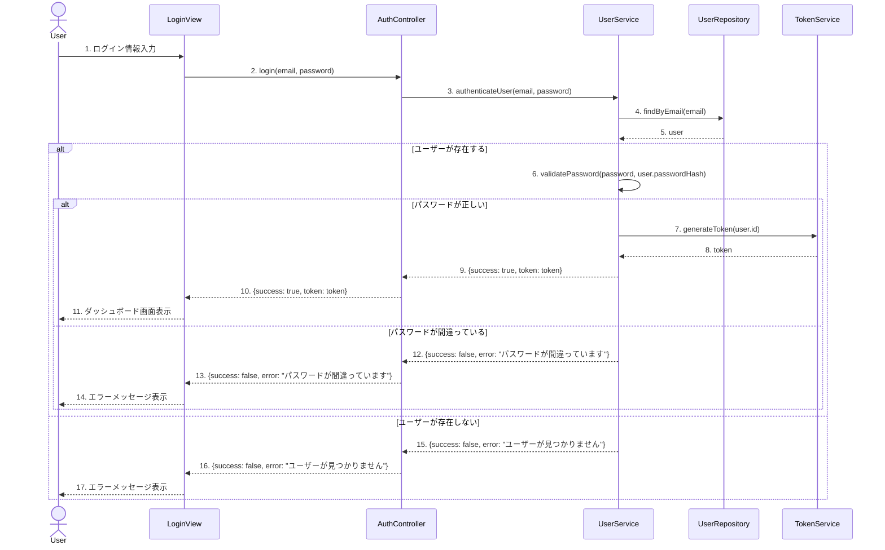

# 🏆 ソフトウェア設計冒険者クエスト 1.0.0　- 基本の館 第1章

あなたは今、ソフトウェア設計の基本をマスターするための冒険に挑戦しようとしています！

---

## 📋 クエスト(問題)一覧

難易度は⭐の数で表現しています：
- ⭐：見習い冒険者でも挑戦できる基本の試練
- ⭐⭐：一人前の冒険者に求められる応用の試練
- ⭐⭐⭐：熟練冒険者のみが挑める高度な試練

| 🔢 番号 | 📜 クエスト名              | 🎯 難易度 |
| ------- | --------------------- | ------ |
| 1       | 🛡️ SOLID原則の適用         | ⭐⭐    |
| 2       | 🏗️ クラス設計の改善         | ⭐⭐    |
| 3       | 📊 UMLクラス図の作成        | ⭐⭐⭐   |
| 4       | 🔄 シーケンス図の解釈        | ⭐⭐    |
| 5       | 🧩 デザインパターンの選択      | ⭐⭐⭐   |

---

## 🔥 クエスト詳細（問題）

### **1. 🛡️ SOLID原則の適用**

#### 🎯 学習項目：[設計の基本原則 - SOLID原則の理解](../guide.md#-初級レベル冒険者の第一歩)

#### 📜 クエスト内容：

以下のコードは、ユーザー情報を管理するシステムの一部です。このコードにはSOLID原則に違反する箇所がいくつかあります。

```java
// ユーザー管理クラス
public class UserManager {
    private Database database;
    
    public UserManager() {
        this.database = new MySQLDatabase();
    }
    
    public void saveUser(User user) {
        // データベースにユーザーを保存
        String query = "INSERT INTO users (name, email, role) VALUES ('" + 
                       user.getName() + "', '" + 
                       user.getEmail() + "', '" + 
                       user.getRole() + "')";
        database.executeQuery(query);
        
        // ユーザーが管理者の場合、ログに記録
        if (user.getRole().equals("ADMIN")) {
            Logger.getInstance().log("Admin user created: " + user.getName());
        }
        
        // ユーザー作成メールを送信
        EmailSender emailSender = new EmailSender();
        emailSender.sendWelcomeEmail(user.getEmail(), user.getName());
    }
    
    public User getUser(String email) {
        // データベースからユーザーを取得
        String query = "SELECT * FROM users WHERE email = '" + email + "'";
        ResultSet result = database.executeQuery(query);
        
        // 結果からユーザーオブジェクトを作成
        User user = new User();
        user.setName(result.getString("name"));
        user.setEmail(result.getString("email"));
        user.setRole(result.getString("role"));
        
        return user;
    }
    
    // ユーザーのHTMLプロファイルを生成
    public String generateUserProfileHtml(User user) {
        StringBuilder html = new StringBuilder();
        html.append("<div class='user-profile'>");
        html.append("<h2>").append(user.getName()).append("</h2>");
        html.append("<p>Email: ").append(user.getEmail()).append("</p>");
        if (user.getRole().equals("ADMIN")) {
            html.append("<p class='admin-badge'>Administrator</p>");
        }
        html.append("</div>");
        return html.toString();
    }
}

// データベース抽象クラス
abstract class Database {
    public abstract ResultSet executeQuery(String query);
}

// MySQL実装
class MySQLDatabase extends Database {
    @Override
    public ResultSet executeQuery(String query) {
        // MySQLデータベースに接続して実行するコード
        return null; // 実際の実装では結果を返す
    }
}

// ロガークラス（シングルトン）
class Logger {
    private static Logger instance;
    
    private Logger() {}
    
    public static Logger getInstance() {
        if (instance == null) {
            instance = new Logger();
        }
        return instance;
    }
    
    public void log(String message) {
        System.out.println("[LOG] " + message);
    }
}

// メール送信クラス
class EmailSender {
    public void sendWelcomeEmail(String email, String name) {
        // 実際のメール送信コード
        System.out.println("Welcome email sent to " + email);
    }
}

// ユーザークラス
class User {
    private String name;
    private String email;
    private String role;
    
    // Getters and setters
    public String getName() { return name; }
    public void setName(String name) { this.name = name; }
    public String getEmail() { return email; }
    public void setEmail(String email) { this.email = email; }
    public String getRole() { return role; }
    public void setRole(String role) { this.role = role; }
}
```

1. 上記のコードで違反しているSOLID原則を少なくとも3つ特定し、それぞれがどのように違反しているか説明してください。
2. 特定した違反を修正するためのリファクタリング案を示してください。コードの一部を書き換えて、SOLID原則に準拠するようにしてください。

---

### **2. 🏗️ クラス設計の改善**

#### 🎯 学習項目：[オブジェクト指向設計の基礎 - クラス設計の基本](../guide.md#-初級レベル冒険者の第一歩)

#### 📜 クエスト内容：

以下は、オンラインショッピングシステムの一部を表すクラス設計です。このクラス設計には、責任の割り当てや関連の管理に問題があります。

```typescript
// 商品クラス
class Product {
    id: number;
    name: string;
    price: number;
    description: string;
    category: string;
    stock: number;
    
    constructor(id: number, name: string, price: number, description: string, category: string, stock: number) {
        this.id = id;
        this.name = name;
        this.price = price;
        this.description = description;
        this.category = category;
        this.stock = stock;
    }
    
    // 商品の在庫を減らす
    decreaseStock(quantity: number): void {
        if (this.stock >= quantity) {
            this.stock -= quantity;
        } else {
            throw new Error("在庫不足です");
        }
    }
    
    // 商品の在庫を増やす
    increaseStock(quantity: number): void {
        this.stock += quantity;
    }
    
    // 商品の詳細情報をHTMLで返す
    getProductDetailsHtml(): string {
        return `
            <div class="product">
                <h2>${this.name}</h2>
                <p class="price">¥${this.price}</p>
                <p class="description">${this.description}</p>
                <p class="category">カテゴリ: ${this.category}</p>
                <p class="stock">在庫: ${this.stock}個</p>
            </div>
        `;
    }
}

// 注文クラス
class Order {
    id: number;
    customerName: string;
    customerEmail: string;
    customerAddress: string;
    products: { product: Product, quantity: number }[];
    orderDate: Date;
    status: string;
    
    constructor(id: number, customerName: string, customerEmail: string, customerAddress: string) {
        this.id = id;
        this.customerName = customerName;
        this.customerEmail = customerEmail;
        this.customerAddress = customerAddress;
        this.products = [];
        this.orderDate = new Date();
        this.status = "新規注文";
    }
    
    // 商品を注文に追加
    addProduct(product: Product, quantity: number): void {
        // 在庫チェック
        if (product.stock < quantity) {
            throw new Error("在庫不足です");
        }
        
        this.products.push({ product, quantity });
        product.decreaseStock(quantity);
    }
    
    // 注文の合計金額を計算
    calculateTotal(): number {
        let total = 0;
        for (const item of this.products) {
            total += item.product.price * item.quantity;
        }
        return total;
    }
    
    // 注文を処理（支払い処理、メール送信など）
    processOrder(): void {
        // 支払い処理
        this.processPayment();
        
        // 注文確認メールの送信
        this.sendOrderConfirmationEmail();
        
        // 注文ステータスの更新
        this.status = "処理済み";
    }
    
    // 支払い処理
    private processPayment(): void {
        console.log(`${this.customerName}様の注文(ID: ${this.id})の支払いを処理しました。合計: ¥${this.calculateTotal()}`);
    }
    
    // 注文確認メールの送信
    private sendOrderConfirmationEmail(): void {
        console.log(`${this.customerEmail}宛に注文確認メールを送信しました。`);
    }
    
    // 注文の詳細情報をHTMLで返す
    getOrderDetailsHtml(): string {
        let productsHtml = "";
        for (const item of this.products) {
            productsHtml += `
                <div class="order-item">
                    <span>${item.product.name}</span>
                    <span>¥${item.product.price} x ${item.quantity}</span>
                    <span>¥${item.product.price * item.quantity}</span>
                </div>
            `;
        }
        
        return `
            <div class="order">
                <h2>注文 #${this.id}</h2>
                <p>お客様: ${this.customerName}</p>
                <p>メール: ${this.customerEmail}</p>
                <p>住所: ${this.customerAddress}</p>
                <p>注文日: ${this.orderDate.toLocaleDateString()}</p>
                <p>ステータス: ${this.status}</p>
                <div class="order-items">
                    ${productsHtml}
                </div>
                <p class="total">合計: ¥${this.calculateTotal()}</p>
            </div>
        `;
    }
}
```

1. 上記のクラス設計における問題点を少なくとも3つ特定し、それぞれがなぜ問題なのか説明してください。
2. 特定した問題を解決するためのリファクタリング案を示してください。責任の適切な割り当てと関連の管理を考慮して、クラス設計を改善してください。

---

### **3. 📊 UMLクラス図の作成**

#### 🎯 学習項目：[UMLの基礎 - クラス図の読み方と書き方](../guide.md#-初級レベル冒険者の第一歩)

#### 📜 クエスト内容：

以下の要件に基づいて、図書館管理システムのUMLクラス図を作成してください。

**要件**:
- 図書館には複数の本が所蔵されています。
- 本には、タイトル、著者、ISBN、出版年、ジャンルなどの情報があります。
- 図書館の利用者は、名前、住所、会員IDなどの情報を持ちます。
- 利用者は複数の本を借りることができます。
- 貸出情報には、貸出日、返却予定日、実際の返却日などの情報が含まれます。
- 図書館員は、本の貸出・返却処理、新しい本の登録、利用者の登録などの操作を行います。
- 図書館員は利用者の一種として扱われます（継承関係）。

1. 上記の要件を満たすUMLクラス図をMermaid記法で作成してください。
2. 各クラスの属性とメソッドを適切に定義し、クラス間の関連（関連、集約、コンポジション、継承など）を明示してください。

---

### **4. 🔄 シーケンス図の解釈**

#### 🎯 学習項目：[UMLの基礎 - シーケンス図の読み方と書き方](../guide.md#-初級レベル冒険者の第一歩)

#### 📜 クエスト内容：

以下は、ユーザー認証プロセスを表すシーケンス図です。



1. このシーケンス図が表すユーザー認証プロセスを詳細に説明してください。
2. このシーケンス図から読み取れる設計上の特徴（責任の分離、レイヤー構造など）を少なくとも3つ挙げてください。
3. このシーケンス図に基づいて、AuthControllerクラスのloginメソッドの擬似コードを作成してください。

---

### **5. 🧩 デザインパターンの選択**

#### 🎯 学習項目：[基本的な設計パターン](../guide.md#-初級レベル冒険者の第一歩)

#### 📜 クエスト内容：

以下のシナリオに対して、適切なデザインパターンを選択し、その実装方法を示してください。

**シナリオ**:
あなたは、さまざまな種類の通知（メール、SMS、プッシュ通知など）を送信できるシステムを設計しています。システムは将来的に新しい通知方法を追加できるように拡張可能である必要があります。また、通知の送信方法はランタイムで切り替えられる必要があります。

1. このシナリオに最も適したデザインパターンを選択し、その理由を説明してください。
2. 選択したデザインパターンを使用して、通知システムのクラス設計をTypeScriptで実装してください。
3. 実装したコードを使用して、メール通知とSMS通知を送信する例を示してください。

---

## 📖 冒険者の図書館

- [Clean Architecture by Robert C. Martin - 設計の古代文書](https://www.amazon.co.jp/Clean-Architecture-%E9%81%94%E4%BA%BA%E3%81%AB%E5%AD%A6%E3%81%B6%E3%82%BD%E3%83%95%E3%83%88%E3%82%A6%E3%82%A7%E3%82%A2%E3%81%AE%E6%A7%8B%E9%80%A0%E3%81%A8%E8%A8%AD%E8%A8%88-Robert-C-Martin/dp/4048930656)
- [Design Patterns: Elements of Reusable Object-Oriented Software - 設計パターンの聖典](https://www.amazon.co.jp/Design-Patterns-Elements-Reusable-Object-Oriented/dp/0201633612)
- [Domain-Driven Design by Eric Evans - ドメイン駆動設計の指南書](https://www.amazon.co.jp/Domain-Driven-Design-%E3%82%A8%E3%83%AA%E3%83%83%E3%82%AF%E3%83%BB%E3%82%A8%E3%83%B4%E3%82%A1%E3%83%B3%E3%82%B9/dp/4798121967)
- [Refactoring by Martin Fowler - リファクタリングの魔法書](https://www.amazon.co.jp/Refactoring-%E7%AC%AC2%E7%89%88-%E6%97%A2%E5%AD%98%E3%81%AE%E3%82%B3%E3%83%BC%E3%83%89%E3%82%92%E5%AE%89%E5%85%A8%E3%81%AB%E6%94%B9%E5%96%84%E3%81%99%E3%82%8B-OBJECT-TECHNOLOGY/dp/4274224546)
- [Building Microservices by Sam Newman - マイクロサービスの設計書](https://www.amazon.co.jp/Building-Microservices-Designing-Fine-Grained-Systems/dp/1492034029)

## 🏆 次の章へ
[ソフトウェア設計冒険者クエスト 1.0.0　- 基本の館 第2章](./e-2.md)