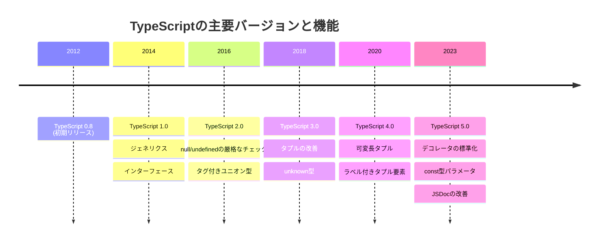

# 🏆 TypeScript冒険の旅 1.0.0

あなたは今、TypeScriptの世界への大冒険を始めようとしています！

この地図は、JavaScriptのスーパーセットである静的型付け言語TypeScriptをマスターするための旅路を示すものです。

## 🔰 初級レベル：冒険者の第一歩

### 🚀 冒険の始まり
*基本スキルを身につけて、TypeScriptの世界への第一歩を踏み出そう！*

#### 📚 クエスト一覧

| 📋 クエスト名 | 💡 挑戦内容 | ✅ クリア条件 |
|--------------|------------|-------------|
| 🌍 TypeScript王国の歴史 | ・JavaScriptのスーパーセット<br/>・静的型付け言語の特徴<br/>・TypeScriptの利点と欠点 | TypeScriptの基本概念と利点を説明できる |
| 🏗️ 開発拠点の構築 | ・Node.jsとnpmのインストール<br/>・TypeScriptのインストール<br/>・VSCodeの設定<br/>・tscコマンドの基本 | 開発環境を自分で構築し、最初のTypeScriptプログラムを実行できる |
| 📝 基本的な型の収集 | ・boolean, number, string<br/>・null, undefined<br/>・symbol, bigint | 基本的なプリミティブ型を使った変数宣言ができる |
| 🔤 変数宣言の秘術 | ・var, let, constの違い<br/>・型注釈の書き方<br/>・型推論の基本 | 適切な変数宣言と型注釈ができる |
| 📦 配列と特殊な型の宝箱 | ・配列の型定義<br/>・タプル型<br/>・any, unknown, void, never型 | 様々な型を適切な場面で使用できる |
| 🧩 関数の型付け魔法 | ・パラメータと戻り値の型付け<br/>・オプショナルパラメータ<br/>・デフォルトパラメータ | 型安全な関数を定義できる |
| 🔄 関数オーバーロードの術 | ・複数のシグネチャを持つ関数<br/>・オーバーロードの使いどころ | 複数の入力パターンに対応する関数を作成できる |
| 🏹 アロー関数の矢 | ・アロー関数の構文<br/>・thisの振る舞いの違い | アロー関数を適切に使用できる |
| 🛡️ インターフェースの盾 | ・インターフェースの定義<br/>・オプショナルプロパティ<br/>・読み取り専用プロパティ<br/>・インターフェースの拡張 | インターフェースを使ってオブジェクトの形を定義できる |
| 🏰 クラスの城 | ・クラスの定義<br/>・コンストラクタ<br/>・プロパティとメソッド<br/>・アクセス修飾子<br/>・継承とポリモーフィズム | クラスを作成し、継承を実装できる |
| 🏷️ 列挙型の宝箱 | ・数値列挙型<br/>・文字列列挙型<br/>・const列挙型 | 列挙型を適切な場面で使用できる |
| 📌 型エイリアスの地図 | ・typeキーワードの使用<br/>・インターフェースとの違い | 型エイリアスを定義できる |
| 🔀 型の合体魔法 | ・ユニオン型<br/>・インターセクション型<br/>・型の絞り込み | 複数の型を組み合わせて新しい型を作成できる |
| 📏 リテラル型の封印 | ・文字列リテラル型<br/>・数値リテラル型<br/>・ブールリテラル型 | 特定の値のみを許容する型を定義できる |

### ⚠️ 注意！落とし穴に気をつけろ

1. **「any」型の罠**
   ```typescript
   // 🚫 危険な使い方
   function processData(data: any) {
     return data.someProperty.someMethod();
   }

   // ✅ 安全な使い方
   interface Data {
     someProperty: {
       someMethod(): void;
     };
   }

   function processData(data: Data) {
     return data.someProperty.someMethod();
   }
   ```
   *「any」型は魔法の呪文のようなもの。簡単だけど、TypeScriptの防御魔法を無効化してしまう！*

2. **インターフェースとタイプエイリアスの混乱の森**
   ```typescript
   // 🏰 インターフェースの特徴: 宣言のマージが可能
   interface User {
     name: string;
   }

   interface User {
     age: number;
   } // OK: 両方のプロパティを持つインターフェースになる

   // 🔮 タイプエイリアスの特徴: プリミティブ型やユニオン型などに名前を付けられる
   type ID = string | number;
   type Point = [number, number];
   ```
   *初心者冒険者への助言：「オブジェクトの形はinterface、それ以外はtype」と覚えよう！*

3. **型推論の過信**
   ```typescript
   // 🐢 誤解を招く例
   const numbers = [1, 2, 3]; // number[]と推論される
   numbers.push("4"); // エラー: 文字列は数値の配列に追加できない

   // 🚀 明示的な型付け
   const mixed: (number | string)[] = [1, 2, 3];
   mixed.push("4"); // OK
   ```
   *TypeScriptの型推論は賢い相棒。でも複雑なデータ構造には明示的に型を付けよう！*

4. **非同期処理の型付け忘れ**
   ```typescript
   // 🚫 悪い例
   async function fetchData() {
     const response = await fetch('/api/data');
     return response.json(); // 戻り値の型が不明確
   }

   // ✅ 良い例
   interface User {
     id: number;
     name: string;
   }

   async function fetchData(): Promise<User[]> {
     const response = await fetch('/api/data');
     return response.json() as Promise<User[]>;
   }
   ```
   *非同期の世界でも型の光を灯そう。未来から届くデータにも型をつけることができる！*

### 💡 初級冒険者へのアドバイス

- 🛡️ VSCodeという最強の装備を使えば、リアルタイムで型エラーを発見できる！
- 🏠 [TypeScript公式Playground](https://www.typescriptlang.org/play)という安全な訓練場で練習しよう
- 🔄 `--watch`という魔法の言葉でtscコマンドを使えば、コードが変わるたびに自動コンパイル
- 📜 「型は最高の文書」という古代の格言を忘れずに
- 🌱 既存のJSプロジェクトからの移行は、`allowJs: true`という友好の呪文から始めよう
- 💬 短くても良いので、**コメント**を残す習慣をつけよう。後で必ず役に立つ！

## 🥋 中級レベル：型の修練場

### 🧙‍♂️ 高度な型魔法

| 📋 クエスト名 | 💡 挑戦内容 | ✅ クリア条件 |
|--------------|------------|-------------|
| 🧬 ジェネリクスの秘法 | ・ジェネリック関数<br/>・ジェネリッククラス<br/>・ジェネリックインターフェース | 汎用的かつ型安全なコードを書ける |
| 🔗 制約付きジェネリクスの鎖 | ・extendsキーワードの使用<br/>・複数の型パラメータ | 特定の条件を満たす型のみを受け入れるジェネリクスを作成できる |
| 🎭 デフォルト型パラメータの仮面 | ・デフォルト値の設定<br/>・条件付き型との組み合わせ | デフォルト型パラメータを持つジェネリクスを定義できる |
| 🛡️ 型ガードの盾 | ・typeof演算子<br/>・instanceof演算子<br/>・in演算子<br/>・カスタム型ガード関数 | 条件分岐内で型を絞り込める |
| 🗝️ インデックス型の鍵 | ・インデックスシグネチャ<br/>・keyof演算子<br/>・インデックスアクセス型 | 動的なプロパティを持つオブジェクトを型安全に扱える |
| 🗺️ マップ型の地図 | ・Partial<T><br/>・Required<T><br/>・Readonly<T><br/>・Record<K, T><br/>・Pick<T, K><br/>・Omit<T, K> | 組み込みのマップ型を活用できる |

### 📦 モジュールの大迷宮

| 📋 クエスト名 | 💡 挑戦内容 | ✅ クリア条件 |
|--------------|------------|-------------|
| 🔄 ESモジュールの回廊 | ・import/export構文<br/>・デフォルトエクスポート<br/>・名前付きエクスポート<br/>・型のインポート/エクスポート | モジュールの分割と結合ができる |
| 🗺️ 名前空間の地図 | ・namespaceキーワード<br/>・複数ファイルにまたがる名前空間 | 名前空間を利用した構造化ができる |
| 📜 外部モジュールの巻物 | ・サードパーティライブラリの型定義<br/>・@typesパッケージの使用<br/>・型定義ファイル（.d.ts）の基本 | 外部ライブラリを型安全に使用できる |

### ⏱️ 非同期魔法の修練

| 📋 クエスト名 | 💡 挑戦内容 | ✅ クリア条件 |
|--------------|------------|-------------|
| 🔮 Promiseの水晶玉 | ・Promiseの型付け<br/>・Promiseチェーン<br/>・Promise.all, Promise.race | Promiseを型安全に扱える |
| ⚡ async/awaitの雷撃 | ・非同期関数の型付け<br/>・エラーハンドリング<br/>・並列処理 | async/awaitを使った非同期処理を実装できる |
| 📡 イベント処理の通信 | ・イベントリスナーの型付け<br/>・カスタムイベントの型定義 | イベント駆動プログラミングを型安全に実装できる |

### ⚙️ TypeScriptの設定と最適化

| 📋 クエスト名 | 💡 挑戦内容 | ✅ クリア条件 |
|--------------|------------|-------------|
| 📜 tsconfig.jsonの秘伝書 | ・コンパイラオプション<br/>・厳格な型チェック<br/>・モジュール解決<br/>・ソースマップ | プロジェクトに最適なコンパイラ設定ができる |
| 🏗️ プロジェクト参照の建築 | ・複数プロジェクトの構成<br/>・依存関係の管理 | 大規模プロジェクトの構成ができる |
| 🧹 Lintingとフォーマットの掃除 | ・ESLintの設定<br/>・Prettierとの統合<br/>・コード品質の維持 | コード品質を維持するための仕組みを構築できる |

### ⚠️ 中級冒険者が遭遇する試練

1. **ジェネリクスの迷宮**
   ```typescript
   // 🐌 限られた力
   function firstElement(arr: number[]): number {
     return arr[0];
   }

   // 🦅 無限の可能性
   function firstElement<T>(arr: T[]): T {
     return arr[0];
   }
   ```
   *ジェネリクスの力を使えば、どんな種類のデータにも対応できる汎用性の高い呪文が作れる！*

2. **型ガードの誤用**
   ```typescript
   // 🚫 効果のない防御魔法
   function process(value: string | number) {
     if (value) { // これは型を絞り込まない
       value.toFixed(); // エラー: stringにtoFixedは存在しない
     }
   }

   // ✅ 正しい防御魔法
   function process(value: string | number) {
     if (typeof value === "number") {
       value.toFixed(); // OK: valueはnumber型
     }
   }
   ```
   *正しい型ガードを使って、TypeScriptの賢さを最大限に活用しよう！*

3. **非同期の罠**
   ```typescript
   // 🌪️ 混沌とした非同期
   async function fetchData(): Promise<any> {
     // anyを使うと型安全性が失われる
     return await fetch('/api/data').then(r => r.json());
   }

   // 🌟 秩序ある非同期
   interface User {
     id: number;
     name: string;
   }

   async function fetchData(): Promise<User[]> {
     const response = await fetch('/api/data');
     return response.json() as Promise<User[]>;
   }
   ```
   *非同期の世界でも型の光を灯そう。未来から届くデータにも型をつけることができる！*

### 💡 中級冒険者へのアドバイス

- 📚 型定義ファイル（`.d.ts`）は敵を知るための情報書。ライブラリの使い方を理解する鍵だ
- 🛡️ `strictNullChecks`という防具を装備すれば、nullやundefinedの罠から身を守れる
- 🔀 ユニオン型とインターセクション型を組み合わせれば、複雑な魔法の呪文も作れる
- 💫 オプショナルチェイニング（`?.`）は不確かな道を安全に進むための松明のようなもの
- 🧪 型テストという実験室で、重要な型定義が期待通りに機能することを確かめよう

## 🏯 上級レベル：型の神殿

### 🧠 究極の型魔法

| 📋 クエスト名 | 💡 挑戦内容 | ✅ クリア条件 |
|--------------|------------|-------------|
| 🔮 条件付き型の占い | ・条件付き型の構文<br/>・分配条件付き型<br/>・infer キーワード | 型の条件分岐を実装できる |
| 📝 テンプレートリテラル型の巻物 | ・文字列操作の型レベル表現<br/>・複雑な文字列パターンのモデリング | テンプレートリテラル型を活用できる |
| 🌀 再帰的な型の渦 | ・深くネストされたデータ構造の型付け<br/>・再帰的なアルゴリズムの型レベル実装 | 再帰的な型を実装できる |

### 🏯 上級建築術とパターン

| 📋 クエスト名 | 💡 挑戦内容 | ✅ クリア条件 |
|--------------|------------|-------------|
| 💎 イミュータビリティの宝石 | ・readonly修飾子<br/>・Readonly<T>とReadonlyArray<T><br/>・イミュータブルデータ構造 | イミュータブルなデータ構造を設計できる |
| 🛡️ 型安全APIの城壁 | ・エラー処理の型付け<br/>・バリデーション<br/>・型駆動開発 | 型安全なAPIを設計できる |
| 🧙‍♂️ 関数型プログラミングの魔術 | ・高階関数の型付け<br/>・関数合成<br/>・モナド的なパターン | 関数型プログラミングの手法を型安全に実装できる |

### 🏭 高度なツールと巨大都市設計

| 📋 クエスト名 | 💡 挑戦内容 | ✅ クリア条件 |
|--------------|------------|-------------|
| ⚒️ TypeScriptコンパイラAPIの鍛冶 | ・プログラムによるコンパイル<br/>・AST（抽象構文木）の操作<br/>・カスタムトランスフォーマー | TypeScriptコンパイラAPIを使用できる |
| 📜 型定義ファイルの創造 | ・サードパーティライブラリの型定義<br/>・宣言マージ<br/>・アンビエント宣言 | 型定義ファイルを作成できる |
| 🧪 テスト駆動開発の実験室 | ・型テスト<br/>・Jest, Mocha, AVAなどのテストフレームワーク<br/>・テストカバレッジ | テスト駆動開発を実践できる |
| ⚡ パフォーマンスの秘術 | ・型システムのパフォーマンス考慮点<br/>・型の簡略化テクニック<br/>・コンパイル時間の最適化 | パフォーマンスを考慮した型設計ができる |
| 📦 バンドルサイズの最適化 | ・ツリーシェイキング<br/>・コード分割<br/>・遅延ロード | バンドルサイズを最適化できる |
| 🏙️ エンタープライズアプリケーション都市 | ・モジュール設計<br/>・レイヤードアーキテクチャ<br/>・マイクロフロントエンド | 大規模アプリケーションの型設計ができる |

### ⚠️ 上級冒険者への試練

1. **複雑な型の迷宮**
   ```typescript
   // 🌀 複雑すぎる呪文
   type DeepReadonly<T> = {
     readonly [P in keyof T]: T[P] extends object
       ? DeepReadonly<T[P]>
       : T[P];
   }

   // 📝 解説付きの呪文書
   type DeepReadonly<T> = {
     // オブジェクトの各プロパティをreadonlyにする
     readonly [P in keyof T]: T[P] extends object
       ? DeepReadonly<T[P]> // オブジェクトならば再帰的に適用
       : T[P];             // プリミティブ値ならそのまま
   }
   ```
   *複雑な魔法は解説を添えて伝授しよう。後の世代の冒険者たちのために。*

2. **type vs. interface 二つの道**
   ```typescript
   // 🔄 interfaceは拡張可能
   interface User {
     name: string;
   }
   // 後から拡張できる
   interface User {
     age: number;
   }

   // 📌 typeは一度定義したら変更できない
   type User = {
     name: string;
   }
   // ❌ エラー: 同じ名前のtypeを再定義できない
   ```
   *interfaceは成長する木、typeは固い岩。それぞれの特性を理解して使い分けよう。*

3. **複雑すぎる型魔法の誘惑**
   ```typescript
   // 🌪️ 暴走した型魔法
   type ComplexUserActions<T extends Record<string, any>> = {
     [K in keyof T]: T[K] extends (...args: infer A) => infer R
       ? (...args: A) => Promise<R>
       : never;
   };

   // 🌟 調和のとれた型魔法
   type AsyncFunction<T extends Function> = T extends (...args: infer A) => infer R
     ? (...args: A) => Promise<R>
     : never;

   type UserActions = {
     createUser: AsyncFunction<(data: UserData) => User>;
     deleteUser: AsyncFunction<(id: string) => boolean>;
   };
   ```
   *複雑な魔法は分解して理解しやすくすることで、より強力な力を発揮する。*

### 💡 上級冒険者へのアドバイス

- 🛠️ TypeScriptのコンパイラAPIという強力な武器を使いこなして、自動化の魔法を作り出そう
- 📚 自作型ライブラリという魔法書を作れば、どの冒険でも同じ強力な魔法が使える
- 📰 TypeScriptのリリースノートを定期的に読み、新しい魔法の知識を得よう
- 👁️ GitHub上の偉大な魔法使いたちのコードを読み解くことで、実践的な知恵を得よう
- 🔍 ESLint+TypeScriptプラグインという賢明な助手を雇って、コード品質を維持しよう
- 🧙‍♂️ 型レベルプログラミングの秘術は少しずつ取り入れ、仲間たちが理解できる範囲で使おう
- 🧪 型テストという実験室で、重要な型定義が期待通りに機能することを確かめよう

## 📚 冒険者の図書館

- [TypeScript公式の古代文書](https://www.typescriptlang.org/docs/)
- [TypeScript Deep Dive - 深淵の知識](https://basarat.gitbook.io/typescript/)
- [TypeScript Playground - 魔法の訓練場](https://www.typescriptlang.org/play)
- [TypeScript GitHub - 賢者たちの集い](https://github.com/microsoft/TypeScript)
- [Definitely Typed - 型の宝物庫](https://github.com/DefinitelyTyped/DefinitelyTyped)

## 🔄 TypeScriptの進化

TypeScriptは継続的に進化しており、新しいバージョンでは新機能や改善が導入されています。最新の機能を把握し、適切に活用することで、より効率的で堅牢なコードを書くことができます。



## 🧩 自己評価チェックリスト

以下のチェックリストを使って、現在の習得レベルを確認できます。

### 初級レベル
- [ ] TypeScriptの基本概念を理解している
- [ ] 基本的な型（number, string, boolean, array）を使える
- [ ] 関数に型注釈を付けられる
- [ ] インターフェースを定義できる
- [ ] クラスを作成し、継承を実装できる
- [ ] 列挙型（Enum）を適切に使用できる
- [ ] 型エイリアスを定義できる
- [ ] ユニオン型とインターセクション型を理解している

### 中級レベル
- [ ] ジェネリクスを使った汎用的なコードを書ける
- [ ] 型ガードを使って型の絞り込みができる
- [ ] インデックス型とマップ型を理解している
- [ ] モジュールシステムを適切に使用できる
- [ ] 非同期処理を型安全に実装できる
- [ ] tsconfig.jsonを適切に設定できる
- [ ] ESLintとPrettierを導入できる

### 上級レベル
- [ ] 条件付き型を使った高度な型を定義できる
- [ ] テンプレートリテラル型を活用できる
- [ ] 再帰的な型を実装できる
- [ ] イミュータブルなデータ構造を設計できる
- [ ] 型安全なAPIを設計できる
- [ ] TypeScriptコンパイラAPIを使用できる
- [ ] 型定義ファイルを作成できる
- [ ] パフォーマンスを考慮した型設計ができる
- [ ] 大規模アプリケーションの型設計ができる