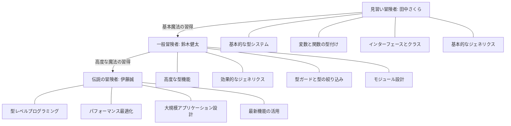

# 🏰 TypeScript冒険者ギルド　1.0.0

TypeScriptの知識を深め、達人を目指そう！

本ガイドでは、あなたのスキルレベルに応じたペルソナを設定し、それぞれの冒険を支援する。

## 🌟 冒険者ランク一覧

| 🏅 ランク | 🛡️ 見習い冒険者 | ⚔️ 一般冒険者 | 🔮 伝説の冒険者 |
|------|--------------|---------------|--------------|
| 📅 冒険歴 | 3年のWeb魔法経験 | 5年のフロントエンド魔法経験 | 12年の魔法使い経験 |
| ⌨️ TypeScript経験値 | 基本的なJavaScript知識<br/>TypeScriptは未経験 | TypeScriptの基本を習得<br/>実務での使用経験あり | TypeScriptの高度な機能を熟知<br/>大規模プロジェクトでの活用経験 |
| 🗺️ 探索範囲 | HTMLとCSSの領域に精通<br/>JavaScriptの基本地域を探索済み | フロントエンド全域を探索<br/>フレームワークの森を踏破 | フルスタックの全領域を制覇<br/>未知の領域も積極的に探索 |
| 📜 コード品質への執着 | 動作する魔法の呪文を書くことに集中 | 再利用可能で読みやすい魔法書の作成 | 最適化された魔法体系の構築と伝承 |
| 🔍 倒せるモンスターの難易度 | 基本的なバグや型エラー | 複雑な型エラーや設計の問題 | 大規模システムの最適化問題や理論的な課題 |

## 🛡️ 見習い冒険者のプロフィール

| 項目 | 詳細 |
|------|------|
| **📋 所属ギルド** | 🎨 Webデザイナーギルド（経験3年）<br/>🖌️ HTML/CSSマスターギルド<br/>🔍 jQuery見習い団 |
| **🧙‍♂️ 習得した魔法** | ✅ HTML/CSSの高度な装飾魔法<br/>✅ 基本的なJavaScript呪文<br/>✅ DOM操作の初級魔法<br/>✅ jQueryを使った簡易イベント魔法<br/>✅ JSONデータの基本的な解読術 |
| **😅 よくある失敗談** | ❌ TypeScriptの型注釈を全ての変数に付けすぎて魔力を消耗<br/>❌ `any`型の魔法で型チェックの防御を無効化してしまう<br/>❌ コンパイルエラーとランタイムエラーの違いを混同<br/>❌ 非同期魔法の詠唱順序を間違える |
| **💪 特殊能力** | 🎨 視覚的な魔法の習得が早い<br/>👁️ デザイン感覚に優れた魔法の詠唱<br/>🔄 実践的な例から学ぶ能力 |
| **🛠️ 装備品** | 🖥️ VSCode（初級者向け設定）<br/>🌐 ブラウザ開発ツール<br/>🎮 コードサンドボックス（CodePen, JSFiddle）<br/>📱 TypeScript Playground |
| **🏆 達成クエスト例** | 🏆 「Hello, TypeScript!」の詠唱<br/>🏆 基本的な型システムの理解<br/>🏆 シンプルなフォームバリデーションの実装 |
| **🌠 冒険者の野望** | 🚀 より高度なWebアプリケーション魔法の習得<br/>⚔️ フロントエンドの魔法使いとしての成長<br/>🏰 TypeScriptを使ったReactプロジェクトへの参加 |
| **📖 修行方法** | 📚 ビジュアル要素が豊富な魔法書の読破<br/>🔍 ステップバイステップの実践的な修行<br/>🎬 短い動画チュートリアルでの学習<br/>⚒️ 実際のプロジェクトでの実践 |

## ⚔️ 一般冒険者のプロフィール

| 項目 | 詳細 |
|------|------|
| **📋 所属ギルド** | 🛡️ フロントエンドエンジニアギルド（経験5年）<br/>⚔️ React/Vue魔法使い協会<br/>🧩 TypeScript実践者同盟 |
| **🧙‍♂️ 習得した魔法** | ✅ TypeScriptの基本的な型システム魔法<br/>✅ インターフェースとクラスの構築術<br/>✅ モジュールシステムとnamespaceの操作<br/>✅ 簡単なジェネリクス魔法<br/>✅ フレームワークとの連携魔法 |
| **😅 よくある失敗談** | ❌ ジェネリクスの複雑な使用で魔法が暴走<br/>❌ 型ガードの使い方を誤り防御魔法が機能しない<br/>❌ 非同期処理の型付けを忘れて未来の魔法が不安定に<br/>❌ 高度な型操作に挑戦するも混乱する |
| **💪 特殊能力** | 📚 体系的な魔法理論の理解力<br/>🧠 概念を深く掘り下げる分析力<br/>🔄 実践と理論のバランス感覚 |
| **🛠️ 装備品** | 🖥️ VSCode（中級者向け拡張機能搭載）<br/>📚 TypeScript公式ドキュメント<br/>🧪 テスト駆動開発の道具<br/>🔍 型定義ファイルの解読器 |
| **🏆 達成クエスト例** | 🏆 TypeScriptを使った中規模アプリケーションの構築<br/>🏆 ジェネリクスを活用した汎用コンポーネントの作成<br/>🏆 型安全なAPIクライアントの実装 |
| **🌠 冒険者の野望** | 🚀 TypeScriptの高度な機能を習得し堅牢なアプリケーションを構築<br/>📚 チーム内でTypeScriptのベストプラクティスを広める<br/>🏗️ アーキテクチャ設計スキルの向上<br/>⚡ パフォーマンスとスケーラビリティを考慮した魔法の習得 |
| **📖 修行方法** | 📚 技術書籍や詳細なドキュメントの研究<br/>🔍 公式ドキュメントの徹底解読<br/>👁️ オープンソースプロジェクトのコード分析<br/>🎬 技術カンファレンスの発表や動画視聴<br/>⚒️ 実践的なワークショップへの参加 |

## 🔮 伝説の冒険者のプロフィール

| 項目 | 詳細 |
|------|------|
| **📋 所属ギルド** | 🌟 シニアソフトウェアエンジニアギルド（経験12年）<br/>👑 テックリード評議会<br/>🔮 TypeScript魔法研究所 |
| **🧙‍♂️ 習得した魔法** | ✅ TypeScriptの型システムの極意<br/>✅ ジェネリクス、条件付き型、マップ型などの高度な型魔法<br/>✅ モジュール設計とアーキテクチャパターンの構築術<br/>✅ パフォーマンス最適化の秘術<br/>✅ テスト駆動開発の高度な魔法 |
| **😅 よくある失敗談** | ❌ 型レベルプログラミングが複雑すぎて他の魔法使いが理解できない<br/>❌ コンパイルパフォーマンスの最適化に苦戦<br/>❌ 複雑なライブラリの型定義作成で混乱<br/>❌ 最新機能の追跡と適用のバランスを見誤る |
| **💪 特殊能力** | 🧠 深い技術的理解と実践的応用のバランス感覚<br/>🔮 最新の研究や先進的な技術への洞察力<br/>👨‍🏫 知識の体系化と伝承能力<br/>🌐 コミュニティからの学習と還元 |
| **🛠️ 装備品** | 🖥️ カスタマイズされた開発環境<br/>📚 TypeScriptのソースコードと仕様書<br/>🧪 実験的プロジェクト用の研究室<br/>🔍 パフォーマンス分析ツール<br/>👨‍👩‍👧‍👦 メンタリングとコードレビューの場 |
| **🏆 達成クエスト例** | 🏆 大規模TypeScriptプロジェクトのアーキテクチャ設計<br/>🏆 型レベルプログラミングを活用した高度なライブラリの開発<br/>🏆 オープンソースプロジェクトへの貢献<br/>🏆 TypeScriptのパフォーマンス最適化技術の確立 |
| **🌠 冒険者の野望** | 🚀 TypeScriptの型システムを極限まで活用した堅牢なシステム設計<br/>⚡ パフォーマンスとスケーラビリティを最適化したエンタープライズアプリケーションの開発<br/>👨‍🏫 チームや組織全体のTypeScriptの知識向上<br/>🔮 型レベルプログラミングの習得と実践<br/>🌐 オープンソースへの貢献とコミュニティへの還元 |
| **📖 修行方法** | 📚 学術論文や詳細な技術記事の研究<br/>🔍 TypeScriptのソースコードと仕様の解析<br/>🎬 高度な技術カンファレンスやワークショップへの参加<br/>👥 専門家とのディスカッションとコードレビュー<br/>🧪 実験的なプロジェクトと研究の実施 |

## 💻 各レベルの冒険者が書く魔法の違い

### 🛡️ 見習い冒険者の魔法

```typescript
// 🚫 見習い冒険者がよく書いてしまう魔法
function processUserData(user: any) {
  // any型を使って型チェックの防御を無効化
  console.log(user.name.toUpperCase());  // 実行時に魔法が暴走する可能性あり
}

// ✅ 成長した見習い冒険者の魔法
interface User {
  name: string;
  age: number;
}

function processUserData(user: User) {
  // 型の盾で守られた安全な魔法
  console.log(user.name.toUpperCase());  // 型安全な魔法
}
```

### ⚔️ 一般冒険者の魔法

```typescript
// 🚫 一般冒険者がよく書いてしまう魔法
function merge<T, U>(obj1: T, obj2: U) {
  // ジェネリクスを単純に「任意の型」として使用
  return { ...obj1, ...obj2 };  // obj1とobj2がオブジェクトであることを保証していない
}

// ✅ 成長した一般冒険者の魔法
function merge<T extends object, U extends object>(obj1: T, obj2: U): T & U {
  // 制約を使用してジェネリクスの型を限定
  return { ...obj1, ...obj2 };  // obj1とobj2がオブジェクトであることを保証
}

// 使用例
const merged = merge({ name: "健太" }, { age: 32 });
console.log(merged);  // { name: "健太", age: 32 }

// エラー例
// merge("name", { age: 32 });  // エラー: 'string' 型の引数を 'object' 型のパラメーターに割り当てることはできません
```

### 🔮 伝説の冒険者の魔法

```typescript
// 🚫 伝説の冒険者でも注意が必要な複雑な魔法
type DeepReadonly<T> = {
  readonly [P in keyof T]: T[P] extends object ? DeepReadonly<T[P]> : T[P];
};

// 大きなオブジェクトに適用すると、魔力消費（コンパイル時間）が増大
type HugeObject = DeepReadonly<{
  // 何百ものネストされたプロパティ...
}>;

// ✅ 洗練された伝説の冒険者の魔法
// 1. 型の再利用と分割で魔力効率化
type ReadonlyPrimitive<T> = T extends object ? never : T;
type ReadonlyObject<T> = T extends object ? { readonly [P in keyof T]: Readonly<T[P]> } : never;
type Readonly<T> = T extends object ? ReadonlyObject<T> : ReadonlyPrimitive<T>;

// 2. 型計算の制限で魔力消費を抑制
// 深さを制限したDeepReadonly
type DeepReadonly2<T, Depth extends number = 3> = {
  readonly [P in keyof T]: Depth extends 0 
    ? T[P] 
    : T[P] extends object 
      ? DeepReadonly2<T[P], Subtract<Depth, 1>> 
      : T[P];
};

// 数値の減算を行う補助魔法
type Subtract<A extends number, B extends number> = [...Array<A>]['length'] extends [...Array<B>, ...infer U]['length'] 
  ? U['length'] 
  : never;
```

## 📚 冒険者のレベルアップ攻略法

### 🛡️→⚔️ 見習いから一般冒険者になるためのクエスト

1. **🧩 型システムの迷宮探検**
   - 基本的な型からユニオン型、インターセクション型まで全ての型を使いこなせるようになる
   - クエスト: 様々な型を組み合わせた「型図鑑」を作成せよ

2. **🏗️ インターフェースの城を建設**
   - インターフェースを使って複雑なオブジェクト構造を定義できるようになる
   - クエスト: WebAPIのレスポンスをインターフェースで完全に型付けせよ

3. **🧙‍♂️ ジェネリクス魔法の習得**
   - 基本的なジェネリクスを理解し、汎用的な関数やクラスを作成できるようになる
   - クエスト: 任意の型に対応する汎用的なデータ構造を3つ実装せよ

4. **🛡️ 型ガードの防御術**
   - 型ガードを使って型の絞り込みを行い、型安全なコードを書けるようになる
   - クエスト: 複数の型が混在するデータを安全に処理する関数を実装せよ

5. **📦 モジュール設計の修行**
   - 適切なモジュール分割とインポート/エクスポートの設計ができるようになる
   - クエスト: 小規模なアプリケーションを適切なモジュール構造で実装せよ

### ⚔️→🔮 一般から伝説の冒険者になるためのクエスト

1. **🧠 型レベルプログラミングの秘術**
   - 条件付き型、マップ型、再帰的な型などの高度な型機能を使いこなせるようになる
   - クエスト: 複雑なデータ変換を型レベルで実装する汎用ユーティリティを作成せよ

2. **⚡ パフォーマンス最適化の魔法**
   - 型システムのパフォーマンスを考慮した設計ができるようになる
   - クエスト: 大規模プロジェクトのコンパイル時間を30%削減せよ

3. **🏰 大規模アプリケーション設計の極意**
   - スケーラブルで保守性の高いアーキテクチャを設計できるようになる
   - クエスト: マイクロフロントエンドアーキテクチャを型安全に実装せよ

4. **📜 型定義ファイルの創造**
   - 複雑なライブラリの型定義ファイルを作成できるようになる
   - クエスト: 型定義のないJavaScriptライブラリに完全な型定義を提供せよ

5. **🧪 型テストの実験**
   - 型レベルでのテストを実装し、型の正確性を検証できるようになる
   - クエスト: 型テストフレームワークを実装し、複雑な型の検証を自動化せよ

## 🧙‍♂️ 冒険者訓練所からの秘伝

### 👶 見習い冒険者への伝言

- 🛡️ VSCodeという最強の装備を使いこなそう！リアルタイムで型エラーを発見できるぞ
- 🏠 TypeScript Playgroundという安全な訓練場で基本的な魔法を練習しよう
- 🔄 `--watch`という魔法の言葉でtscコマンドを使えば、コードが変わるたびに自動コンパイル
- 📜 「型は最高の文書」という古代の格言を忘れずに
- 🌱 既存のJSプロジェクトからの移行は、`allowJs: true`という友好の呪文から始めよう
- 💬 短くても良いので、**コメント**を残す習慣をつけよう。後で必ず役に立つ！
- 🚫 `any`型の使用は最小限に抑えよう。TypeScriptの防御魔法が無効になってしまう

### 🧙‍♂️ 一般冒険者への伝言

- 📚 型定義ファイル（`.d.ts`）は敵を知るための情報書。ライブラリの使い方を理解する鍵だ
- 🛡️ `strictNullChecks`という防具を装備すれば、nullやundefinedの罠から身を守れる
- 🔀 ユニオン型とインターセクション型を組み合わせれば、複雑な魔法の呪文も作れる
- 💫 オプショナルチェイニング（`?.`）は不確かな道を安全に進むための松明のようなもの
- 🧪 型テストという実験室で、重要な型定義が期待通りに機能することを確かめよう
- 🏗️ 型の再利用と合成を意識しよう。DRY原則は型システムにも適用される
- 📖 TypeScriptの型システムの仕組みを深く理解し、その背後にある原理を学ぼう

### 🧙‍♂️ 伝説の冒険者への伝言

- 🛠️ TypeScriptのコンパイラAPIという強力な武器を使いこなして、自動化の魔法を作り出そう
- 📚 自作型ライブラリという魔法書を作れば、どの冒険でも同じ強力な魔法が使える
- 📰 TypeScriptのリリースノートを定期的に読み、新しい魔法の知識を得よう
- 👁️ GitHub上の偉大な魔法使いたちのコードを読み解くことで、実践的な知恵を得よう
- 🔍 ESLint+TypeScriptプラグインという賢明な助手を雇って、コード品質を維持しよう
- 🧙‍♂️ 型レベルプログラミングの秘術は少しずつ取り入れ、仲間たちが理解できる範囲で使おう
- 🧪 型テストという実験室で、重要な型定義が期待通りに機能することを確かめよう
- 👨‍🏫 知識の伝承も伝説の冒険者の重要な役割。次世代の魔法使いを育てよう

## 📜 冒険者の図書館

- 📚 [TypeScript公式の古代文書](https://www.typescriptlang.org/docs/) - 全ての魔法使いが読むべき基本の書
- 📖 [TypeScript Deep Dive - 深淵の知識](https://basarat.gitbook.io/typescript/) - より深い魔法の理解のための必読書
- 🎮 [TypeScript Playground - 魔法の訓練場](https://www.typescriptlang.org/play) - 魔法を安全に試せる実験場
- 🏛️ [TypeScript GitHub - 賢者たちの集い](https://github.com/microsoft/TypeScript) - 魔法の源流を探る場所
- 🗃️ [Definitely Typed - 型の宝物庫](https://github.com/DefinitelyTyped/DefinitelyTyped) - 数千の魔法アイテムの型定義が集まる宝庫
- 📝 [TypeScript Weekly](https://typescript-weekly.com/) - 最新の魔法情報を届ける定期便
- 🧙‍♂️ [TypeScript Evolution](https://mariusschulz.com/blog/series/typescript-evolution) - TypeScriptの進化の歴史を学ぶ書物



🎉 **さあ、あなたもTypeScriptの冒険へ旅立とう！** 🚀